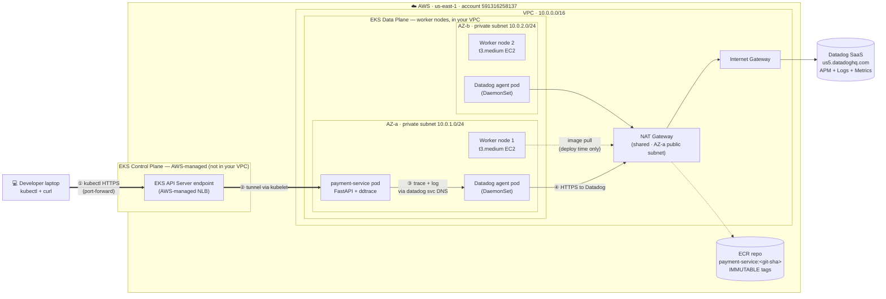

# Architecture

Single canonical view of the **cumulative current system state**. Updated at the end of each phase.

For the *delta* introduced by any given phase (and the failure-mode notes for new components), see that phase's spec under [specs/](specs/).

## Current state

End-state of Phase 01: VPC + EKS + payment-service + Datadog observability pipeline. One end-to-end traced `curl` request whose trace correlates to a log line via shared `trace_id`.

### Components by layer

**Network (Phase 01, Milestone 3)**
- VPC `10.0.0.0/16` in `us-east-1`
- 2 public subnets (`10.0.101.0/24`, `10.0.102.0/24`) — host the NAT GW
- 2 private subnets (`10.0.1.0/24`, `10.0.2.0/24`) — host worker nodes
- 1 shared NAT Gateway in AZ-a (Phase 5 will expand to per-AZ)
- 1 Internet Gateway

**Compute (Phase 01, Milestone 4)**
- EKS cluster `capstone-sre-cluster` (Kubernetes 1.34, public + private API endpoint, IRSA enabled)
- Managed node group: 2× `t3.medium` EC2 instances, one per AZ, 30 GB gp3 EBS each
- AWS access via SSO role `CapstoneAdmin` (no long-lived IAM keys)

**Observability (Phase 01, Milestone 5)**
- Datadog Helm chart deployed as DaemonSet (one agent pod per node)
- Each agent pod runs 3 containers: `agent`, `trace-agent`, `process-agent`
- Telemetry ships to `us5.datadoghq.com` via NAT GW egress
- `logs.containerCollectAll = true` enables stdout/stderr collection from all pods

**Application (Phase 01, Milestone 6)**
- ECR repository `payment-service` with IMMUTABLE git-SHA tags (lifecycle policy keeps last 10)
- FastAPI app exposing `POST /pay` (returns synthetic payment_id) + `GET /health`
- Hand-written Helm chart (Deployment + Service + ServiceAccount + ConfigMap)
- `ddtrace-run` entrypoint + `python-json-logger` for structured JSON
- `DD_LOGS_INJECTION=true` injects `dd.trace_id`/`dd.span_id` into every log line
- Service points to Datadog agent via cluster DNS (`datadog.datadog.svc.cluster.local:8126`)

## Request flow

End-to-end trace path for a `curl POST /pay` (verified in Phase 01 Milestone 7):

1. **Setup (one-time per session):** `kubectl port-forward svc/payment 8080:80 -n payment` opens an HTTPS tunnel from laptop → public EKS API server endpoint → kubelet on the pod's node
2. **Request (synchronous, NAT-independent):** `curl http://localhost:8080/pay` is tunneled through kubelet → pod's port 8080
3. **App handles request:** FastAPI generates a `payment_id`, emits a JSON log line with `dd.trace_id` injected by ddtrace, returns 200
4. **Trace shipping (async, NAT-dependent):** ddtrace ships the span to the Datadog agent pod via cluster DNS (NOT loopback — we use the K8s service, not host-IP); the agent batches and ships to `us5.datadoghq.com` via NAT GW
5. **Log shipping (async, NAT-dependent):** the agent's log collector tails the pod's stdout/stderr file on the node and ships to Datadog SaaS
6. **Correlation:** in Datadog, clicking the trace's span shows the log line with the matching `dd.trace_id`, and clicking a log shows its connected trace

**Failure-mode reminder:** if the NAT GW dies, steps 1–3 keep working (control-plane path). Steps 4–5 go silent — the system *works*, but observability *lies*. This is the partial-observability lesson Phase 5's NAT drill will demonstrate live.

## How this is maintained

Maintenance rules live in [`CLAUDE.md`](CLAUDE.md) (hard rule #4 + `/phase-close` flow). This file is updated at phase close — see CLAUDE.md for the full list of phase-close gates.

## Last updated

2026-05-01 — Phase 01 closed. VPC + EKS + Datadog DaemonSet + payment-service deployed; end-to-end trace + log correlation verified via curl POST /pay.
