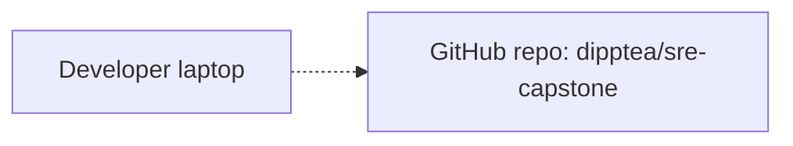

# Architecture

Single canonical view of the **cumulative current system state**. Updated at the end of each phase.

For the *delta* introduced by any given phase (and the failure-mode notes for new components), see that phase's spec under [specs/](specs/).

## Current state

_Pre-Phase-01: nothing deployed yet._

## Request flow

_No live request flow yet — Phase 1 introduces the first one._

## How this is maintained

At phase close (alongside `runbook.md` and `lessons.md` updates):

1. Update the architecture diagram above to reflect the new cumulative end-state.
2. Update the request flow if it changed.
3. Update the "Last updated" line.
4. Commit alongside the rest of the phase-close work.

## Last updated

2026-04-27 — pre-Phase-01 baseline (empty).
