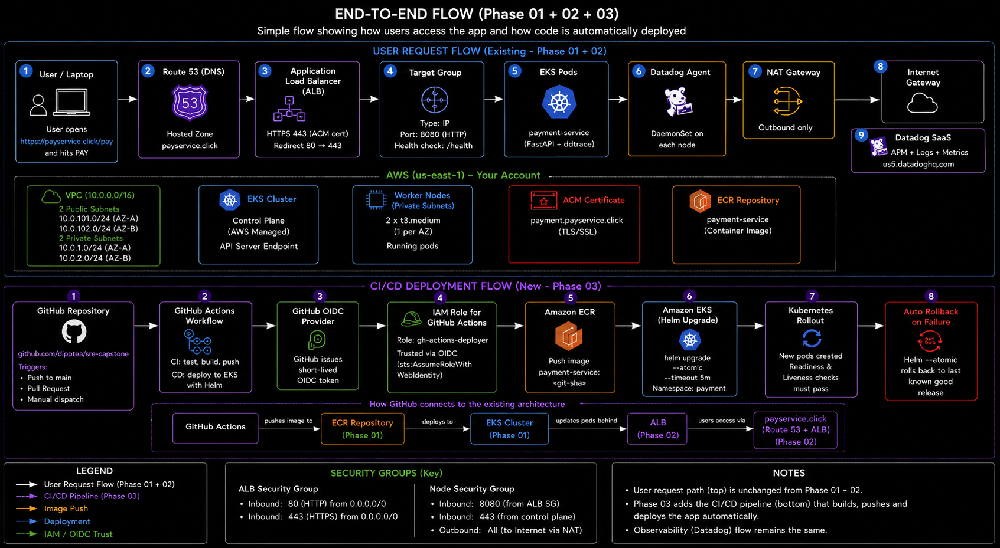
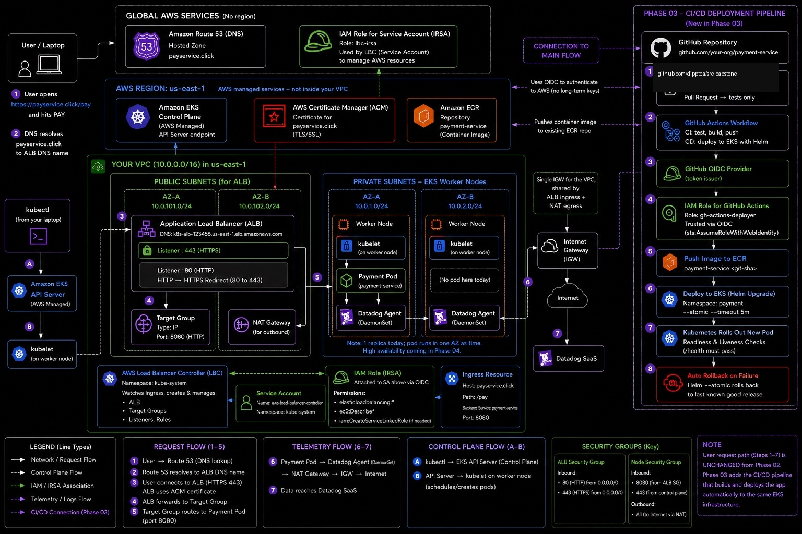
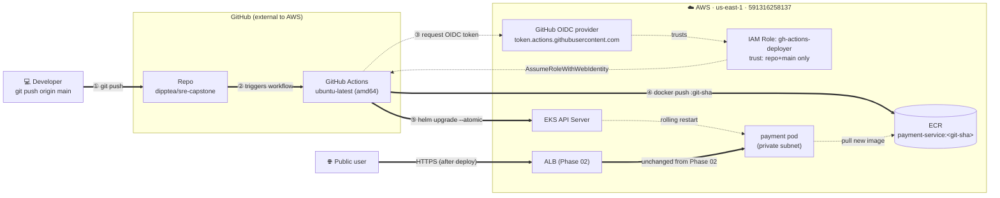
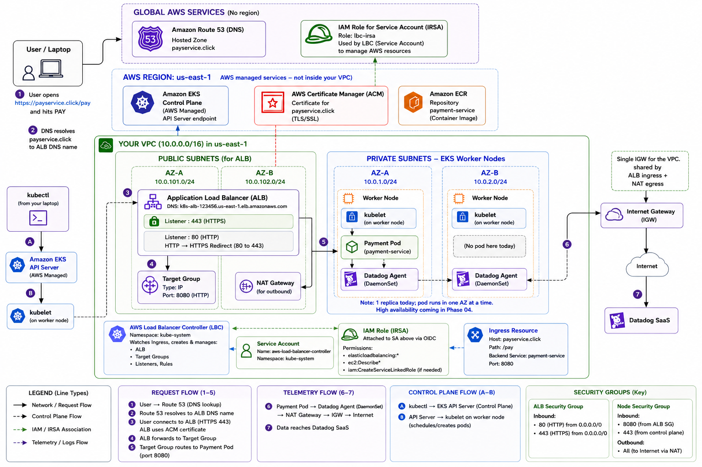
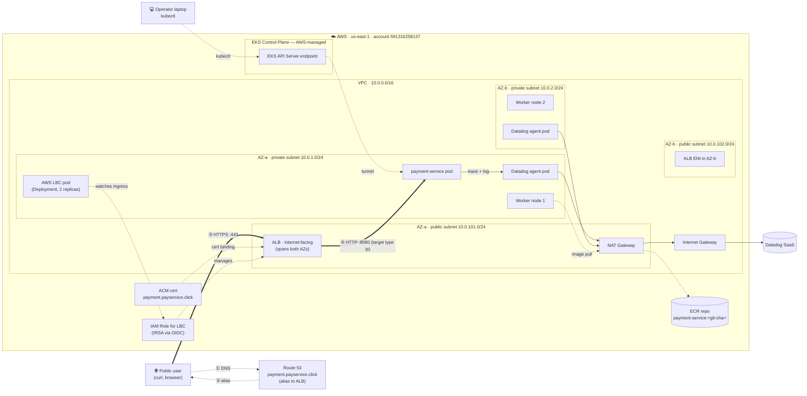
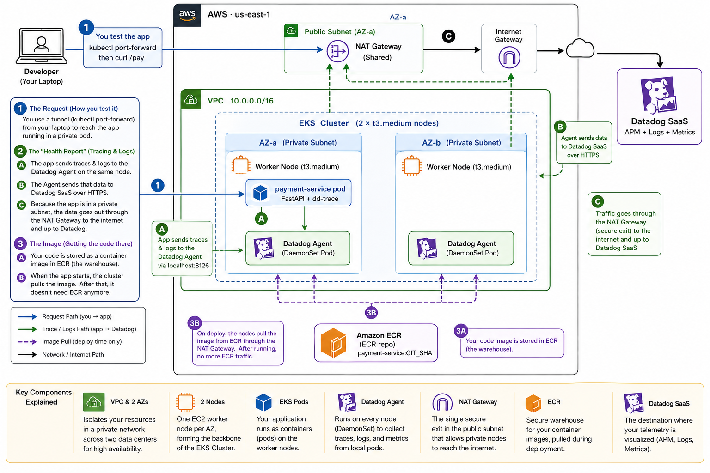
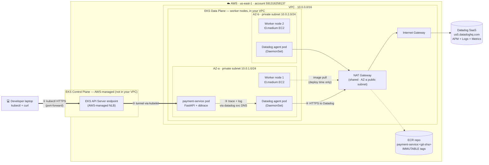

# Architecture

Single canonical view of the **cumulative current system state**. Updated at the end of each phase.

For the *delta* introduced by any given phase (and the failure-mode notes for new components), see that phase's spec under [specs/](specs/).

## Phase 03 — current cumulative state

End-state of Phase 03: Phase 02 + automated CI/CD deploy chain. Pushing to `main` builds, tests, pushes to ECR with an immutable git-SHA tag, and runs `helm upgrade --atomic` against EKS — replacing manual deploys with a hands-free pipeline that auto-rolls back on failure. **User request path is unchanged from Phase 02** — `https://payment.payservice.click/pay` still flows through Route 53 alias → ALB → pod.

*Overview above shows the two parallel flows: **user request flow** (top, Phase 01+02, unchanged) and **CI/CD deploy flow** (bottom, Phase 03, new). The detailed diagram below shows the cumulative AWS topology with the CI/CD pipeline as a vertical add-on on the right.*

*Mermaid version below for source-controlled editing — focuses on the deploy flow specifically.*

### Components by layer (cumulative)

All Phase 01–02 categories carry over unchanged — see [Phase 02 baseline](#phase-02-baseline-kept-for-comparison) section below for the full list (Network, Compute, Observability, Application, Public ingress).

**Deploy automation (Phase 03)**
- GitHub Actions workflow `.github/workflows/deploy.yml` — three jobs: `test` (always), `build-and-push` (push to main only), `deploy` (push to main only, `helm upgrade --install --atomic --timeout 5m`)
- IAM OIDC provider for `token.actions.githubusercontent.com` (alongside the existing EKS OIDC provider — separate AWS resources, different issuers)
- IAM Role `gh-actions-deployer` — trust policy locked via `StringEquals` on `sub:repo:dipptea/sre-capstone:ref:refs/heads/main`
- Inline IAM policy `gh-actions-deployer-permissions`: ECR push verbs (scoped to `payment-service` repo), `ecr:GetAuthorizationToken` (resource `*`, AWS API limitation), `eks:DescribeCluster` (scoped to `capstone-sre-cluster`). No S3, no Secrets Manager, no general read.
- EKS access entry granting `AmazonEKSClusterAdminPolicy` to the role (broad scope, parallel to CapstoneAdmin SSO role's existing access entry; tighter scoping deferred to Phase 07)
- Image tagging: short git SHA (7 chars), immutable in ECR (lifecycle keeps last 10)
- AWS auth: OIDC only — no static AWS keys stored in GitHub repository secrets

### Request flow

The "request" this phase introduced is a **deploy** (the user-request path is unchanged from Phase 02). End-to-end deploy on push to main:

1. **Developer pushes to main** — GitHub triggers the workflow on `ubuntu-latest` (amd64).
2. **Test job runs** — `pytest` (smoke test) + `docker build` validation. Fails fast on any test failure; if it fails, `build-and-push` and `deploy` jobs don't run.
3. **Workflow assumes IAM role via OIDC** — `AssumeRoleWithWebIdentity` with the GitHub OIDC token. STS validates the `sub` claim matches `repo:dipptea/sre-capstone:ref:refs/heads/main`. Returns short-lived (~15 min) AWS credentials.
4. **Build & push** — image tagged with the commit's short SHA, pushed to ECR.
5. **Deploy** — `aws eks update-kubeconfig` then `helm upgrade --install --atomic --timeout 5m --set image.tag=<sha>`. Helm rolls out new pod alongside old; readiness probes hit `/health`.
6. **If new pod becomes Ready within 5 min** → old pod terminated, new pod serves traffic. Workflow ✅ green.
7. **If new pod fails to become Ready within 5 min** → Helm `--atomic` triggers automatic rollback to previous revision. Old pod keeps serving. Workflow ❌ red. **Public endpoint never goes down.**

**Pull request flow** (validated in Phase 03 M5): on `pull_request` event, only the `test` job runs; `build-and-push` and `deploy` are skipped via `if: github.event_name == 'push' && github.ref == 'refs/heads/main'`. Provides PR-level CI signal without shipping anything.

**New failure-modes (Phase 03):**

- **GitHub OIDC thumbprint stale** — if GitHub rotates their TLS cert and `terraform apply` hasn't been re-run since, the `tls_certificate` data source's value freezes the old thumbprint in the AWS OIDC provider. Result: silent `AccessDenied` on every `AssumeRoleWithWebIdentity`. Fix: `cd infra && terraform apply` to refresh.
- **Trust policy `sub` mismatch** — feature branches and PR-from-fork commits cannot assume the role (intentional). If you ever need to deploy from a non-main branch (e.g., emergency hotfix), use the documented break-glass: manual `helm upgrade` from operator laptop with the CapstoneAdmin SSO role.
- **Test gate flake** — a flaky test on `main` blocks all deploys until fixed/quarantined. Treat test flake as a real bug (don't `--no-verify` past it); the gate's value is its credibility.

---

## Phase 02 baseline (kept for comparison)

End-state of Phase 02: Phase 01 + public HTTPS via ALB. Public users hit `https://payment.payservice.click/pay` from any laptop on the internet → 200, with no `--insecure` flag, observable end-to-end in Datadog APM and Logs.

*Diagram above is the polished view (PNG). The Mermaid version below is the source-controlled equivalent — easier to edit in PRs, renders inline in GitHub.*

### Components by layer (cumulative)

**Network (Phase 01, Milestone 3)**
- VPC `10.0.0.0/16` in `us-east-1`
- 2 public subnets (`10.0.101.0/24`, `10.0.102.0/24`) — host the NAT GW + ALB
- 2 private subnets (`10.0.1.0/24`, `10.0.2.0/24`) — host worker nodes + pods
- 1 shared NAT Gateway in AZ-a (Phase 5 will expand to per-AZ)
- 1 Internet Gateway

**Compute (Phase 01, Milestone 4)**
- EKS cluster `capstone-sre-cluster` (Kubernetes 1.34, public + private API endpoint, IRSA enabled)
- Managed node group: 2× `t3.medium` EC2 instances, one per AZ, 30 GB gp3 EBS each
- AWS access via SSO role `CapstoneAdmin` (no long-lived IAM keys)

**Observability (Phase 01, Milestone 5)**
- Datadog Helm chart deployed as DaemonSet (one agent pod per node)
- Each agent pod runs 3 containers: `agent`, `trace-agent`, `process-agent`
- Telemetry ships to `us5.datadoghq.com` via NAT GW egress
- `logs.containerCollectAll = true` enables stdout/stderr collection from all pods

**Application (Phase 01, Milestone 6 + Phase 02 Milestone 6)**
- ECR repository `payment-service` with IMMUTABLE git-SHA tags (lifecycle policy keeps last 10)
- FastAPI app exposing `POST /pay` (returns synthetic payment_id) + `GET /health`
- Hand-written Helm chart (Deployment + Service + ServiceAccount + ConfigMap + **Ingress added in Phase 02**)
- `ddtrace-run` entrypoint + `python-json-logger` for structured JSON
- `DD_LOGS_INJECTION=true` injects `dd.trace_id`/`dd.span_id` into every log line
- Service points to Datadog agent via cluster DNS (`datadog.datadog.svc.cluster.local:8126`)

**Public ingress (Phase 02)**
- Domain `payservice.click` (Route 53 registration, 1-year, auto-renew off, lapses 2027-05-04)
- Route 53 hosted zone `payservice.click` (auto-created with domain)
- Alias `A` record `payment.payservice.click` → ALB
- ACM public cert for `payment.payservice.click` (DNS-validated, ACM auto-renews while attached to a load balancer)
- AWS Application Load Balancer (`internet-facing`, spans both AZs)
  - HTTP `:80` listener — `ssl-redirect` → 443
  - HTTPS `:443` listener — ACM cert attached
  - Target group `target-type: ip` (forwards to pod IP, skips kube-proxy hop)
  - Health check `GET /health`
- AWS Load Balancer Controller (Helm chart `eks/aws-load-balancer-controller` v1.11.0; controller v2.11.0; Deployment in `kube-system`, 2 replicas with leader election)
- IRSA IAM role `capstone-sre-lbc-irsa` with AWS-published LBC policy; trust policy locked to `kube-system:aws-load-balancer-controller`
- Subnet tags: `kubernetes.io/role/elb=1` (public) + `kubernetes.io/role/internal-elb=1` (private) for LBC discovery

### Request flow

End-to-end trace path for `curl -X POST https://payment.payservice.click/pay` (verified in Phase 02 Milestone 8):

1. **DNS resolution:** laptop's resolver → Route 53 alias → ALB's public IPs (one per AZ)
2. **TLS handshake:** ALB presents the ACM cert; laptop validates against the public CA chain (no `--insecure` needed)
3. **ALB routing:** Host header matches the Ingress rule for `payment.payservice.click`; ALB forwards plain HTTP to the pod's VPC IP on `:8080` (target type `ip`, skips kube-proxy)
4. **Pod handles request:** FastAPI generates a `payment_id`, emits a JSON log line with `dd.trace_id` injected by ddtrace, returns 200
5. **Response:** ALB re-wraps in TLS, returns to laptop
6. **Trace + log shipping (async, NAT-dependent):** unchanged from Phase 01 — pod → Datadog agent (via cluster DNS) → Datadog SaaS via NAT GW
7. **Correlation:** trace + log linked by `dd.trace_id` in Datadog UI

**Operator path** (kubectl port-forward → EKS API → kubelet → pod) is still available for debugging but is no longer the primary user request path.

**New failure-mode (Phase 02):** if the LBC pod dies, the *existing ALB keeps routing fine* (AWS-managed, lives outside the cluster) — but pod-IP changes stop being reflected. During a rollout, traffic still flows to dead pod IPs and you get 502s. Existing pods unaffected; new deploys silently broken.

---

## Phase 01 baseline (preserved for comparison)

End-state of Phase 01: VPC + EKS + payment-service + Datadog observability pipeline. One end-to-end traced `curl` request whose trace correlates to a log line via shared `trace_id`.

*Diagram above is the polished view (PNG). The Mermaid version below is the source-controlled equivalent — easier to edit in PRs, renders inline in GitHub.*

### Components by layer

**Network (Phase 01, Milestone 3)**
- VPC `10.0.0.0/16` in `us-east-1`
- 2 public subnets (`10.0.101.0/24`, `10.0.102.0/24`) — host the NAT GW
- 2 private subnets (`10.0.1.0/24`, `10.0.2.0/24`) — host worker nodes
- 1 shared NAT Gateway in AZ-a (Phase 5 will expand to per-AZ)
- 1 Internet Gateway

**Compute (Phase 01, Milestone 4)**
- EKS cluster `capstone-sre-cluster` (Kubernetes 1.34, public + private API endpoint, IRSA enabled)
- Managed node group: 2× `t3.medium` EC2 instances, one per AZ, 30 GB gp3 EBS each
- AWS access via SSO role `CapstoneAdmin` (no long-lived IAM keys)

**Observability (Phase 01, Milestone 5)**
- Datadog Helm chart deployed as DaemonSet (one agent pod per node)
- Each agent pod runs 3 containers: `agent`, `trace-agent`, `process-agent`
- Telemetry ships to `us5.datadoghq.com` via NAT GW egress
- `logs.containerCollectAll = true` enables stdout/stderr collection from all pods

**Application (Phase 01, Milestone 6)**
- ECR repository `payment-service` with IMMUTABLE git-SHA tags (lifecycle policy keeps last 10)
- FastAPI app exposing `POST /pay` (returns synthetic payment_id) + `GET /health`
- Hand-written Helm chart (Deployment + Service + ServiceAccount + ConfigMap)
- `ddtrace-run` entrypoint + `python-json-logger` for structured JSON
- `DD_LOGS_INJECTION=true` injects `dd.trace_id`/`dd.span_id` into every log line
- Service points to Datadog agent via cluster DNS (`datadog.datadog.svc.cluster.local:8126`)

## Request flow

End-to-end trace path for a `curl POST /pay` (verified in Phase 01 Milestone 7):

1. **Setup (one-time per session):** `kubectl port-forward svc/payment 8080:80 -n payment` opens an HTTPS tunnel from laptop → public EKS API server endpoint → kubelet on the pod's node
2. **Request (synchronous, NAT-independent):** `curl http://localhost:8080/pay` is tunneled through kubelet → pod's port 8080
3. **App handles request:** FastAPI generates a `payment_id`, emits a JSON log line with `dd.trace_id` injected by ddtrace, returns 200
4. **Trace shipping (async, NAT-dependent):** ddtrace ships the span to the Datadog agent pod via cluster DNS (NOT loopback — we use the K8s service, not host-IP); the agent batches and ships to `us5.datadoghq.com` via NAT GW
5. **Log shipping (async, NAT-dependent):** the agent's log collector tails the pod's stdout/stderr file on the node and ships to Datadog SaaS
6. **Correlation:** in Datadog, clicking the trace's span shows the log line with the matching `dd.trace_id`, and clicking a log shows its connected trace

**Failure-mode reminder:** if the NAT GW dies, steps 1–3 keep working (control-plane path). Steps 4–5 go silent — the system *works*, but observability *lies*. This is the partial-observability lesson Phase 5's NAT drill will demonstrate live.

## How this is maintained

Maintenance rules live in [`CLAUDE.md`](CLAUDE.md) (hard rule #4 + `/phase-close` flow). This file is updated at phase close — see CLAUDE.md for the full list of phase-close gates.

## Last updated

2026-05-06 — Phase 03 closed. Added: GitHub Actions OIDC provider, IAM Role `gh-actions-deployer` with minimum-scope inline policy (ECR push + EKS DescribeCluster), EKS access entry granting cluster-admin RBAC, GitHub Actions workflow `.github/workflows/deploy.yml` with test → build → deploy jobs and `helm --atomic` auto-rollback. CI/CD pipeline validated end-to-end including a deliberate broken-deploy test that auto-rolled-back without dropping the public endpoint. User request path unchanged from Phase 02.

2026-05-05 — Phase 02 closed. Added: Route 53 alias + ACM cert + AWS Application Load Balancer + AWS Load Balancer Controller (with IRSA) + subnet tags. Public HTTPS path now the primary user request path; kubectl port-forward retained as ops fallback for debugging.

2026-05-01 — Phase 01 closed. VPC + EKS + Datadog DaemonSet + payment-service deployed; end-to-end trace + log correlation verified via curl POST /pay.
