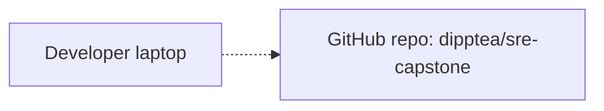

# Architecture

Single canonical view of the **cumulative current system state**. Updated at the end of each phase.

For the *delta* introduced by any given phase (and the failure-mode notes for new components), see that phase's spec under [specs/](specs/).

## Current state

_Pre-Phase-01: nothing deployed yet._

## Request flow

_No live request flow yet — Phase 1 introduces the first one._

## How this is maintained

Maintenance rules live in [`CLAUDE.md`](CLAUDE.md) (hard rule #4 + `/phase-close` flow). This file is updated at phase close — see CLAUDE.md for the full list of phase-close gates.

## Last updated

2026-04-27 — pre-Phase-01 baseline (empty).
