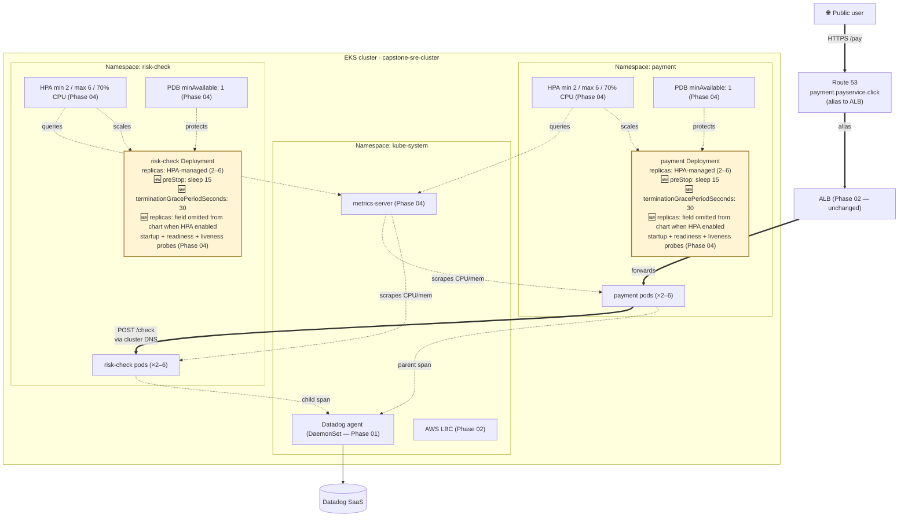
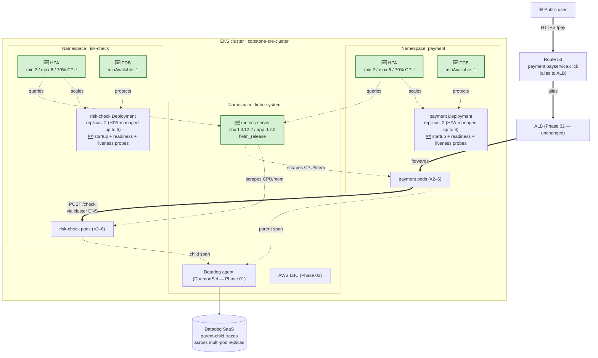
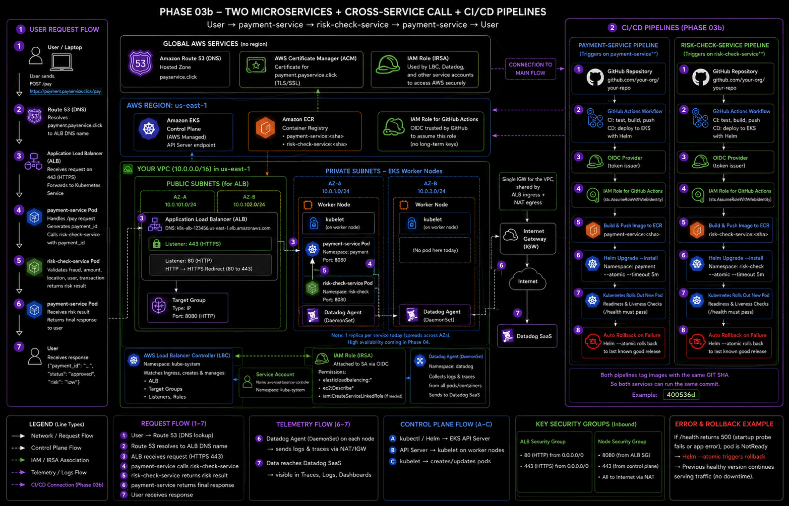
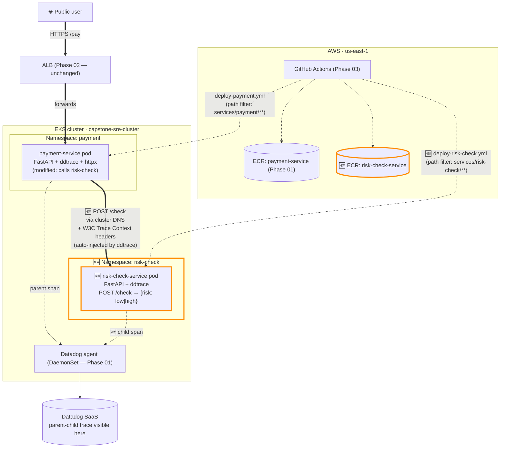
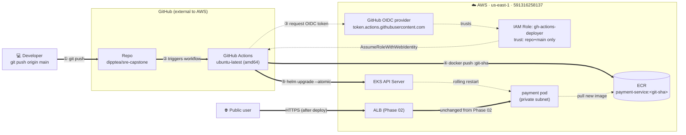
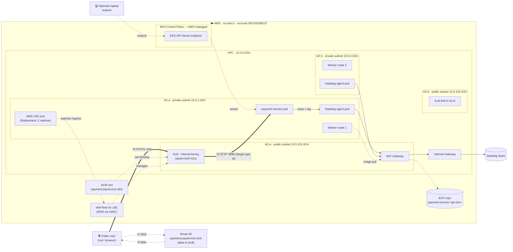
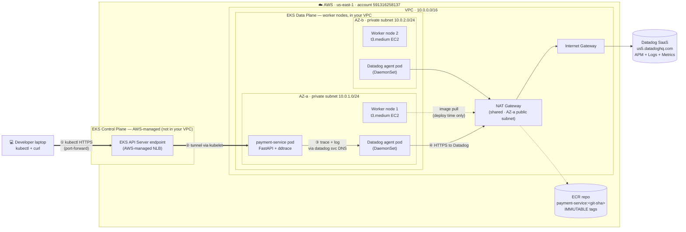

# Architecture

Single canonical view of the **cumulative current system state**. Updated at the end of each phase.

For the *delta* introduced by any given phase (and the failure-mode notes for new components), see that phase's spec under [specs/](specs/).

## Phase 05 — current cumulative state

End-state of Phase 05: Phase 04 + **graceful-shutdown closure + 3 chaos drills + runbook playbooks + 1 production bug fix in code**. Both `payment-service` and `risk-check-service` now have `preStop: sleep 15` + `terminationGracePeriodSeconds: 30` to close the M4b drain-test 502 gap from Phase 04. A subtle Helm + HPA Server-Side Apply field-ownership bug was discovered (and fixed in code) during M4: the Deployment template now conditionally omits `replicas:` when HPA is enabled, eliminating the SSA conflict between Helm and `kube-controller-manager`. **No new AWS resources, no new runtime components** — Phase 05 was a *resilience-validation* phase. The architecture diagram below is materially identical to Phase 04; the changes are configuration-level on existing components.



### Components by layer (cumulative)

All Phase 01–04 categories carry over unchanged — see [Phase 04 baseline](#phase-04-baseline-kept-for-comparison) and earlier sections for the full list. Phase 05 adds:

**Graceful shutdown configuration (Phase 05 M1)**
- Both `payment-service` and `risk-check-service` Deployment pods now have:
  - `lifecycle.preStop.exec.command: ["sh", "-c", "sleep 15"]` — 15-second pause before SIGTERM, gives the ALB time to de-register the pod from its target group BEFORE the application starts shutting down. Closes the Phase 04 M4b 502 gap.
  - `terminationGracePeriodSeconds: 30` — total grace period for the pod to exit, must be ≥ preStopSleep + margin for app drain.
- Parameterized via `gracefulShutdown.preStopSleep` and `gracefulShutdown.terminationGracePeriodSeconds` in `values.yaml`. Initially set to 10s, bumped to 15s after M1 retest (10s left 1 × 502; 15s closes the gap cleanly).

**Helm chart fix for HPA compatibility (Phase 05 M4 — production bug fix in code)**
- Discovered during M4: when a Deployment is HPA-managed, Helm trying to set `.spec.replicas` in its manifest triggers a Kubernetes Server-Side Apply (SSA) field-ownership conflict with `kube-controller-manager` (which owns `.spec.replicas` via the scale subresource). Symptom: `helm upgrade` fails with "conflict with kube-controller-manager subresource scale". Worse: the rollback fails the same way, leaving the helm release in a `failed` state.
- **Fix:** both `helm/payment/templates/deployment.yaml` and `helm/risk-check/templates/deployment.yaml` now conditionally omit `replicas:` when `hpa.enabled` is true:
  ```yaml
  spec:
  {{- if not .Values.hpa.enabled }}
    replicas: {{ .Values.replicas }}
  {{- end }}
  ```
- HPA becomes the sole writer of `.spec.replicas`; SSA has no conflict possible. Future deploys (including any chaos-drill helm operations) succeed cleanly.

**Operational playbooks (Phase 05 M5)**
- `runbook.md` now has fleshed-out incident playbooks for the three failure modes drilled in Phase 05:
  - Pod crashloop / pod kill (from M2)
  - Node drained / unschedulable / lost (from M3)
  - Image pull failure / bad deploy (from M4)
- Each playbook includes: first signal, how to confirm, automated-vs-manual recovery distinction, observed time-to-recovery, escalation criteria.

### Request flow

The user-facing path is unchanged from Phase 04. Phase 05 adds **one new control loop** worth naming:

**Graceful shutdown sequence on pod termination** (now active on every payment + risk-check pod):
1. Kubernetes signals pod termination (drain, eviction, rolling deploy, `kubectl delete pod`)
2. Service endpoints are immediately updated to remove the pod's IP — Kubernetes-side update is instantaneous
3. `preStop` hook runs: `sleep 15` — pod stays alive but is no longer in Service endpoints
4. **In parallel:** AWS LBC notices the endpoint change and instructs the ALB to de-register the pod's IP from the target group. ALB de-registration completes within seconds.
5. After preStop sleep finishes, kubelet sends SIGTERM to the application
6. uvicorn graceful shutdown: in-flight requests are allowed to complete (within the `terminationGracePeriodSeconds: 30` window)
7. Application exits cleanly; pod terminates

The 15-second preStop sleep ensures step 4 completes before step 5 — no traffic is routed to the pod after it starts shutting down.

**New failure-modes (Phase 05 — observed during drills, documented in runbook playbooks):**

- **Application-layer cross-service in-flight race** (M2 finding) — `kubectl delete pod` on a payment pod that's mid-call to risk-check produces ~0.01% 502 rate due to uvicorn closing httpx connections during graceful shutdown. Deferred to Phase 06 (application-level shutdown handler).
- **Involuntary node disruption** (M3 finding) — `aws ec2 terminate-instances` produces a 30-90s window of 5xx (~3.6% error rate during a 5-min load test) while ALB detects dead targets via health checks. PDB does NOT protect this. EKS managed node group auto-provisions a replacement in ~13s.
- **Helm + HPA SSA conflict** (M4 finding) — already fixed in code via conditional `replicas:` rendering. The fix is now part of the chart.
- **Asymmetric scaling under cross-service load** (M3 observation) — services in a synchronous chain can have wildly different HPA-managed replica counts. Payment (more CPU per request) scales to MAX 6; risk-check (lighter per request) stays at 4 under same RPS. HPA scales on CPU, not RPS.

---

## Phase 04 baseline (kept for comparison)

End-state of Phase 04: Phase 03b + HA primitives on both services. `metrics-server` is installed in `kube-system` and feeds CPU metrics to per-service HPAs via the `metrics.k8s.io` API. Both `payment-service` and `risk-check-service` now run **2-to-6 replicas behind HPAs** (target 70% CPU), have a **PodDisruptionBudget** (`minAvailable: 1`), and a **three-probe stack** (startup + readiness + liveness on `/health`). The M4b drain test functionally verified PDB; the M6/M7 load tests verified both HPAs scale together (lockstep) under sustained `/pay` traffic, and confirmed cross-service distributed tracing continues to work across multi-pod replicas. **User-facing request path is unchanged from Phase 03b** — the system can now absorb a node drain or a traffic spike without dropping availability.



### Components by layer (cumulative)

All Phase 01–03b categories carry over unchanged — see [Phase 03b baseline](#phase-03b-baseline-kept-for-comparison) and earlier sections for the full list (Network, Compute, Observability, Application, Public ingress, Deploy automation, Cross-service tracing).

**HA / scaling primitives (Phase 04)**
- `metrics-server` installed via `helm_release` in [infra/metrics-server.tf](infra/metrics-server.tf) — chart `3.12.2` (app `0.7.2`), `kube-system` namespace. Feeds CPU/memory to HPAs via the `metrics.k8s.io` API. `kubectl top nodes` and `kubectl top pods -A` work because of this.
- Per-service `HorizontalPodAutoscaler` (`autoscaling/v2`): `minReplicas: 2`, `maxReplicas: 6`, `averageUtilization: 70` on CPU. Same on both `payment` and `risk-check` for lockstep scaling per the spec's Goal.
- Per-service `PodDisruptionBudget` (`policy/v1`): `minAvailable: 1` on both. Selector matches `app: payment-service` and `app: risk-check-service` respectively. Voluntary-disruption only — does not protect against pod crashes or node hardware failure.
- Per-service three-probe stack on `/health`:
  - **startup** probe — period 5s, failureThreshold 6 (30s boot budget). Blocks readiness + liveness during boot; runs once.
  - **readiness** probe — period 5s, failureThreshold 3 (15s before removal from Service endpoints).
  - **liveness** probe — period 10s, failureThreshold 6 (60s before kill — deliberately *looser* than readiness, to avoid restart cascades when downstreams are slow).
- Both services bumped from `replicas: 1` to `replicas: 2` to match HPA `minReplicas` (avoids HPA scaling down to 1 on first reconcile).
- Helm chart additions: `helm/payment/values.yaml` + `helm/payment/templates/{hpa.yaml,pdb.yaml}`; same shape on `helm/risk-check/`.
- Public ingress restored to chart defaults (was implicitly held by `--reuse-values`): `ingress.enabled: true` and `certificateArn` are now hardcoded in `helm/payment/values.yaml` instead of being passed via `--set` at install time.

**Helm-install pattern shift (Phase 04 M1)**
- New cluster addons going forward use the `helm_release` Terraform resource (declarative, drift-detected, supports `terraform plan` showing real diffs on chart version / values changes).
- Existing addons (Datadog, AWS LBC) remain on the older `null_resource + local-exec` pattern. Migration to `helm_release` is tracked as future cleanup, not Phase 04 scope.

### Request flow

The user-facing path is unchanged from Phase 03b — `curl https://payment.payservice.click/pay` still flows Route 53 → ALB → payment pod → risk-check pod → response. Phase 04 adds **two new control loops inside the cluster** that are not on the user request path but are the whole point of the phase.

**HPA scale-up loop** (runs every ~15 seconds, per HPA):
1. `metrics-server` scrapes pod CPU/memory from each kubelet's `/metrics/resource` endpoint (every ~15s, in-cluster).
2. Each HPA reconciles: queries `metrics.k8s.io` for the pods matched by `scaleTargetRef`, computes `desired = ceil(currentReplicas × currentMetric / targetMetric)`.
3. If `desired > current`, HPA patches the Deployment's `replicas` field.
4. Deployment controller schedules new pods; the kube-scheduler places them on whichever node has capacity (preferring spread across nodes).
5. New pod boots → startup probe gates → readiness probe passes (~5–10s after container starts) → pod joins the Service's `endpoints` → ALB target group registers the pod IP.
6. After load drops, HPA waits for the **scale-down stabilization window (300s default)** of sustained low CPU before removing pods.

**PDB enforcement** (synchronous, on every eviction attempt):
1. Operator runs `kubectl drain` or the autoscaler issues an eviction.
2. The Kubernetes Eviction API checks the relevant PDB before approving each pod eviction.
3. If allowing the eviction would drop ready replicas below `minAvailable` → eviction REJECTED (caller retries until safe).
4. If allowed → pod evicted; Deployment controller schedules a replacement; `ALLOWED DISRUPTIONS` dynamically updates as pods come and go.
5. PDB only governs *voluntary* disruption (drain, eviction, cluster upgrade). Involuntary disruption (node hardware failure, kernel panic) ignores PDB by design.

**New failure-modes (Phase 04):**

- **Liveness restart cascade** — if a future change makes the liveness probe call downstream services, a slow downstream causes liveness to fail on every payment pod → kubelet restarts every pod → replacements also can't reach the downstream → restart storm across the entire Deployment. Mitigation: liveness MUST be in-process only. We audited both services' `/health` handlers (both pure in-process at end of Phase 04); any future change touching `/health` should re-check this invariant.
- **Graceful-shutdown gap (KNOWN, DEFERRED)** — when a payment pod terminates (drain, rolling deploy), the ALB takes ~3-5 seconds to de-register it from the target group. During that window, in-flight requests routed to the dying pod return 502. Observed in M4b drain test (5 × 502 out of ~100 requests). PDB does not address this; the fix is `preStop` lifecycle hook + `terminationGracePeriodSeconds: 30`. Deferred to Phase 05 chaos-drill prep.
- **HPA hits MAX under sustained load** — observed in M6: payment CPU went to 488% of request, HPA wanted ~14 pods but was capped at `maxReplicas: 6`. Driven by the request-vs-actual mismatch (request 100m, actual idle ~3m, actual under load 488m). Mitigation in production: tune CPU requests after observing real usage (`kubectl top pods` under load); add cluster autoscaler if true MAX is needed; per-service `maxReplicas` bump if appropriate.
- **Pending pods when HPA exceeds node capacity** — not observed (max=6 chosen to fit on 2× t3.medium with system overhead). Would manifest as `kubectl get pods` showing `Pending` and `kubectl describe pod` showing "0/2 nodes available: insufficient cpu". Mitigation: lower `maxReplicas`, add nodes, or add cluster autoscaler.
- **metrics-server down** — if metrics-server's pod is down or unhealthy, all HPAs show `TARGETS: <unknown>/70%` and freeze at current replica count (no scale up, no scale down). PDB and probes are independent and continue to work. Diagnostic: `kubectl get deploy -n kube-system metrics-server` and `kubectl top nodes`. Mitigation: `kubectl rollout restart deploy/metrics-server -n kube-system`.
- **`--reuse-values` footgun (lesson from M2 fix)** — the original CI workflow's `--reuse-values` flag had two effects: (a) blocked new schema additions in `values.yaml` from being picked up, and (b) silently preserved old `--set`-time values (like `ingress.enabled=true`) across deploys. Removing it to fix (a) exposed (b) — Helm reverted `ingress.enabled` to the chart default `false` and silently deleted the public ALB. Mitigation now in place: all configuration is committed to `values.yaml`; `--set` in CI is reserved only for runtime-injected values (image repository + tag).

---

## Phase 03b baseline (kept for comparison)

End-state of Phase 03b: Phase 03 + a second internal service `risk-check-service` that `payment-service` calls synchronously during `/pay`. Datadog APM now shows ONE distributed trace spanning BOTH services with parent-child span relationships — establishes the foundation for Phase 06 downstream-service latency/failure drills. **User-facing request path is unchanged from Phase 02** — `curl https://payment.payservice.click/pay` still hits the ALB → payment pod; the new behavior is invisible to external callers (the response just gains a `risk` field).


*Overview above is the high-level visual. The detailed diagram below shows the cumulative AWS topology with both microservices, both CI/CD pipelines, the cross-service call, and the failure-rollback example.*



*Mermaid version below for source-controlled editing — focuses on the cross-service call + deploy flow specifically.*



### Components by layer (cumulative)

All Phase 01–03 categories carry over unchanged — see [Phase 03 baseline](#phase-03-baseline-kept-for-comparison) section below for full list (Network, Compute, Observability, Application, Public ingress, Deploy automation).

**Cross-service tracing (Phase 03b)**
- New service: `risk-check-service` (FastAPI, single replica) — synthetic risk decision; always returns `{"risk": "low"}` for Phase 03b (per resolved Open Q #1).
- New namespace: `risk-check` (separate from `payment`).
- New ECR repo: `risk-check-service` with the same lifecycle policy + IMMUTABLE tags + scan-on-push as payment.
- New Helm chart: `helm/risk-check/` (Deployment + Service + ServiceAccount + ConfigMap; **no Ingress** — internal service only).
- New CI/CD workflow: `.github/workflows/deploy-risk-check.yml` with path filters scoped to `services/risk-check/**` and `helm/risk-check/**`. Existing `deploy.yml` renamed to `deploy-payment.yml` and given symmetric path filters.
- IAM: existing `gh-actions-deployer` role's inline policy extended to permit ECR push to BOTH repos (no new role; one CI role serves both services).
- Cross-service call: `payment-service` calls `risk-check-service` synchronously via cluster DNS (`risk-check-service.risk-check.svc.cluster.local`) during `/pay` handling, with a 2-second timeout (`httpx.post(timeout=2.0)`).
- Trace propagation: dd-trace SDK auto-injects W3C `traceparent` and `tracestate` headers into the outgoing httpx call; risk-check's dd-trace reads them and creates a child span linked to payment's parent span.

### Request flow

End-to-end path for `POST /pay` now spans two services:

1. **DNS + TLS + ALB** — unchanged from Phase 02 (Route 53 alias → ALB :443 → ACM cert validates → ALB forwards to payment pod IP on :8080).
2. **payment-service receives /pay** — generates `payment_id`, dd-trace span begins (parent).
3. **payment-service calls risk-check** — `httpx.post("http://risk-check-service.risk-check.svc.cluster.local/check", json={"payment_id": ...}, timeout=2.0)`. dd-trace auto-injects `traceparent` header into the outgoing request.
4. **risk-check-service receives /check** — dd-trace reads the `traceparent` header, creates a span whose `parent_id` matches payment's span. Returns `{"risk": "low"}`.
5. **payment-service returns to user** — combines `payment_id` + `risk` into response JSON, returns 200 OK to the ALB → laptop.
6. **Async telemetry** — both spans ship to Datadog agent → Datadog SaaS, which assembles them into one distributed trace based on shared `trace_id` and parent-child `span_id` references.

**Failure-mode addition (Phase 03b):**

- **Synchronous coupling = cascading failure risk.** If `risk-check-service` is down or slow, `payment-service`'s `/pay` either times out (after 2s) or returns 500. The 2s timeout is a floor (prevents indefinite hang), not isolation (no graceful degradation yet). Phase 06 explores retries, circuit breakers, and graceful fallback.
- **Trace propagation broken silently.** If risk-check's Dockerfile loses its `ddtrace-run` wrapper, payment + risk-check still work end-to-end, but Datadog shows them as TWO unrelated traces instead of ONE parent-child trace. Diagnostic: search Datadog APM by `service:risk-check-service` — if traces appear there but `parent_id` is null/missing, propagation is broken.

---

## Phase 03 baseline (kept for comparison)

End-state of Phase 03: Phase 02 + automated CI/CD deploy chain. Pushing to `main` builds, tests, pushes to ECR with an immutable git-SHA tag, and runs `helm upgrade --atomic` against EKS — replacing manual deploys with a hands-free pipeline that auto-rolls back on failure. **User request path is unchanged from Phase 02** — `https://payment.payservice.click/pay` still flows through Route 53 alias → ALB → pod.


*Overview above shows the two parallel flows: **user request flow** (top, Phase 01+02, unchanged) and **CI/CD deploy flow** (bottom, Phase 03, new). The detailed diagram below shows the cumulative AWS topology with the CI/CD pipeline as a vertical add-on on the right.*


*Mermaid version below for source-controlled editing — focuses on the deploy flow specifically.*



### Components by layer (cumulative)

All Phase 01–02 categories carry over unchanged — see [Phase 02 baseline](#phase-02-baseline-kept-for-comparison) section below for the full list (Network, Compute, Observability, Application, Public ingress).

**Deploy automation (Phase 03)**
- GitHub Actions workflow `.github/workflows/deploy.yml` — three jobs: `test` (always), `build-and-push` (push to main only), `deploy` (push to main only, `helm upgrade --install --atomic --timeout 5m`)
- IAM OIDC provider for `token.actions.githubusercontent.com` (alongside the existing EKS OIDC provider — separate AWS resources, different issuers)
- IAM Role `gh-actions-deployer` — trust policy locked via `StringEquals` on `sub:repo:dipptea/sre-capstone:ref:refs/heads/main`
- Inline IAM policy `gh-actions-deployer-permissions`: ECR push verbs (scoped to `payment-service` repo), `ecr:GetAuthorizationToken` (resource `*`, AWS API limitation), `eks:DescribeCluster` (scoped to `capstone-sre-cluster`). No S3, no Secrets Manager, no general read.
- EKS access entry granting `AmazonEKSClusterAdminPolicy` to the role (broad scope, parallel to CapstoneAdmin SSO role's existing access entry; tighter scoping deferred to Phase 07)
- Image tagging: short git SHA (7 chars), immutable in ECR (lifecycle keeps last 10)
- AWS auth: OIDC only — no static AWS keys stored in GitHub repository secrets

### Request flow

The "request" this phase introduced is a **deploy** (the user-request path is unchanged from Phase 02). End-to-end deploy on push to main:

1. **Developer pushes to main** — GitHub triggers the workflow on `ubuntu-latest` (amd64).
2. **Test job runs** — `pytest` (smoke test) + `docker build` validation. Fails fast on any test failure; if it fails, `build-and-push` and `deploy` jobs don't run.
3. **Workflow assumes IAM role via OIDC** — `AssumeRoleWithWebIdentity` with the GitHub OIDC token. STS validates the `sub` claim matches `repo:dipptea/sre-capstone:ref:refs/heads/main`. Returns short-lived (~15 min) AWS credentials.
4. **Build & push** — image tagged with the commit's short SHA, pushed to ECR.
5. **Deploy** — `aws eks update-kubeconfig` then `helm upgrade --install --atomic --timeout 5m --set image.tag=<sha>`. Helm rolls out new pod alongside old; readiness probes hit `/health`.
6. **If new pod becomes Ready within 5 min** → old pod terminated, new pod serves traffic. Workflow ✅ green.
7. **If new pod fails to become Ready within 5 min** → Helm `--atomic` triggers automatic rollback to previous revision. Old pod keeps serving. Workflow ❌ red. **Public endpoint never goes down.**

**Pull request flow** (validated in Phase 03 M5): on `pull_request` event, only the `test` job runs; `build-and-push` and `deploy` are skipped via `if: github.event_name == 'push' && github.ref == 'refs/heads/main'`. Provides PR-level CI signal without shipping anything.

**New failure-modes (Phase 03):**

- **GitHub OIDC thumbprint stale** — if GitHub rotates their TLS cert and `terraform apply` hasn't been re-run since, the `tls_certificate` data source's value freezes the old thumbprint in the AWS OIDC provider. Result: silent `AccessDenied` on every `AssumeRoleWithWebIdentity`. Fix: `cd infra && terraform apply` to refresh.
- **Trust policy `sub` mismatch** — feature branches and PR-from-fork commits cannot assume the role (intentional). If you ever need to deploy from a non-main branch (e.g., emergency hotfix), use the documented break-glass: manual `helm upgrade` from operator laptop with the CapstoneAdmin SSO role.
- **Test gate flake** — a flaky test on `main` blocks all deploys until fixed/quarantined. Treat test flake as a real bug (don't `--no-verify` past it); the gate's value is its credibility.

---

## Phase 02 baseline (kept for comparison)

End-state of Phase 02: Phase 01 + public HTTPS via ALB. Public users hit `https://payment.payservice.click/pay` from any laptop on the internet → 200, with no `--insecure` flag, observable end-to-end in Datadog APM and Logs.


*Diagram above is the polished view (PNG). The Mermaid version below is the source-controlled equivalent — easier to edit in PRs, renders inline in GitHub.*



### Components by layer (cumulative)

**Network (Phase 01, Milestone 3)**
- VPC `10.0.0.0/16` in `us-east-1`
- 2 public subnets (`10.0.101.0/24`, `10.0.102.0/24`) — host the NAT GW + ALB
- 2 private subnets (`10.0.1.0/24`, `10.0.2.0/24`) — host worker nodes + pods
- 1 shared NAT Gateway in AZ-a (Phase 5 will expand to per-AZ)
- 1 Internet Gateway

**Compute (Phase 01, Milestone 4)**
- EKS cluster `capstone-sre-cluster` (Kubernetes 1.34, public + private API endpoint, IRSA enabled)
- Managed node group: 2× `t3.medium` EC2 instances, one per AZ, 30 GB gp3 EBS each
- AWS access via SSO role `CapstoneAdmin` (no long-lived IAM keys)

**Observability (Phase 01, Milestone 5)**
- Datadog Helm chart deployed as DaemonSet (one agent pod per node)
- Each agent pod runs 3 containers: `agent`, `trace-agent`, `process-agent`
- Telemetry ships to `us5.datadoghq.com` via NAT GW egress
- `logs.containerCollectAll = true` enables stdout/stderr collection from all pods

**Application (Phase 01, Milestone 6 + Phase 02 Milestone 6)**
- ECR repository `payment-service` with IMMUTABLE git-SHA tags (lifecycle policy keeps last 10)
- FastAPI app exposing `POST /pay` (returns synthetic payment_id) + `GET /health`
- Hand-written Helm chart (Deployment + Service + ServiceAccount + ConfigMap + **Ingress added in Phase 02**)
- `ddtrace-run` entrypoint + `python-json-logger` for structured JSON
- `DD_LOGS_INJECTION=true` injects `dd.trace_id`/`dd.span_id` into every log line
- Service points to Datadog agent via cluster DNS (`datadog.datadog.svc.cluster.local:8126`)

**Public ingress (Phase 02)**
- Domain `payservice.click` (Route 53 registration, 1-year, auto-renew off, lapses 2027-05-04)
- Route 53 hosted zone `payservice.click` (auto-created with domain)
- Alias `A` record `payment.payservice.click` → ALB
- ACM public cert for `payment.payservice.click` (DNS-validated, ACM auto-renews while attached to a load balancer)
- AWS Application Load Balancer (`internet-facing`, spans both AZs)
  - HTTP `:80` listener — `ssl-redirect` → 443
  - HTTPS `:443` listener — ACM cert attached
  - Target group `target-type: ip` (forwards to pod IP, skips kube-proxy hop)
  - Health check `GET /health`
- AWS Load Balancer Controller (Helm chart `eks/aws-load-balancer-controller` v1.11.0; controller v2.11.0; Deployment in `kube-system`, 2 replicas with leader election)
- IRSA IAM role `capstone-sre-lbc-irsa` with AWS-published LBC policy; trust policy locked to `kube-system:aws-load-balancer-controller`
- Subnet tags: `kubernetes.io/role/elb=1` (public) + `kubernetes.io/role/internal-elb=1` (private) for LBC discovery

### Request flow

End-to-end trace path for `curl -X POST https://payment.payservice.click/pay` (verified in Phase 02 Milestone 8):

1. **DNS resolution:** laptop's resolver → Route 53 alias → ALB's public IPs (one per AZ)
2. **TLS handshake:** ALB presents the ACM cert; laptop validates against the public CA chain (no `--insecure` needed)
3. **ALB routing:** Host header matches the Ingress rule for `payment.payservice.click`; ALB forwards plain HTTP to the pod's VPC IP on `:8080` (target type `ip`, skips kube-proxy)
4. **Pod handles request:** FastAPI generates a `payment_id`, emits a JSON log line with `dd.trace_id` injected by ddtrace, returns 200
5. **Response:** ALB re-wraps in TLS, returns to laptop
6. **Trace + log shipping (async, NAT-dependent):** unchanged from Phase 01 — pod → Datadog agent (via cluster DNS) → Datadog SaaS via NAT GW
7. **Correlation:** trace + log linked by `dd.trace_id` in Datadog UI

**Operator path** (kubectl port-forward → EKS API → kubelet → pod) is still available for debugging but is no longer the primary user request path.

**New failure-mode (Phase 02):** if the LBC pod dies, the *existing ALB keeps routing fine* (AWS-managed, lives outside the cluster) — but pod-IP changes stop being reflected. During a rollout, traffic still flows to dead pod IPs and you get 502s. Existing pods unaffected; new deploys silently broken.

---

## Phase 01 baseline (preserved for comparison)

End-state of Phase 01: VPC + EKS + payment-service + Datadog observability pipeline. One end-to-end traced `curl` request whose trace correlates to a log line via shared `trace_id`.


*Diagram above is the polished view (PNG). The Mermaid version below is the source-controlled equivalent — easier to edit in PRs, renders inline in GitHub.*



### Components by layer

**Network (Phase 01, Milestone 3)**
- VPC `10.0.0.0/16` in `us-east-1`
- 2 public subnets (`10.0.101.0/24`, `10.0.102.0/24`) — host the NAT GW
- 2 private subnets (`10.0.1.0/24`, `10.0.2.0/24`) — host worker nodes
- 1 shared NAT Gateway in AZ-a (Phase 5 will expand to per-AZ)
- 1 Internet Gateway

**Compute (Phase 01, Milestone 4)**
- EKS cluster `capstone-sre-cluster` (Kubernetes 1.34, public + private API endpoint, IRSA enabled)
- Managed node group: 2× `t3.medium` EC2 instances, one per AZ, 30 GB gp3 EBS each
- AWS access via SSO role `CapstoneAdmin` (no long-lived IAM keys)

**Observability (Phase 01, Milestone 5)**
- Datadog Helm chart deployed as DaemonSet (one agent pod per node)
- Each agent pod runs 3 containers: `agent`, `trace-agent`, `process-agent`
- Telemetry ships to `us5.datadoghq.com` via NAT GW egress
- `logs.containerCollectAll = true` enables stdout/stderr collection from all pods

**Application (Phase 01, Milestone 6)**
- ECR repository `payment-service` with IMMUTABLE git-SHA tags (lifecycle policy keeps last 10)
- FastAPI app exposing `POST /pay` (returns synthetic payment_id) + `GET /health`
- Hand-written Helm chart (Deployment + Service + ServiceAccount + ConfigMap)
- `ddtrace-run` entrypoint + `python-json-logger` for structured JSON
- `DD_LOGS_INJECTION=true` injects `dd.trace_id`/`dd.span_id` into every log line
- Service points to Datadog agent via cluster DNS (`datadog.datadog.svc.cluster.local:8126`)

## Request flow

End-to-end trace path for a `curl POST /pay` (verified in Phase 01 Milestone 7):

1. **Setup (one-time per session):** `kubectl port-forward svc/payment 8080:80 -n payment` opens an HTTPS tunnel from laptop → public EKS API server endpoint → kubelet on the pod's node
2. **Request (synchronous, NAT-independent):** `curl http://localhost:8080/pay` is tunneled through kubelet → pod's port 8080
3. **App handles request:** FastAPI generates a `payment_id`, emits a JSON log line with `dd.trace_id` injected by ddtrace, returns 200
4. **Trace shipping (async, NAT-dependent):** ddtrace ships the span to the Datadog agent pod via cluster DNS (NOT loopback — we use the K8s service, not host-IP); the agent batches and ships to `us5.datadoghq.com` via NAT GW
5. **Log shipping (async, NAT-dependent):** the agent's log collector tails the pod's stdout/stderr file on the node and ships to Datadog SaaS
6. **Correlation:** in Datadog, clicking the trace's span shows the log line with the matching `dd.trace_id`, and clicking a log shows its connected trace

**Failure-mode reminder:** if the NAT GW dies, steps 1–3 keep working (control-plane path). Steps 4–5 go silent — the system *works*, but observability *lies*. This is the partial-observability lesson Phase 5's NAT drill will demonstrate live.

## How this is maintained

Maintenance rules live in [`CLAUDE.md`](CLAUDE.md) (hard rule #4 + `/phase-close` flow). This file is updated at phase close — see CLAUDE.md for the full list of phase-close gates.

## Last updated

2026-05-12 — Phase 05 closed. Added: `lifecycle.preStop.exec.command: ["sh", "-c", "sleep 15"]` and `terminationGracePeriodSeconds: 30` on both `payment-service` and `risk-check-service` Deployments (parameterized via `gracefulShutdown.preStopSleep` and `gracefulShutdown.terminationGracePeriodSeconds` in `values.yaml`); initial value `sleep 10` retried to `sleep 15` after the first drain test left 1 × 502 in the curl loop. Chart fix: conditional `replicas:` rendering in both `helm/payment/templates/deployment.yaml` and `helm/risk-check/templates/deployment.yaml` — when `hpa.enabled` is true, the `replicas:` field is omitted from the rendered manifest, eliminating the Kubernetes Server-Side Apply field-ownership conflict between Helm and HPA (`kube-controller-manager` via the scale subresource). Surfaced + fixed during M4. Three chaos drills run: M2 pod-kill drill (graceful, 99.99% success, 0.01% residual deferred to Phase 06), M3 node-terminate drill (real EC2 termination, ~13s for EKS managed group to provision replacement, 3.64% error rate during 5-min load — within spec's "some 5xx is acceptable" criterion since PDB doesn't protect involuntary disruption), M4 image-pull failure drill (`helm upgrade --set image.tag=nonexistent-deadbeef` → ImagePullBackOff → `--atomic` rolled back to previous good revision → zero user-visible impact). `runbook.md` now has incident playbooks for pod crashloop, node drained/lost, image pull failure. **Cumulative cost unchanged at ~$160.50/mo** — Phase 05 added $0 of new AWS resources (no new EC2, no new ALB, no new networking). All changes are Kubernetes-level chart additions.

2026-05-09 — Phase 04 closed. Added: `metrics-server` (chart 3.12.2 / app 0.7.2) installed via `helm_release` Terraform resource in `kube-system` (NEW Helm-install pattern; Datadog and LBC remain on the older `null_resource + local-exec` pattern, deferred migration). HorizontalPodAutoscaler (`autoscaling/v2`, min 2 / max 6, target 70% CPU) added on both services. PodDisruptionBudget (`policy/v1`, `minAvailable: 1`) added on both services. Three-probe stack (startup + readiness + liveness on `/health`, all parameterized in `values.yaml`) added to both services; existing hardcoded readiness + liveness probes replaced. Both Deployments bumped from `replicas: 1` to `replicas: 2`. Public ingress restored to chart defaults (`ingress.enabled: true` and `certificateArn` now in `values.yaml` instead of being held implicitly by `--reuse-values`); `--reuse-values` removed from `deploy-payment.yml` after M2 deploy failure exposed it. Route 53 alias re-applied via `terraform apply` after Ingress recreation gave the ALB a new DNS name. M4b drain test functionally verified PDB (one payment pod evicted, replacement Ready in ~6s, service stayed up — observed ~5 transient 502s during ALB de-registration window, graceful-shutdown fix deferred to Phase 05). M6 load test (`hey -z 5m -c 50 POST /pay`) confirmed both HPAs scale to MAX (6) within ~12s and back down after the 300s scale-down stabilization window; 25,236 requests with 99.96% 2xx (8 × 500 + 2 × 502 during scale-up window). M7 cross-service trace verification confirmed in Datadog APM — single trace IDs span both `payment-service` and `risk-check-service` across multi-pod replicas. Cumulative cost unchanged (~$160.50/mo).

2026-05-07 — Phase 03b closed. Added: `risk-check-service` (new FastAPI service in `risk-check` namespace, 1 replica, synthetic always-low risk decision); new ECR repo + extended `gh-actions-deployer` inline policy to push both repos; new Helm chart `helm/risk-check/`; new CI/CD workflow `.github/workflows/deploy-risk-check.yml` with path filters for per-service deploy independence; existing `deploy.yml` renamed to `deploy-payment.yml` with symmetric path filters; payment-service modified to call risk-check synchronously via cluster DNS with 2s timeout. Datadog APM now shows distributed parent-child trace across both services. Cumulative cost unchanged (~$160.50/mo).

2026-05-06 — Phase 03 closed. Added: GitHub Actions OIDC provider, IAM Role `gh-actions-deployer` with minimum-scope inline policy (ECR push + EKS DescribeCluster), EKS access entry granting cluster-admin RBAC, GitHub Actions workflow `.github/workflows/deploy.yml` with test → build → deploy jobs and `helm --atomic` auto-rollback. CI/CD pipeline validated end-to-end including a deliberate broken-deploy test that auto-rolled-back without dropping the public endpoint. User request path unchanged from Phase 02.

2026-05-05 — Phase 02 closed. Added: Route 53 alias + ACM cert + AWS Application Load Balancer + AWS Load Balancer Controller (with IRSA) + subnet tags. Public HTTPS path now the primary user request path; kubectl port-forward retained as ops fallback for debugging.

2026-05-01 — Phase 01 closed. VPC + EKS + Datadog DaemonSet + payment-service deployed; end-to-end trace + log correlation verified via curl POST /pay.
