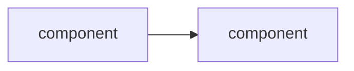
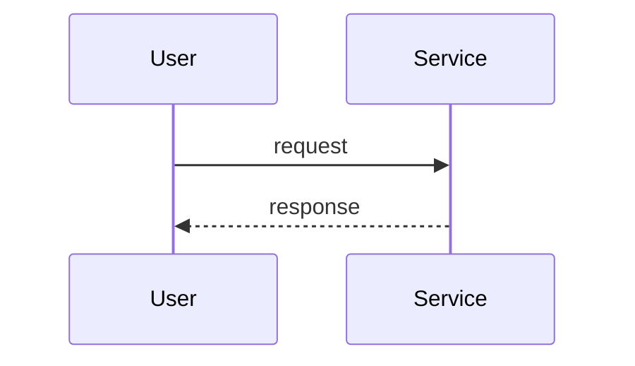

# Phase NN — <title>

## Goal

One or two sentences. The single most important outcome. If everything else slips and only this works, the phase succeeded.

## Non-goals

Explicitly list what is **not** in scope this phase. Reduces drift more than any other section.

- ...

## Background

Why this phase, what it depends on, what comes after. Link to ROADMAP.md rows or prior phase specs.

## Design

### Decisions & rationale

The technical approach in prose. Concrete enough that someone else could implement from this section alone.

- AWS / k8s resources to create or modify
- Key configuration choices and the reason for each

### Architecture (delta this phase)

Mermaid `flowchart` showing the cumulative system state at end of this phase. New components introduced *this* phase noted with a comment or distinct style. Update [../ARCHITECTURE.md](../ARCHITECTURE.md) at phase close to reflect the new cumulative state.

### Request flow

Mermaid `sequenceDiagram` showing how a representative request travels through the system. Mark the trace boundary if relevant.

### Failure-mode notes

For each *new* component introduced this phase: if it dies or degrades, what's the first symptom, what's the blast radius, what's the mitigation? Plain text, one bullet per component. **This is the most important sub-section for SRE muscle.**

- **<component>**: symptom = ?, blast radius = ?, mitigation = ?

## Validation

How we know it worked. Observable, checkable conditions — not "looks fine."

- [ ] ...
- [ ] ...

## Rollback / undo

If this phase goes wrong mid-execution, how do we get back to safety?

- `terraform destroy -target=...`
- `helm rollback ...`
- Manual cleanup steps

## Comprehension checkpoints

Things the user should be able to explain unprompted at end of phase. Used by `/spec-check` to drive question selection.

- [ ] ...
- [ ] ...

## Open questions

Must be resolved before `status: approved`.

- [ ] ?

## Decision log

Append entries during execution when something deviates or a choice gets made.

- YYYY-MM-DD: chose X over Y because Z.
