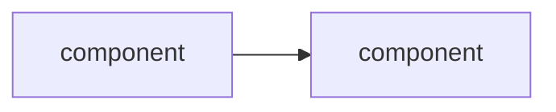
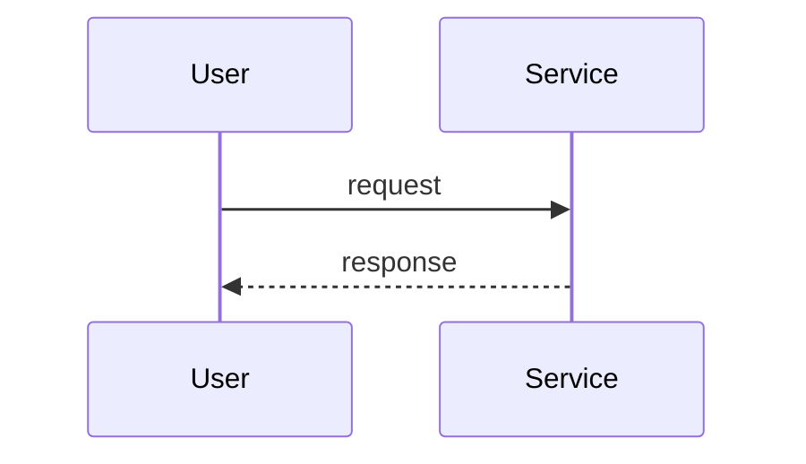

# Phase 01 — Hello, observable payment

## Goal

Spin up a VPC + EKS + one Helm-deployed service, with a Datadog trace correlating to a log line, working on a `curl` request.

## Non-goals

If we find ourselves reaching for any of these in Phase 01, stop — it's drift, and it belongs to a later phase.

- **Ingress / ALB / HTTPS termination** — Phase 2. Phase 01 reaches the service via `kubectl port-forward` or an internal `curl` from inside the cluster, not via a public hostname.
- **Second service / service-to-service traces** — Phase 2.
- **CI/CD pipeline** — Phase 3. Deploys in Phase 01 are manual `terraform apply` and `helm upgrade --install`.
- **HPA / PDB / autoscaling / probes tuning** — Phase 4. A single replica with default probes is fine.
- **Failure injection / chaos drills** — Phase 5–6.
- **WAF / Datadog synthetics / alerting → Jira** — Phase 7.
- **Multi-region** — stretch only.

## Background

Phase 01 establishes the **observability pipeline** that every later phase depends on. The end-state isn't "a cluster" — it's a `curl` request whose Datadog APM trace correlates to a log line via a shared `trace_id`. Without that visibility in place, every later debugging exercise (failure injection, scaling validation, deploy strategies) is guesswork. You can't debug what you can't see.

**Depends on (external, must exist before `terraform apply`):**

- AWS account with billing enabled + budget alarm ($200 soft / $500 hard — see [../INVENTORY.md](../INVENTORY.md))
- Datadog trial (agent + APM + log correlation)
- GitHub repo for code
- Jira free tier (not used until Phase 7, but set up now to avoid the context switch later)
- Local tooling: `aws`, `kubectl`, `helm`, `terraform`, `docker`

VS Code is the editor; not a dependency.

**What comes after:** Phase 02 inherits the cluster, the payment service, `kubectl` access, and the trace pipeline — and adds external access on top (ALB Ingress, ACM/HTTPS termination, a second service so traces span service boundaries). The full dependency chain is laid out in [../ROADMAP.md](../ROADMAP.md): observability → external access → CI/CD → HA/scaling → failure injection → WAF/alerts → deploy strategy. Every later phase **adds** on top of this foundation; none rebuild it.

## Design

### Decisions & rationale

(to be filled)

### Architecture (delta this phase)

(to be filled)

### Request flow

(to be filled)

### Implementation outline

(to be filled — list 4–8 milestones in build order, milestone-level not command-level. Each milestone is a natural pause point for a comprehension question + verification step.)

1. ...
2. ...

### Failure-mode notes

(to be filled)

## Validation

(to be filled)

- [ ] ...

## Rollback / undo

(to be filled)

## Comprehension checkpoints

(to be filled)

- [ ] ...

## Open questions

(to be filled)

- [ ] ?

## Decision log

(append entries during execution when something deviates or a choice gets made)
