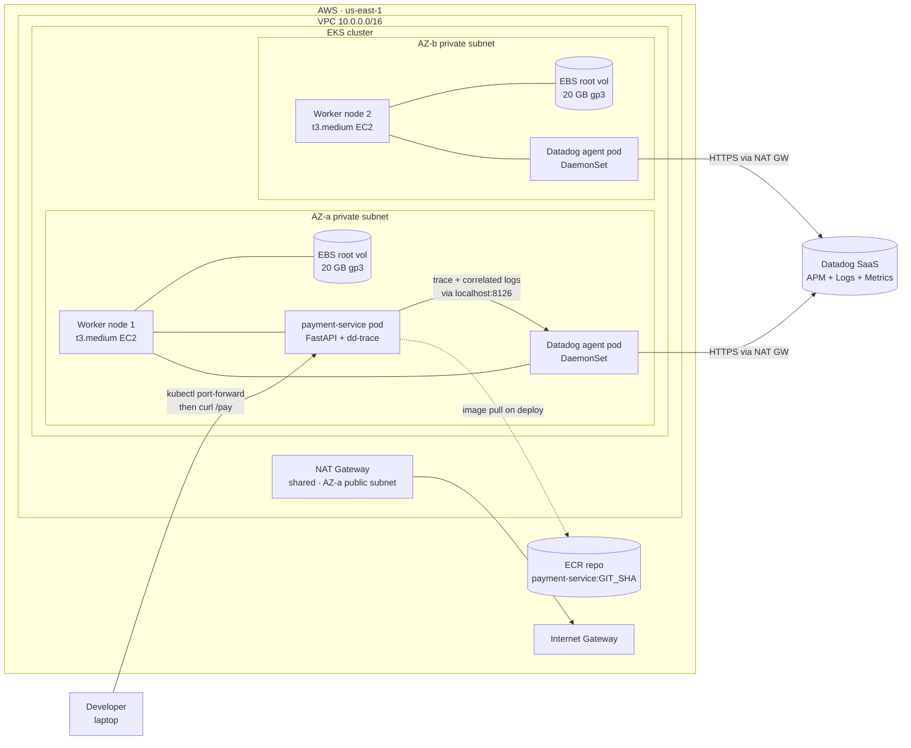

# Phase 01 — Hello, observable payment

## Goal

Spin up a VPC + EKS + one Helm-deployed service, with a Datadog trace correlating to a log line, working on a `curl` request.

## Non-goals

If we find ourselves reaching for any of these in Phase 01, stop — it's drift, and it belongs to a later phase.

- **Ingress / ALB / HTTPS termination** — Phase 2. Phase 01 reaches the service via `kubectl port-forward` or an internal `curl` from inside the cluster, not via a public hostname.
- **Second service / service-to-service traces** — Phase 2.
- **CI/CD pipeline** — Phase 3. Deploys in Phase 01 are manual `terraform apply` and `helm upgrade --install`.
- **HPA / PDB / autoscaling / probes tuning** — Phase 4. A single replica with default probes is fine.
- **Failure injection / chaos drills** — Phase 5–6.
- **WAF / Datadog synthetics / alerting → Jira** — Phase 7.
- **Multi-region** — stretch only.

## Background

Phase 01 establishes the **observability pipeline** that every later phase depends on. The end-state isn't "a cluster" — it's a `curl` request whose Datadog APM trace correlates to a log line via a shared `trace_id`. Without that visibility in place, every later debugging exercise (failure injection, scaling validation, deploy strategies) is guesswork. You can't debug what you can't see.

**Depends on (external, must exist before `terraform apply`):**

- AWS account with billing enabled + budget alarm ($200 soft / $500 hard — see [../INVENTORY.md](../INVENTORY.md))
- Datadog trial (agent + APM + log correlation)
- GitHub repo for code
- Jira free tier (not used until Phase 7, but set up now to avoid the context switch later)
- Local tooling: `aws`, `kubectl`, `helm`, `terraform`, `docker`

VS Code is the editor; not a dependency.

**What comes after:** Phase 02 inherits the cluster, the payment service, `kubectl` access, and the trace pipeline — and adds external access on top (ALB Ingress, ACM/HTTPS termination, a second service so traces span service boundaries). The full dependency chain is laid out in [../ROADMAP.md](../ROADMAP.md): observability → external access → CI/CD → HA/scaling → failure injection → WAF/alerts → deploy strategy. Every later phase **adds** on top of this foundation; none rebuild it.

## Design

### Decisions & rationale

**Infrastructure (Terraform):**

- **VPC** via official `terraform-aws-modules/vpc/aws` module — `10.0.0.0/16` CIDR, 2 AZs (`us-east-1a` + `us-east-1b`), public + private subnets per AZ. Reason: official modules are what real P-SRE work modifies; reinventing eats a week (logged in [../DECISIONS.md](../DECISIONS.md)).
- **1 shared NAT Gateway** in a public subnet for both AZs' private-subnet egress (~$33/mo). Phase 5 will add a 2nd NAT GW per AZ as part of the failure-injection drill — run the NAT-down scenario with the shared NAT first (observe full egress collapse), then upgrade and rerun (observe AZ-isolated failure). Cross-phase decision logged in [../DECISIONS.md](../DECISIONS.md).
- **IGW** on the VPC; public route table → IGW; private route tables → NAT GW.
- **EKS** via official `terraform-aws-modules/eks/aws` module. Managed node group with **2× t3.medium** on-demand instances, default 20 GB gp3 root volume each. Workers in private subnets (egress via NAT). Control plane endpoint public for now (private-only is a later phase).

**Application:**

- Single payment service in **Python** (FastAPI — small, fast to write, good Datadog tracer support). One `POST /pay` endpoint, returns 200 with a synthetic payment ID. Structured JSON logs with `trace_id` field for correlation.
- **Hand-written Helm chart** (not generator-scaffolded). Goal: learn what a chart actually contains. Includes Deployment, Service, ServiceAccount, ConfigMap.
- Container image built locally → pushed to ECR. **Image tag = git short SHA** (immutable). Mutable tags like `latest`/`main` are explicitly avoided — Phase 3 covers why.
- Manual deploy via `helm upgrade --install` from the laptop. CI/CD is Phase 3.

**Observability (Datadog):**

- Datadog agent installed via the official Datadog Helm chart, running as a **DaemonSet** so every node ships node + pod + container metrics + logs + traces.
- Datadog API key in a manually-created Kubernetes Secret. (Sealed Secrets / External Secrets is a later phase.)
- APM enabled; service tagged `payment-service`. Log correlation via Datadog's standard `dd.trace_id` injection in the JSON logs emitted by the service.

**Access pattern (Phase 1 only):**

- No public hostname. Reach the service via `kubectl port-forward svc/payment 8080:80` from your laptop, then `curl http://localhost:8080/pay`. ALB Ingress + ACM/HTTPS is Phase 2.

### Architecture (delta this phase)

All components shown are new this phase — Phase 01 is the foundation; the system is empty before this phase.



**Reading the diagram:**

1. **Request path** (solid arrow from laptop): `kubectl port-forward` opens a tunnel from the laptop to the pod via the cluster API server. There is no public hostname this phase — Phase 2 adds the ALB.
2. **Trace + log flow**: the pod ships traces and structured JSON logs to the **local-node** Datadog agent (DaemonSet pod listening on `localhost:8126`). The agent then ships everything to Datadog SaaS over HTTPS, egressing through the shared NAT GW.
3. **Cluster topology**: 2 AZs of private subnets, one `t3.medium` worker node per AZ, each with a 20 GB gp3 EBS root volume. The Datadog agent runs on every node because it's a DaemonSet — that's how it picks up node-level metrics (cAdvisor, kubelet) and pod logs from the local container runtime.
4. **Egress path** (any solid arrow leaving the VPC to the right): all internet-bound traffic from private subnets traverses the NAT GW → IGW → public internet. This includes Datadog telemetry. There is exactly one shared NAT GW in Phase 1; Phase 5 will add a 2nd.
5. **Image pull** (dashed): only happens during `helm upgrade --install` when nodes pull the payment-service image from ECR. After deploy, no more ECR traffic.

### Request flow

One representative `curl /pay` end-to-end. The colored rectangle marks the **dd-trace span boundary** — the part of the flow that's captured as a single span in Datadog APM. The async telemetry path is shown explicitly so the NAT dependency is visible in the spec, not just in chat history.

```mermaid
sequenceDiagram
    autonumber
    participant Dev as Developer<br/>(laptop)
    participant API as EKS API server<br/>(public endpoint)
    participant Pod as payment-service pod<br/>(FastAPI + dd-trace)
    participant DD as Datadog agent<br/>(DaemonSet, same node)
    participant NAT as NAT GW
    participant SaaS as Datadog SaaS

    Dev->>API: kubectl port-forward svc/payment 8080:80
    Note over Dev,API: HTTPS tunnel stays open

    Dev->>API: curl http://localhost:8080/pay → tunneled
    API->>Pod: TCP to pod port 80

    rect rgb(220, 240, 220)
    Note over Pod: dd-trace span begins: POST /pay
    Pod->>Pod: handle request, synthesize payment_id
    Pod->>Pod: emit JSON log line with trace_id
    Pod->>DD: ship span via localhost:8126
    Note over Pod: span ends; return 200
    end

    Pod-->>API: 200 + payment_id
    API-->>Dev: 200 visible in curl output

    Note over DD,SaaS: Async — parallel to response, NOT on the request path
    DD->>NAT: batched HTTPS to api.datadoghq.com
    NAT->>SaaS: outbound (NAT-translated)
    SaaS-->>NAT: ack
    NAT-->>DD: delivered

    Note over Dev,SaaS: ⚠ If NAT dies mid-flight: curl still returns 200, but the<br/>trace never reaches Datadog SaaS. Pod logs scraped by the<br/>agent also stop shipping. The system works; observability lies.
```

**Reading the sequence:**

1. **Steps 1–2** (port-forward setup, then curl). The user-facing path uses the **public EKS API server endpoint**, not the VPC's NAT GW. This is why `kubectl port-forward` is NAT-independent.
2. **Green span box** — everything inside this rectangle is one Datadog APM trace span. `dd-trace` instrumentation in the FastAPI process generates the span ID, stamps it onto the JSON log line emitted to stdout, and ships the span to the local-node Datadog agent over loopback (`localhost:8126`). All synchronous; no NAT involved.
3. **Pod → response** — the response leaves the pod and travels back the same tunnel to the laptop. The user sees a 200 in their terminal regardless of what happens next.
4. **Async telemetry** (the section *after* the response is delivered). The Datadog agent batches traces + logs + metrics, then ships to `api.datadoghq.com` over HTTPS. **This is the only step that uses the NAT GW.**
5. **Failure-mode call-out** — if the NAT dies, the user-visible request is unaffected, but Datadog SaaS goes silent. This is the partial-observability failure mode that Phase 5's NAT drill will demonstrate live.

### Implementation outline

(to be filled — list 4–8 milestones in build order, milestone-level not command-level. Each milestone is a natural pause point for a comprehension question + verification step.)

1. ...
2. ...

### Failure-mode notes

(to be filled)

## Validation

(to be filled)

- [ ] ...

## Rollback / undo

(to be filled)

## Comprehension checkpoints

(to be filled)

- [ ] ...

## Open questions

(to be filled)

- [ ] ?

## Decision log

(append entries during execution when something deviates or a choice gets made)
