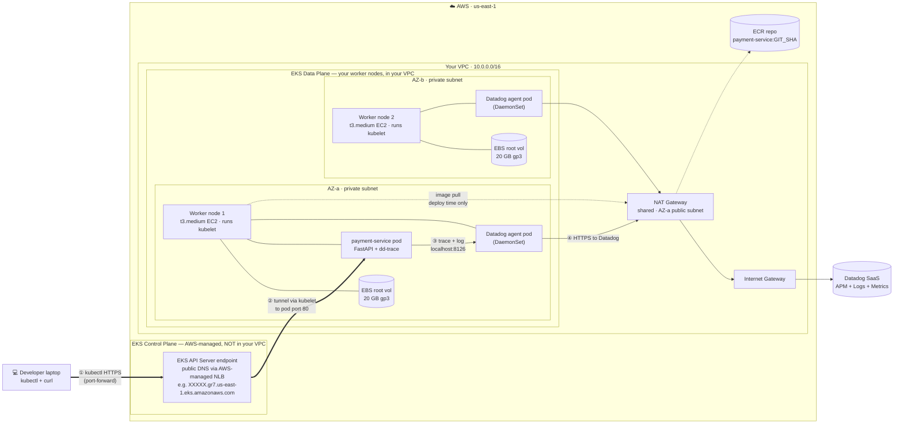

# Phase 01 — Hello, observable payment

## Goal

Spin up a VPC + EKS + one Helm-deployed service, with a Datadog trace correlating to a log line, working on a `curl` request.

## Non-goals

If we find ourselves reaching for any of these in Phase 01, stop — it's drift, and it belongs to a later phase.

- **Ingress / ALB / HTTPS termination** — Phase 2. Phase 01 reaches the service via `kubectl port-forward` or an internal `curl` from inside the cluster, not via a public hostname.
- **Second service / service-to-service traces** — Phase 2.
- **CI/CD pipeline** — Phase 3. Deploys in Phase 01 are manual `terraform apply` and `helm upgrade --install`.
- **HPA / PDB / autoscaling / probes tuning** — Phase 4. A single replica with default probes is fine.
- **Failure injection / chaos drills** — Phase 5–6.
- **WAF / Datadog synthetics / alerting → Jira** — Phase 7.
- **Multi-region** — stretch only.

## Background

Phase 01 establishes the **observability pipeline** that every later phase depends on. The end-state isn't "a cluster" — it's a `curl` request whose Datadog APM trace correlates to a log line via a shared `trace_id`. Without that visibility in place, every later debugging exercise (failure injection, scaling validation, deploy strategies) is guesswork. You can't debug what you can't see.

**Depends on (external, must exist before `terraform apply`):**

- AWS account with billing enabled + budget alarm ($200 soft / $500 hard — see [../INVENTORY.md](../INVENTORY.md))
- Datadog trial (agent + APM + log correlation)
- GitHub repo for code
- Jira free tier (not used until Phase 7, but set up now to avoid the context switch later)
- Local tooling: `aws`, `kubectl`, `helm`, `terraform`, `docker`

VS Code is the editor; not a dependency.

**What comes after:** Phase 02 inherits the cluster, the payment service, `kubectl` access, and the trace pipeline — and adds external access on top (ALB Ingress, ACM/HTTPS termination, a second service so traces span service boundaries). The full dependency chain is laid out in [../ROADMAP.md](../ROADMAP.md): observability → external access → CI/CD → HA/scaling → failure injection → WAF/alerts → deploy strategy. Every later phase **adds** on top of this foundation; none rebuild it.

## Design

### Decisions & rationale

**Infrastructure (Terraform):**

- **VPC** via official `terraform-aws-modules/vpc/aws` module — `10.0.0.0/16` CIDR, 2 AZs (`us-east-1a` + `us-east-1b`), public + private subnets per AZ. Reason: official modules are what real P-SRE work modifies; reinventing eats a week (logged in [../DECISIONS.md](../DECISIONS.md)).
- **1 shared NAT Gateway** in a public subnet for both AZs' private-subnet egress (~$33/mo). Phase 5 will add a 2nd NAT GW per AZ as part of the failure-injection drill — run the NAT-down scenario with the shared NAT first (observe full egress collapse), then upgrade and rerun (observe AZ-isolated failure). Cross-phase decision logged in [../DECISIONS.md](../DECISIONS.md).
- **IGW** on the VPC; public route table → IGW; private route tables → NAT GW.
- **EKS** via official `terraform-aws-modules/eks/aws` module. Managed node group with **2× t3.medium** on-demand instances, default 20 GB gp3 root volume each. Workers in private subnets (egress via NAT). Control plane endpoint public for now (private-only is a later phase).

**Application:**

- Single payment service in **Python** (FastAPI — small, fast to write, good Datadog tracer support). One `POST /pay` endpoint, returns 200 with a synthetic payment ID. Structured JSON logs with `trace_id` field for correlation.
- **Hand-written Helm chart** (not generator-scaffolded). Goal: learn what a chart actually contains. Includes Deployment, Service, ServiceAccount, ConfigMap.
- Container image built locally → pushed to ECR. **Image tag = git short SHA** (immutable). Mutable tags like `latest`/`main` are explicitly avoided — Phase 3 covers why.
- Manual deploy via `helm upgrade --install` from the laptop. CI/CD is Phase 3.

**Observability (Datadog):**

- Datadog agent installed via the official Datadog Helm chart, running as a **DaemonSet** so every node ships node + pod + container metrics + logs + traces.
- Datadog API key in a manually-created Kubernetes Secret. (Sealed Secrets / External Secrets is a later phase.)
- APM enabled; service tagged `payment-service`. Log correlation via Datadog's standard `dd.trace_id` injection in the JSON logs emitted by the service.

**Access pattern (Phase 1 only):**

- No public hostname. Reach the service via `kubectl port-forward svc/payment 8080:80` from your laptop, then `curl http://localhost:8080/pay`. ALB Ingress + ACM/HTTPS is Phase 2.

### Architecture (delta this phase)

All components shown are new this phase — Phase 01 is the foundation; the system is empty before this phase.

> **Glossary** (for reading the diagram):
> - **EKS cluster** = control plane (AWS-managed, lives in AWS's account) + data plane (your worker nodes, in your VPC). Two halves with very different ownership.
> - **EKS API server endpoint** = the public DNS name your `kubectl` actually talks to. AWS-managed NLB in front of AWS-run API server processes.
> - **Worker node** = an EC2 instance running `kubelet` + container runtime. Pods get scheduled onto nodes.
> - **Pod** = smallest deploy unit; one or more containers sharing a network namespace, scheduled onto a node.
> - **DaemonSet** = a Kubernetes workload type that runs one pod *per node* (used here for the Datadog agent so every node ships telemetry).



**Reading the diagram — follow the numbered arrows ① → ② → ③ → ④ for one `curl /pay`:**

- **① + ② — Request path (NAT-independent).** Your laptop's `kubectl port-forward` opens an HTTPS connection to the **EKS API Server endpoint** — the public AWS-managed NLB that lives in AWS's *control-plane account*, **not your VPC**. The API server tunnels through to the **kubelet** on the pod's node, which forwards traffic to the pod's port 80. Notice: this path crosses **neither** the Internet Gateway **nor** the NAT GW. The request enters through the control-plane side door, not the VPC's data-plane front door.
- **③ — Trace + log to local Datadog agent (loopback).** The pod ships its trace span and structured JSON log line to the Datadog agent running on the *same node*, via `localhost:8126`. This stays *inside* the node — never crosses the network.
- **④ — Egress to Datadog SaaS (NAT-dependent).** The Datadog agent batches telemetry and ships it over HTTPS to `api.datadoghq.com`. **This is the only step that uses the NAT GW.** If NAT dies, this arrow goes dark — but ①, ②, and ③ keep working, so `curl` still returns 200 while Datadog SaaS goes silent. *(That's the lesson Phase 5's NAT drill will demonstrate live.)*
- **Image pull (dashed)** — happens only during `helm upgrade --install` when the kubelet pulls the payment-service image from ECR. Goes via NAT.

**Why the control-plane / data-plane split matters:**

The control plane (the `EKS Control Plane` subgraph) is not yours to operate. AWS runs the API server, etcd, scheduler, and controller-manager in *their own account* — you can't SSH into them, can't see their logs, can't tune their flags. You pay $0.10/hour for the privilege of *not* having to. The data plane (your VPC, the `EKS Data Plane` subgraph) is what you own — your worker nodes, your pods, your network. **This separation is also why a NAT GW outage doesn't take down `kubectl`** — the API server doesn't use your NAT.

### Request flow

One representative `curl /pay` end-to-end, with **every hop made explicit** (especially the kubelet, which lives between the API server and the pod). The green rectangle marks the **dd-trace span boundary** — the part of the flow captured as a single span in Datadog APM. The async telemetry path is shown explicitly so the NAT dependency is visible in the spec, not just in chat history.

```mermaid
sequenceDiagram
    autonumber
    participant Dev as 💻 Developer<br/>(laptop)
    participant API as EKS API Server<br/>(public endpoint, AWS-managed)
    participant Kube as kubelet<br/>(on the pod's node)
    participant Pod as payment-service pod<br/>(FastAPI + dd-trace)
    participant DD as Datadog agent<br/>(DaemonSet, same node)
    participant NAT as NAT GW
    participant SaaS as Datadog SaaS

    Note over Dev,Kube: Setup — one-time per port-forward session
    Dev->>API: kubectl port-forward svc/payment 8080:80<br/>(HTTPS, IAM-signed)
    API->>Kube: control-plane msg: open tunnel to pod port 80

    Note over Dev,Pod: Synchronous request path — NAT-independent
    Dev->>API: curl http://localhost:8080/pay (tunneled)
    API->>Kube: tunneled TCP, framed in the existing HTTPS connection
    Kube->>Pod: forward to container port 80

    rect rgb(220, 240, 220)
    Note over Pod: dd-trace span begins: POST /pay
    Pod->>Pod: handle request, synthesize payment_id
    Pod->>Pod: emit JSON log line with trace_id
    Pod->>DD: ship span via localhost:8126 (loopback, never leaves the node)
    Note over Pod: span ends; return 200
    end

    Pod-->>Kube: 200 + payment_id
    Kube-->>API: response via tunnel
    API-->>Dev: 200 visible in curl output

    Note over DD,SaaS: Async path — parallel to response, NAT-dependent
    DD->>NAT: batched HTTPS to api.datadoghq.com (egress from private subnet)
    NAT->>SaaS: outbound (NAT-translated, via IGW)
    SaaS-->>NAT: ack
    NAT-->>DD: delivered

    Note over Dev,SaaS: ⚠ If NAT dies mid-flight: curl still returns 200, but the<br/>trace never reaches Datadog SaaS. Pod logs scraped by the<br/>agent also stop shipping. The system works; observability lies.
```

**Reading the sequence:**

1. **Steps 1–2 — Setup.** `kubectl port-forward` is a control-plane operation: it goes from your laptop → public EKS API Server endpoint → kubelet on the pod's node, asking the kubelet to open a tunnel. Your VPC's data-plane network (subnets, NAT, IGW) is not involved.
2. **Steps 3–5 — Request enters the pod.** The actual `curl` traffic flows through that same tunnel: `Dev → API server → kubelet → Pod`. Three hops, all of them control-plane-side. Still no NAT.
3. **Green span rectangle (steps 6–9).** Everything inside is one Datadog APM trace span. `dd-trace` instrumentation in FastAPI generates the span ID, stamps it onto the JSON log line, and ships the span to the local-node Datadog agent over **loopback** (`localhost:8126`) — that traffic never even leaves the worker node, let alone uses the network.
4. **Steps 10–12 — Response returns.** Same tunnel, reverse direction. User sees a 200.
5. **Steps 13–16 — Async egress (the only NAT-using part).** The Datadog agent batches telemetry, then ships HTTPS to `api.datadoghq.com`. This is **the only step in the whole sequence that uses the NAT GW.**
6. **Failure-mode call-out (final note).** If NAT dies, the user-visible request is unaffected — but Datadog SaaS goes silent. The system works; observability lies. This is the partial-observability failure mode that Phase 5's NAT drill will demonstrate live.

### Implementation outline

7 milestones, in build order. Each ends with a verification step that the **user** runs (per the Hands rule). Milestone-level only — specific commands belong in chat during execution.

1. **External setup (accounts + identity).** One-time setup before any Terraform runs:
   - **AWS account** with billing enabled + budget alarm ($200 soft / $500 hard).
   - **AWS IAM Identity Center** (account-level instance) with a Permission Set scoped to admin, assigned to your user. Configure AWS CLI v2 via `aws configure sso` to create a `capstone-admin` profile (12-hour STS sessions via `aws sso login`). **No long-lived IAM access keys** on the laptop — see [../DECISIONS.md](../DECISIONS.md) for the cross-phase auth strategy.
   - **Datadog trial** account; **Jira free tier**; **GitHub repo** created.

   *Done when:* `aws sso login --profile capstone-admin` succeeds; `aws sts get-caller-identity --profile capstone-admin` returns an **assumed-role** ARN (not an IAM user); budget alarm visible in CloudWatch; Datadog API key in hand.

2. **Terraform skeleton + remote state.** `backend.tf` (S3 bucket + DynamoDB lock table), `provider.tf`, `variables.tf`, empty `main.tf`. `terraform init` against the remote backend. *Done when:* `terraform validate` passes; the S3 state bucket exists and holds an (empty) state file.

3. **VPC + networking.** Apply the official `terraform-aws-modules/vpc/aws` module: `10.0.0.0/16`, 2 AZs, public + private subnets per AZ, Internet Gateway, **1 shared NAT GW** in AZ-a's public subnet, route tables wired. *Done when:* VPC + 4 subnets visible in console; private subnet route tables point `0.0.0.0/0` at the NAT GW; public route tables point `0.0.0.0/0` at the IGW.

4. **EKS cluster + managed node group.** Apply the official `terraform-aws-modules/eks/aws` module: control plane provisioned, 2× t3.medium managed node group in the private subnets, default 20 GB gp3 root volumes. Update kubeconfig with `aws eks update-kubeconfig`. *Done when:* `kubectl get nodes` returns 2 nodes in `Ready` status.

5. **Datadog agent (DaemonSet).** Create a Kubernetes Secret holding the Datadog API key. Install the official Datadog Helm chart (`datadog/datadog`) with APM enabled and a `cluster_name` tag. *Done when:* `kubectl get ds -n datadog` shows the agent on both nodes; the cluster appears in the Datadog Infrastructure UI within ~5 min; node-level metrics (CPU, memory, network) are flowing.

6. **Payment service — build, push, deploy.** Tiny FastAPI app with a `POST /pay` endpoint that returns 200 with a synthetic payment ID. `dd-trace` instrumentation wired in; `python-json-logger` configured so every log line includes the `dd.trace_id` field. `Dockerfile` builds a slim image; image pushed to ECR tagged with the git short SHA. **Hand-written** Helm chart (Deployment, Service, ServiceAccount, ConfigMap — no generator). `helm upgrade --install` deploys. *Done when:* `kubectl get pods -n payment` shows the pod `Running` and `1/1 Ready`.

7. **End-to-end trace + log correlation (the actual deliverable).** `kubectl port-forward svc/payment 8080:80`, then `curl http://localhost:8080/pay`. *Done when:* (a) `curl` returns 200 with a synthetic `payment_id`, (b) the trace appears in Datadog APM tagged `payment-service`, (c) clicking the span reveals the correlated pod log line containing the same `trace_id`. **This milestone is the Validation that proves the phase succeeded.**

### Failure-mode notes

For each new component in Phase 1, the first observable symptom / blast radius / mitigation. Tight version; the deep failure-analysis muscle gets built via the Phase 5–6 drills.

- **NAT Gateway** (single, shared, in AZ-a public subnet): *Symptom* = Datadog SaaS goes silent + new pod scheduling fails with `ImagePullBackOff`. *Blast radius* = all private-subnet egress dies. **`kubectl` and `curl /pay` keep working** (control-plane path, doesn't traverse NAT). *Mitigation* = `terraform apply -replace='module.vpc.aws_nat_gateway.this[0]'` (~5 min). Single point of failure until Phase 5 stages a 2nd.
- **Internet Gateway**: *Symptom* = same as NAT death (NAT depends on IGW). *Blast radius* = wider than NAT — also kills any direct public-subnet egress. *Mitigation* = recreate via Terraform; AWS-managed and rarely fails.
- **EKS Control Plane** (AWS-managed): *Symptom* = `kubectl` commands time out. *Blast radius* = all cluster ops blocked, but **already-running pods keep serving traffic** (data plane is independent). Auto-recovery (HPA, node-group repair) stops. *Mitigation* = AWS's problem to recover; subscribe to EKS health alerts in CloudWatch; multi-region is the only structural fix (stretch phase).
- **Worker node** (t3.medium EC2): *Symptom* = pods on it go `NodeLost` / `Unknown`. *Blast radius* = that node's pods only; with 1 replica of payment-service, service is **down ~30–60s** while pod reschedules. *Mitigation* = managed node group auto-replaces dead nodes (5–10 min). For uptime: replicas ≥2 + PodDisruptionBudget (Phase 4).
- **EBS root volume** (20 GB gp3 per node): *Symptom* = node `NotReady` or pods crash with disk I/O errors. **Phase 1's likely real failure: disk full from accumulated logs.** *Blast radius* = that node's pods. *Mitigation* = configure log rotation; set a Datadog disk-usage alert at 75%.
- **payment-service pod** (single replica): *Symptom* = `curl /pay` returns `connection refused` or `5xx`; `kubectl get pods` shows `CrashLoopBackOff`. *Blast radius* = service fully down. *Mitigation* = `kubectl logs --previous payment-xxx`; common Phase 1 root causes: bad Datadog API key, bad ConfigMap reference, dd-trace init failing.
- **Datadog agent pod** (DaemonSet): *Symptom* = node shows "agent not reporting" in Datadog Infrastructure UI. *Blast radius* = visibility into one node's pods is gone; **application traffic unaffected**. *Mitigation* = DaemonSet automatically restarts the crashed pod; set "agent down" alert in Datadog. Common cause on small nodes: OOM kill — agent needs ~300 MB.
- **ECR**: *Symptom* = new pod scheduling fails with `ImagePullBackOff`. *Blast radius* = can't deploy or scale; existing pods keep running. *Mitigation* = check the node group's IAM role has `AmazonEC2ContainerRegistryReadOnly`; check NAT GW health (egress required to reach ECR's public endpoint).
- **Datadog SaaS**: *Symptom* = dashboards show "no data" or stale metrics. *Blast radius* = total visibility loss; system works fine underneath. **This is the "system works; observability lies" failure mode.** *Mitigation* = subscribe to Datadog status page; have a backup debug path (`kubectl logs`, `kubectl describe`); never confuse "no incidents in Datadog" with "no problems in production" during a Datadog outage.

## Validation

Phase 1 is **done** when ALL of the following are true. Items are observable conditions, not gut checks. The Milestone 7 verification doubles as the headline test.

- [ ] `aws sts get-caller-identity --profile capstone-admin` returns an **assumed-role** ARN (proves no long-lived IAM keys are in use)
- [ ] `terraform plan` shows zero pending changes (Terraform state matches reality)
- [ ] `kubectl get nodes` shows 2 nodes in `Ready` state
- [ ] `kubectl get ds -n datadog` shows the Datadog agent on both nodes (`READY 2/2`)
- [ ] Datadog Infrastructure UI shows the cluster within ~5 min of agent install; node CPU/memory metrics are flowing
- [ ] `kubectl get pods -n payment` shows the payment-service pod `Running` and `1/1 Ready`
- [ ] `curl http://localhost:8080/pay` (after `kubectl port-forward`) returns `200` with a synthetic `payment_id`
- [ ] That curl appears as a span in Datadog APM tagged `service:payment-service`
- [ ] Clicking the span in Datadog reveals the correlated pod log line containing the same `trace_id` value
- [ ] [../INVENTORY.md](../INVENTORY.md) updated with the actually-deployed resources, their monthly cost, and a verified teardown sequence

## Rollback / undo

If Phase 1 needs to be reverted (budget breach, scope reset, decision change), tear down top-of-stack first so dependencies don't block:

```bash
# 1. Application layer
helm uninstall payment -n payment
kubectl delete namespace payment

# 2. Datadog agent (so it stops shipping from a doomed cluster)
helm uninstall datadog -n datadog
kubectl delete namespace datadog

# 3. EKS cluster (managed node group goes first, then control plane)
terraform destroy -target=module.eks
# Wait for nodes to fully terminate before next step

# 4. VPC + networking (last; everything depends on this)
terraform destroy -target=module.vpc
```

After running: check the AWS console for orphaned resources — common stragglers are detached EBS volumes, released-but-not-freed EIPs, ECR images still consuming storage (free under 500 MB). Update [../INVENTORY.md](../INVENTORY.md) to reflect zero spend.

## Comprehension checkpoints

By end of Phase 1, you should be able to explain — out loud, without notes, in 60s or less per item:

- [ ] Why a NAT GW exists, and which subnets need it
- [ ] What the Datadog agent does, and why it runs as a DaemonSet (not a single Deployment)
- [ ] How a trace ID propagates from request → service → log line — naming what code/agent does what
- [ ] What you'd check first if Datadog metrics suddenly stopped flowing
- [ ] Why `kubectl port-forward` keeps working when the NAT GW dies (the control-plane vs data-plane split)
- [ ] What's in the EKS Control Plane vs the EKS Data Plane, and who owns each

## Open questions

None blocking approval. The CI/CD GHA-vs-Jenkins choice in [../DECISIONS.md](../DECISIONS.md) is open but is a Phase 3 question, not a Phase 1 blocker.

## Decision log

### Milestone 5 — Datadog DaemonSet Deployment (2026-04-30)

**Issue: Cross-Account AWS Authentication**
- **What:** EKS cluster created in account 591316258137 (capstone-sre-v2), but user was authenticated to account 090762805447 (default).
- **Decision:** Use AWS SSO profile `capstone-admin` to switch accounts (via `export AWS_PROFILE=capstone-admin`).
- **Rationale:** SSO is the correct multi-account auth pattern; avoids long-lived IAM keys. No long-lived credentials on laptop (enforced by [../DECISIONS.md](../DECISIONS.md)).
- **Result:** ✅ `kubectl` and Terraform now authenticate to correct cluster.

**Issue: EKS Access Entry Configuration**
- **What:** Attempted to use old `manage_aws_auth_configmap` Terraform parameter; module doesn't support it in v20.x. Also tried `kubernetes_groups = ["system:masters"]` which AWS EKS rejects (system: prefix is reserved).
- **Decision:** Use modern `aws_eks_access_entry` + `aws_eks_access_policy_association` resources (AWS API-level controls, not Kubernetes-level ConfigMap).
- **Rationale:** Old aws-auth ConfigMap pattern is deprecated. EKS now uses IAM-native access entries. System group names are AWS-reserved and forbidden.
- **Result:** ✅ `aws_eks_access_policy_association` with `AmazonEKSClusterAdminPolicy` grants cluster-admin access without custom groups.

**Issue: IAM Role ARN Format for SSO Roles**
- **What:** Used `arn:aws:iam::591316258137:role/AWSReservedSSO_CapstoneAdmin_5211c2f501907eff` but AWS rejected it as "invalid principal". Real ARN is `arn:aws:iam::591316258137:role/aws-reserved/sso.amazonaws.com/AWSReservedSSO_CapstoneAdmin_5211c2f501907eff`.
- **Decision:** Query actual ARN from AWS (`aws iam get-role`) rather than constructing it.
- **Rationale:** SSO roles have special path format that's not obvious. Querying is the only reliable method.
- **Result:** ✅ Access entry now accepts the full ARN with correct path.

**Issue: Terraform Kubernetes Provider Defaulting to localhost**
- **What:** `provider "kubernetes" {}` with no config defaulted to `localhost:80`, even after updating kubeconfig.
- **Decision:** Explicitly configure provider with cluster endpoint, CA cert, and exec-based auth (AWS CLI token).
- **Rationale:** Implicit configuration is fragile and error-prone. Explicit config is self-documenting and provider-initialization-order independent.
- **Result:** ✅ Kubernetes provider now successfully authenticates via `aws eks get-token`.

**Issue: Helm Provider Authentication**
- **What:** Helm provider didn't automatically inherit Kubernetes provider config; tried various attribute names (`kubernetes_config_path`, nested `kubernetes { }` blocks) before finding correct syntax.
- **Decision:** Use explicit Helm provider configuration with nested `kubernetes { config_path }` block pointing to kubeconfig.
- **Rationale:** Helm provider has its own auth setup; it doesn't inherit from Kubernetes provider. Kubeconfig path is simpler than exec-based auth for this use case.
- **Result:** ✅ Helm provider now reads kubeconfig and authenticates alongside Kubernetes provider.

**Issue: Helm Repository Not in Local Cache**
- **What:** Terraform Helm provider tried to download Datadog chart but local Helm cache didn't have the repository indexed. Error: "no cached repo found".
- **Decision:** (1) Install Helm CLI (`brew install helm`). (2) Pre-populate repo with `helm repo add datadog https://helm.datadoghq.com --force-update && helm repo update`.
- **Rationale:** Terraform Helm provider relies on local Helm CLI state. External dependencies must be pre-installed before Terraform runs.
- **Result:** ✅ Datadog Helm chart successfully deploys.

**Issue: Tilde Not Expanding in Terraform**
- **What:** `config_path = "~/.kube/config"` was treated literally, not expanded to `/Users/deepti/.kube/config`.
- **Decision:** Use `pathexpand("~/.kube/config")` function in Terraform to properly expand home directory.
- **Rationale:** Terraform doesn't shell-expand paths. Built-in `pathexpand()` function is the standard workaround.
- **Result:** ✅ Kubeconfig path now resolves correctly.

**Issue: Provider Initialization & Environment Variables**
- **What:** Setting `export AWS_PROFILE=capstone-admin` before `terraform apply` wasn't enough; Terraform still used old provider config.
- **Decision:** Run `terraform init` AFTER setting environment variables, not before.
- **Rationale:** Terraform providers are initialized and cached at `terraform init` time, not at `terraform apply` time. Env vars must be set before init.
- **Result:** ✅ Subsequent applies now pick up correct AWS profile.

---
