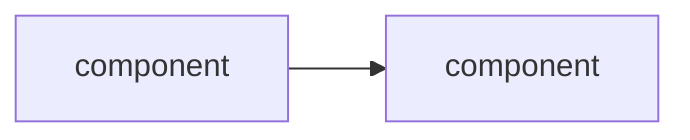
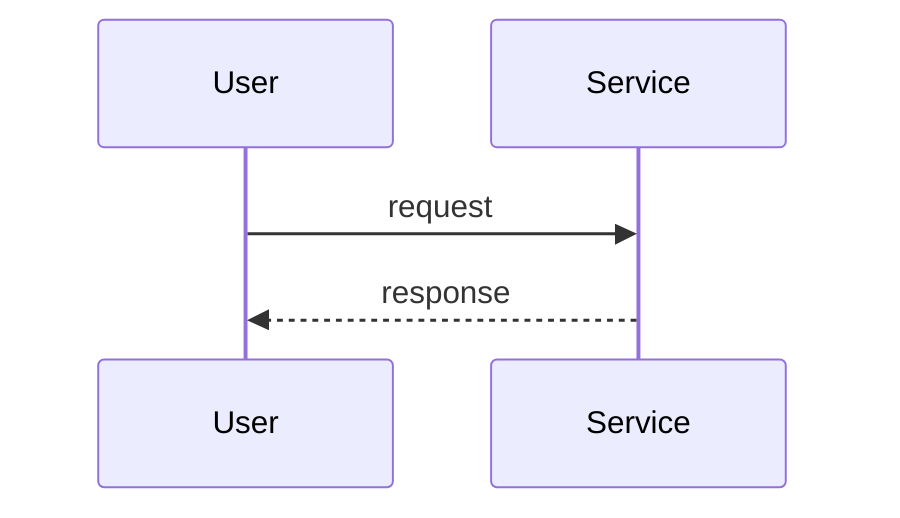

# Phase 01 — Hello, observable payment

## Goal

Spin up a VPC + EKS + one Helm-deployed service, with a Datadog trace correlating to a log line, working on a `curl` request.

## Non-goals

If we find ourselves reaching for any of these in Phase 01, stop — it's drift, and it belongs to a later phase.

- **Ingress / ALB / HTTPS termination** — Phase 2. Phase 01 reaches the service via `kubectl port-forward` or an internal `curl` from inside the cluster, not via a public hostname.
- **Second service / service-to-service traces** — Phase 2.
- **CI/CD pipeline** — Phase 3. Deploys in Phase 01 are manual `terraform apply` and `helm upgrade --install`.
- **HPA / PDB / autoscaling / probes tuning** — Phase 4. A single replica with default probes is fine.
- **Failure injection / chaos drills** — Phase 5–6.
- **WAF / Datadog synthetics / alerting → Jira** — Phase 7.
- **Multi-region** — stretch only.

## Background

(to be filled)

## Design

### Decisions & rationale

(to be filled)

### Architecture (delta this phase)

(to be filled)

### Request flow

(to be filled)

### Implementation outline

(to be filled — list 4–8 milestones in build order, milestone-level not command-level. Each milestone is a natural pause point for a comprehension question + verification step.)

1. ...
2. ...

### Failure-mode notes

(to be filled)

## Validation

(to be filled)

- [ ] ...

## Rollback / undo

(to be filled)

## Comprehension checkpoints

(to be filled)

- [ ] ...

## Open questions

(to be filled)

- [ ] ?

## Decision log

(append entries during execution when something deviates or a choice gets made)
