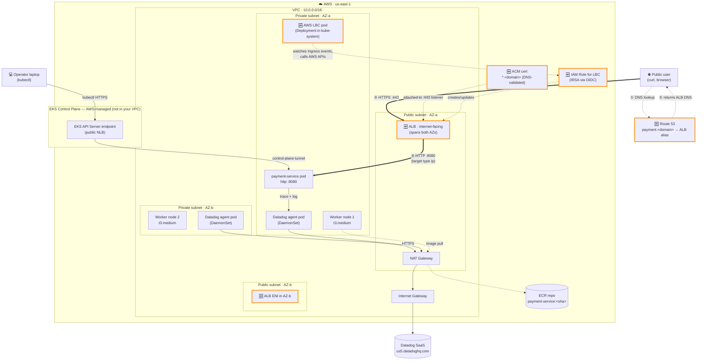
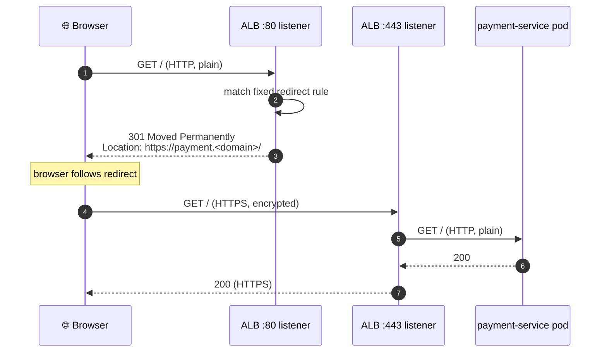

# Phase 02 — Ingress and second service

## Goal

Expose the existing payment-service to the public internet via an Application Load Balancer with HTTPS termination, so a successful `curl https://...` from any laptop reaches the pod running in the private subnet.

> **Scope note:** ROADMAP's Phase 02 also included adding a second downstream service to enable cross-service tracing. That piece is **deferred** — see Decision log. ROADMAP will be updated at phase close to slide the second-service work into a later phase.

## Non-goals

If we find ourselves reaching for any of these in Phase 02, stop — it's drift, and it belongs to a later phase.

- **Second service / cross-service distributed tracing** — deferred per Decision log; will land in a later phase.
- **CI/CD pipeline** — deploys remain manual (`terraform apply` + `helm upgrade`); Phase 03.
- **HPA / autoscaling / PodDisruptionBudget / probes tuning** — single replica with default probes is fine. Phase 04.
- **WAF / Datadog synthetics / alerts** — no AWS WAF in front of the ALB. Phase 07.
- **Failure-injection drills** — no chaos / pod-kill / load-shedding here. Phase 05–06.
- **Internal-facing / private ALB** — this phase's ALB is internet-facing on purpose. Internal-only ingress is a later concept.
- **Hosted zone delegation / domain registration churn** — we will *use* a domain (see Open questions) but not register a new one mid-phase or migrate hosted zones.
- **Multi-region failover / Route 53 latency-based routing** — single region (`us-east-1`); stretch only.
- **mTLS / service mesh / Envoy sidecars** — TLS terminates at the ALB. Mutual TLS is out of scope.

## Background

Phase 01 built the observability foundation — a payment-service running in EKS shipping traces and logs to Datadog, but only reachable from the operator's laptop via `kubectl port-forward`. Phase 02 puts a real **front door** on the system: an Application Load Balancer sitting in the public subnet, terminating HTTPS, routing traffic to the existing payment-service pod in the private subnet. Inside the cluster, an **Ingress** resource (managed by the AWS Load Balancer Controller add-on) is what tells the ALB which Service to send traffic to.

**Depends on (must exist before `terraform apply`):**

- Phase 01 deliverables: VPC + EKS cluster + payment-service Helm release + Datadog DaemonSet (all from [phase-01.md](phase-01.md)).
- A domain you control (for the ACM cert + Route 53 record) — see Open questions.
- AWS Load Balancer Controller IAM policy + IRSA setup.

**What comes after:** Phase 03 (CI/CD) automates the deploy of new payment-service versions through this same ALB; Phase 05 failure drills become much more realistic because you can `curl` from outside the cluster while pods/nodes get broken; Phase 07 layers WAF rules on top of this same ALB.

## Design

### Decisions & rationale

**Ingress controller — AWS Load Balancer Controller (LBC).**
The LBC is a Kubernetes add-on that watches `Ingress` and `Service` resources and calls AWS APIs to provision/configure ALBs, target groups, listeners, and listener rules to match. Alternative — NGINX Ingress + a separate NLB — adds an in-cluster proxy hop and forces us to manage NGINX ourselves. The LBC is the standard EKS choice and integrates natively with WAF (Phase 07) and ACM. It runs as a single **Deployment** (not a DaemonSet) in `kube-system`.

**LBC authentication to AWS — IRSA (IAM Roles for Service Accounts).**
The LBC pod needs AWS API permissions to call `elasticloadbalancing:CreateLoadBalancer` and friends. Pods aren't humans — they can't `aws sso login`. IRSA lets us bind the LBC's Kubernetes ServiceAccount to an IAM Role via the EKS OIDC provider that Phase 01 already enabled. The LBC pod assumes that role automatically; no static credentials anywhere.

**Load balancer type — ALB (Layer 7), not NLB.**
Our service speaks HTTP. ALB does HTTPS termination, path-based routing, host-based routing, header inspection, and integrates with WAF. NLB operates at L4 (TCP) — useful when TLS must terminate inside the pod (mTLS) or for non-HTTP protocols. Not us. *Counterfactual logged for future muscle: a hypothetical mTLS gRPC service would belong behind an NLB precisely because the client cert needs to reach the pod intact, which an ALB would strip during TLS termination.*

**ALB placement — public subnets, internet-facing scheme.**
The ALB has to be reachable from the public internet, so it lives in the two public subnets (one per AZ). Pods stay in private subnets — they never get a public IP. The ALB's security group will allow `:443` from `0.0.0.0/0`; the worker-node security group will allow ingress from the ALB's SG only. Standard defense-in-depth: only the LB is public.

**Target type — `ip`, not `instance`.**
With the AWS VPC CNI (Phase 01 default), every pod gets a real VPC IP routable from anywhere in the VPC, including from the ALB. So the ALB forwards traffic *directly to the pod IP* (`ALB → pod IP:8080`), skipping the `kube-proxy` NodePort hop that `instance` mode would require. Lower latency, simpler debugging (target = pod, not node), faster pod churn (LBC just registers/deregisters one IP). The LBC keeps the target group's IP list in sync by watching EndpointSlice events. **Failure-mode worth naming:** if the LBC pod dies, the *ALB itself keeps running fine* — but pod-IP changes stop being reflected, so a rollout silently breaks.

**HTTPS termination — at the ALB, not in the pod.**
The ALB unwraps TLS using a cert from ACM; the pod still serves plain HTTP on `:8080`. This is the boring-correct pattern: cert lifecycle (rotation, validation) lives in AWS, not in the application code. The pod doesn't have to know it's behind HTTPS. Listener on `:443` does the work; we will *also* configure `:80 → :443` redirect so HTTP requests don't hang.

**TLS certificate — ACM (AWS Certificate Manager), DNS validation.**
ACM is AWS's free public-cert service for AWS-resident workloads (ALB, CloudFront, API Gateway). DNS validation requires creating a CNAME record in our hosted zone — we'll use Route 53 (next decision) so Terraform can create both the cert and the validation record in one shot. Cert auto-renews while it's attached to a load balancer; no rotation work for us.

**DNS — Route 53 hosted zone + alias A-record to the ALB.**
We'll use a subdomain we control (e.g. `payment.<your-domain>`) pointing to the ALB. Route 53 alias records resolve dynamically to the ALB's public IPs (which can change), so we don't have to manage IP-level DNS. This pairs naturally with ACM DNS validation. The hosted zone itself is the open question (do we already have one, or buy a domain?) — see Open questions.

### Architecture (delta this phase)

Cumulative system state at end of Phase 02. **Components introduced this phase are styled with thick orange borders;** everything else carried over from Phase 01.



**Reading the diagram (numbered request path ① → ② → ③ → ④):**

1. User issues `curl https://payment.<domain>/pay` from anywhere on the internet.
2. DNS resolves to Route 53, which returns the ALB's public DNS (alias record).
3. User opens HTTPS to the ALB on `:443`. ALB unwraps TLS using the ACM cert.
4. ALB forwards plain HTTP to the **pod's VPC IP** (target type `ip`) on `:8080`. Response flows back the same way.

**What's NOT in the request path** (carried over from Phase 01, intentionally unchanged):
- The control-plane path (kubectl → EKS API → kubelet) is still there for operators but is **no longer the user's request path**.
- The Datadog telemetry path (pod → agent → NAT → IGW → SaaS) is unchanged. The trace span boundary is still inside the pod; the ALB is *not* a traced span participant in Phase 02 (the AWS LBC doesn't inject Datadog headers).
- NAT GW is still single, in AZ-a — same blast radius story as Phase 01.

### Request flow

Three flows, each showing a different real-world scenario. The main happy path is what you'll demonstrate at phase close. The two edge cases are worth modeling because they both *will* be exercised in the wild and they reveal where the ALB does its work.

#### Flow A — Happy path: `curl https://payment.<domain>/pay`

The canonical successful request. Green rectangle marks the dd-trace span boundary inside the pod. Async telemetry path runs in parallel after the response.

```mermaid
sequenceDiagram
    autonumber
    participant U as 🌐 User<br/>(curl/browser)
    participant DNS as Route 53
    participant ALB as ALB<br/>(public subnets)
    participant ACM as ACM cert
    participant Pod as payment-service pod<br/>(private subnet)
    participant DD as Datadog agent<br/>(DaemonSet)
    participant SaaS as Datadog SaaS

    Note over U,DNS: ① Resolve hostname
    U->>DNS: lookup payment.<domain>
    DNS-->>U: returns ALB DNS (alias)

    Note over U,ALB: ② TLS handshake on :443
    U->>ALB: TCP SYN, then TLS ClientHello
    ALB->>ACM: present ACM cert (chain + leaf)
    ALB-->>U: TLS handshake complete

    Note over U,Pod: ③ HTTPS request → HTTP forward
    U->>ALB: POST /pay (HTTPS, encrypted)
    ALB->>ALB: terminate TLS, look up listener rule
    ALB->>Pod: POST /pay (HTTP, plain) on :8080<br/>target type ip → pod IP directly

    rect rgb(220, 240, 220)
    Note over Pod: dd-trace span begins
    Pod->>Pod: handle request, generate payment_id
    Pod->>Pod: emit JSON log with dd.trace_id
    Pod->>DD: ship span via cluster DNS<br/>(datadog.datadog.svc:8126)
    Note over Pod: span ends; return 200
    end

    Pod-->>ALB: 200 + JSON body (HTTP)
    ALB->>ALB: re-wrap response in TLS
    ALB-->>U: 200 + JSON body (HTTPS)

    Note over DD,SaaS: ④ Async telemetry shipping (parallel, NAT-dependent)
    DD->>SaaS: HTTPS to us5.datadoghq.com via NAT GW
    SaaS-->>DD: ack
```

**The new spans introduced this phase** *(if/when AWS X-Ray or Datadog ALB tracing is enabled — not in scope yet)*: the ALB's TLS handshake and listener-rule evaluation could become spans of their own. For now the trace is still pod-only.

---

#### Flow B — First-time visitor on plain HTTP: 301 redirect to HTTPS

A browser hits `http://payment.<domain>` (no scheme typed, autocomplete, old bookmark). The ALB's `:80` listener has a fixed redirect rule — never reaches the pod.



**Why this matters in Phase 02:** the ALB's `:80` listener is configured with a `redirect` action in Terraform — the request **never reaches the pod**, so a browser typing the bare domain doesn't get a connection refused. Without this rule, plain-HTTP requests would either time out (no listener on `:80`) or hit the pod over HTTP (security regression). It's three lines of Terraform that prevent a confusing failure mode.

---

#### Flow C — Browser CORS preflight: `OPTIONS` before the real request

If a browser-side JavaScript app (different origin) calls our API with a non-simple request, the browser **automatically issues an `OPTIONS`** request first to ask "are you OK with this cross-origin POST?" The pod must respond with the right `Access-Control-Allow-*` headers, or the browser will block the real request.

```mermaid
sequenceDiagram
    autonumber
    participant JS as 🌐 Browser JS<br/>(different origin)
    participant ALB as ALB :443
    participant Pod as payment-service pod

    Note over JS: page loaded from app.<some-other-domain>;<br/>about to POST to payment.<domain>/pay

    JS->>ALB: OPTIONS /pay<br/>Origin: app.<other>.<br/>Access-Control-Request-Method: POST
    ALB->>Pod: OPTIONS /pay (forwarded as-is)
    Pod-->>ALB: 204 No Content<br/>Access-Control-Allow-Origin: app.<other><br/>Access-Control-Allow-Methods: POST<br/>Access-Control-Allow-Headers: Content-Type
    ALB-->>JS: 204 + CORS headers

    Note over JS: browser sees OK; proceeds with real request

    JS->>ALB: POST /pay (real request)
    ALB->>Pod: POST /pay
    Pod-->>ALB: 200 + payment_id
    ALB-->>JS: 200 + payment_id
```

**Why this matters in Phase 02:** strictly speaking, Phase 02 has no browser frontend — `curl` doesn't do CORS preflight. **But:** anyone testing the API from a browser tab (Postman web, a quick HTML page, JavaScript console) *will* trip this. Two options for the spec:

- **Option 1 (chosen):** add CORS handling to the FastAPI app via `fastapi.middleware.cors.CORSMiddleware`, with `allow_origins=["*"]` for now (Phase 07 will tighten this).
- **Option 2 (rejected):** leave it off and document that browser callers will fail until a later phase. Adds a real-world footgun that costs more debugging time than the code costs.

The OPTIONS path also confirms the ALB *forwards* the OPTIONS verb correctly without trying to handle it — ALB is not a CORS proxy by default.

### Implementation outline

8 milestones, in build order. Each ends with a verification step that the **user** runs (per the Hands rule). Milestone-level only — specific commands belong in chat during execution.

1. **Domain + Route 53 hosted zone.** Confirm the domain to use (see Open questions). Ensure the Route 53 hosted zone exists and is authoritative for the domain (NS records at the registrar match Route 53's name servers). *Done when:* `aws route53 list-hosted-zones --profile capstone-admin` shows the zone, and `dig NS <domain>` returns the same name servers Route 53 reports.

2. **ACM certificate (DNS-validated).** Terraform `aws_acm_certificate` for `payment.<domain>` (or wildcard `*.<domain>` if you'd rather one cert covers later phases too) + the Route 53 CNAME validation record + `aws_acm_certificate_validation` to wait until ACM marks it issued. *Done when:* `aws acm describe-certificate` shows `Status: ISSUED`.

3. **Subnet tagging.** Apply the LBC's required tags via Terraform on the VPC module's subnet outputs: public subnets get `kubernetes.io/role/elb=1`, private subnets get `kubernetes.io/role/internal-elb=1`. Without these the LBC can't discover subnets and refuses to create the ALB. *Done when:* `aws ec2 describe-subnets --filters Name=tag:kubernetes.io/role/elb,Values=1` returns exactly the two public subnets, and `Name=tag:kubernetes.io/role/internal-elb,Values=1` returns the two private subnets.

4. **AWS Load Balancer Controller install (with IRSA).** IAM policy (download AWS's official LBC policy JSON), IAM role bound to the LBC's ServiceAccount via the EKS OIDC provider that Phase 01 enabled, then Helm-install the LBC chart in `kube-system`. *Done when:* `kubectl get pods -n kube-system -l app.kubernetes.io/name=aws-load-balancer-controller` shows the Deployment `Running 1/1`; `kubectl logs deployment/aws-load-balancer-controller -n kube-system | grep -i 'successfully' | head` shows successful startup; no `not authorized` errors.

5. **Verify payment-service still internally healthy** (regression check before adding ALB). Re-run the Phase 01 verification chain to make sure nothing else has drifted. *Done when:* `kubectl get svc,pods -n payment` shows `Running 1/1`; `kubectl port-forward svc/payment 8080:80 -n payment` + `curl http://localhost:8080/health` returns `{"status":"ok"}`; trace still flows to Datadog APM. **If this fails, fix it before any Ingress work** — debugging an Ingress on top of a broken Service is the kind of compound-incident waste this milestone exists to prevent.

6. **Ingress resource for payment-service.** Add `templates/ingress.yaml` to the existing Helm chart with annotations: `kubernetes.io/ingress.class=alb`, `alb.ingress.kubernetes.io/scheme=internet-facing`, `alb.ingress.kubernetes.io/target-type=ip`, `alb.ingress.kubernetes.io/listen-ports=[{"HTTP":80},{"HTTPS":443}]`, `alb.ingress.kubernetes.io/ssl-redirect=443`, `alb.ingress.kubernetes.io/certificate-arn=<acm-arn>`. `helm upgrade` to apply. *Done when:* `kubectl get ingress -n payment` shows an `ADDRESS` (the ALB DNS); `aws elbv2 describe-load-balancers --profile capstone-admin` shows the ALB `state.code=active`; `aws elbv2 describe-target-health` shows the pod IP target as `healthy`.

7. **Route 53 alias record → ALB.** Terraform `aws_route53_record` of type `A` with an alias block pointing at the ALB's DNS name and zone ID (both come from the LBC-created LB). *Done when:* `dig payment.<domain>` returns the ALB's IPs; `dig +short` shows alias resolution working from any DNS resolver (Google `8.8.8.8`, Cloudflare `1.1.1.1`).

8. **End-to-end HTTPS verification (the actual deliverable).** From your laptop with no port-forward open: `curl -v https://payment.<domain>/pay`. *Done when:* (a) connection establishes on `:443`, (b) TLS cert validates without `--insecure` (chain trusts back to a public root, served by ACM), (c) returns `200` with a synthetic `payment_id`, (d) `curl http://payment.<domain>` returns `301 Location: https://...`, (e) the curl appears as a Datadog APM trace tagged `service:payment-service` with a corresponding log line containing the same `dd.trace_id`. **This milestone is the Validation that proves the phase succeeded.**

> **CORS preflight handling** (the OPTIONS flow from the Request-flow section) is **deferred to Phase 02b** — Phase 02 has no browser frontend so the preflight path won't be exercised by `curl`. Decision logged.

### Failure-mode notes

For each *new* component this phase, the first observable symptom / blast radius / where to look first. Tight version; deeper failure-analysis comes via the Phase 5–6 drills.

- **Route 53 hosted zone / `payment.<domain>` alias record**: *Symptom* = `dig payment.<domain>` returns NXDOMAIN or wrong IPs; users see "site can't be reached." *Blast radius* = **total outage from the user perspective** (no one can resolve the hostname); existing ALB and pods keep running fine internally. *Mitigation* = `dig NS <domain> @8.8.8.8` to confirm registrar's NS records match Route 53's; `aws route53 list-resource-record-sets --hosted-zone-id <id>` to confirm the alias exists; if you migrated registrars and forgot to re-point NS, fix at the registrar (propagation up to 48h).

- **ACM certificate**: *Symptom* = browser shows `NET::ERR_CERT_*` or "Not Secure"; `curl` fails with `SSL certificate problem`; or ALB listener creation fails entirely. *Blast radius* = HTTPS broken; if `ssl-redirect` is also configured, plain HTTP gets redirected to broken HTTPS and the site is fully down. *Mitigation* = `aws acm describe-certificate` should show `Status: ISSUED` (not `PENDING_VALIDATION`); if pending, the DNS validation CNAME isn't published — check Route 53. **Region gotcha**: ACM cert and ALB **must be in the same region** (`us-east-1` for both here); a cert in another region is invisible to the ALB. **SAN gotcha**: cert must cover `payment.<domain>` exactly; a cert for `<domain>` doesn't cover the subdomain unless it's wildcard (`*.<domain>`).

- **ALB itself** (AWS-managed): *Symptom* = `curl https://payment.<domain>` returns `502 Bad Gateway` / `503 Service Unavailable` / hangs. *Blast radius* = all incoming public traffic fails; internal `kubectl port-forward` access still works (control plane unaffected). *Mitigation* = `aws elbv2 describe-target-health --target-group-arn <arn>` — if targets show `unhealthy`, the pod's `/health` is failing or the SG between ALB and pod is wrong; if targets are missing entirely, suspect the LBC reconciliation (next bullet); if ALB itself is in `failed` state, AWS console will show why (almost always subnet/SG misconfiguration). The ALB is fully managed by AWS and is rarely the *root* problem — usually a downstream symptom.

- **AWS Load Balancer Controller pod** (in-cluster reconciler): *Symptom* = `kubectl get ingress` shows no `ADDRESS`, or rollouts stop registering new pod IPs in the target group (502s on new deploys). *Blast radius* = **existing ALB keeps routing fine** (AWS-managed, lives outside the cluster), but any pod-IP change is invisible to the ALB → during a rollout, traffic still goes to dead pod IPs. New Ingress objects don't materialize at all. *Mitigation* = `kubectl logs deployment/aws-load-balancer-controller -n kube-system --tail=50`; common errors are `not authorized` (IRSA broken — see IRSA bullet) or `failed to find subnet with tag …` (subnet tagging missing).

- **Subnet tags missing or wrong**: *Symptom* = LBC logs show `failed to discover subnets`; Ingress has no `ADDRESS` indefinitely; or worse, ALB gets created in only 1 AZ (no HA) or as `internal` instead of `internet-facing`. *Blast radius* = no ALB → no public access; or single-AZ ALB → loses redundancy that the rest of the design assumed. *Mitigation* = `aws ec2 describe-subnets --filters "Name=tag:kubernetes.io/role/elb,Values=1"` should return the **two** public subnets; `internal-elb` tag should return the two private subnets. Apply tags via Terraform on the VPC module's outputs (don't hand-tag — drift). If ALB came up internal-only because tags were wrong, you have to recreate it (mutability is limited).

- **IAM role for LBC (IRSA)**: *Symptom* = LBC pod logs show `AccessDenied: not authorized to perform elasticloadbalancing:CreateLoadBalancer` (or any other ELB API). Ingress has no `ADDRESS`. *Blast radius* = **same as LBC pod down** — no new ALB, no target group reconciliation; existing ALB keeps running. *Mitigation* = `kubectl describe sa aws-load-balancer-controller -n kube-system` to confirm the `eks.amazonaws.com/role-arn` annotation exists and points to the correct IAM role; in IAM console, confirm the role's trust policy allows the cluster's OIDC provider as principal; confirm the policy attached to the role contains the AWS-published LBC permissions (download from the LBC project's GitHub releases, never hand-write — too easy to miss a permission).

- **Bonus — pod's `/health` endpoint failing** (not new this phase but newly load-bearing): *Symptom* = ALB target group shows targets as `unhealthy`; ALB returns 502s. *Blast radius* = total user-facing outage even though the pod is running. *Mitigation* = exec into the pod: `kubectl exec -n payment <pod> -- curl localhost:8080/health`; if that fails, the app is broken; if it works, the ALB→pod SG is wrong or the health check path/port in the Ingress annotations is misconfigured. *Phase 02 makes the health endpoint go from "convenient" to "load-bearing for production traffic" — which is the phase's quietest blast-radius expansion.*

## Validation

Phase 02 is **done** when ALL of the following are true. Items are observable conditions, not gut checks. The Milestone 8 verification doubles as the headline test.

### Infrastructure (AWS-side)

- [ ] `aws acm describe-certificate --certificate-arn <arn>` shows `Status: ISSUED` (region: us-east-1)
- [ ] `aws elbv2 describe-load-balancers` shows the ALB `state.code: active`, `scheme: internet-facing`, registered in 2 AZs (both public subnets)
- [ ] `aws elbv2 describe-listeners --load-balancer-arn <arn>` shows: an HTTPS `:443` listener with the **correct ACM cert ARN attached**, AND an HTTP `:80` listener configured with a `redirect` action to HTTPS
- [ ] `aws elbv2 describe-target-groups` shows `target-type: ip` and health-check path `/health`
- [ ] `aws elbv2 describe-target-health` shows the payment-service pod IP target as `healthy`
- [ ] **Security groups chain**: ALB SG allows inbound `:80` and `:443` from `0.0.0.0/0`; the worker-node / pod SG allows inbound from the ALB SG (and only the ALB SG, not the world) on the pod's container port (`:8080`)
- [ ] `aws ec2 describe-subnets --filters "Name=tag:kubernetes.io/role/elb,Values=1"` returns the 2 public subnets; `internal-elb` returns the 2 private subnets
- [ ] `dig payment.<domain> @8.8.8.8` returns the ALB's IPs (Route 53 alias resolves correctly from a public resolver)

### Kubernetes / cluster-side

- [ ] `kubectl get pods -n kube-system -l app.kubernetes.io/name=aws-load-balancer-controller` shows the LBC `Running 1/1`
- [ ] `kubectl describe ingress payment -n payment` shows the expected ALB annotations (scheme, target-type, listen-ports, ssl-redirect, certificate-arn) and an `ADDRESS` field with the ALB DNS
- [ ] `kubectl get pods -n payment` shows the payment-service pod still `Running 1/1` (regression check)

### End-to-end (the deliverable)

- [ ] `curl -v https://payment.<domain>/pay` returns `200` + `{"payment_id": "...", "status": "approved"}` with **no `--insecure` flag** — cert chain validates against a public root
- [ ] `curl -I http://payment.<domain>` returns `301 Moved Permanently` with `Location: https://payment.<domain>/...`
- [ ] The curl appears as a Datadog APM trace tagged `service:payment-service` AND `env:capstone`
- [ ] The pod log line for that request (in Datadog Logs) contains a `dd.trace_id` field matching the APM trace
- [ ] `terraform plan` shows zero pending changes (no infrastructure drift)

### Tracking & ops

- [ ] [INVENTORY.md](../INVENTORY.md) updated with the new resources (ALB, Route 53 hosted zone + alias, ACM cert, LBC Helm release, IRSA IAM role), monthly cost added (~$25/mo for ALB), cumulative monthly cost line updated
- [ ] Architecture diagram in [ARCHITECTURE.md](../ARCHITECTURE.md) updated to reflect Phase 02 cumulative state
- [ ] `runbook.md` "Common operations" section has at least one Phase-02-specific note (e.g., "if Ingress shows no ADDRESS, check LBC logs and IRSA")

## Rollback / undo

If Phase 02 needs to be reverted (budget breach, scope reset, broken cert, decision change), tear down **top of stack first** so dependencies don't block. Order matters: deleting underlying infra before the things on top of it produces orphans and timeout errors.

```bash
# 1. Delete Route 53 alias record — public hostname stops resolving
#    (do this FIRST so users get clean NXDOMAIN instead of a half-broken ALB)
terraform destroy -target=aws_route53_record.payment

# 2. Disable / delete the Ingress — LBC will tear down ALB + listener + target group
helm upgrade payment helm/payment --set ingress.enabled=false -n payment
#  (or: kubectl delete ingress payment -n payment)

# 3. WAIT until ALB is fully gone before touching the cert
#    Verify in AWS console (EC2 → Load Balancers) OR via CLI:
aws elbv2 describe-load-balancers --profile capstone-admin
#    No payment-service ALB should appear. Usually 1–2 min.

# 4. Destroy ACM cert validation + cert (only safe after ALB no longer references it)
terraform destroy -target=aws_acm_certificate_validation.payment
terraform destroy -target=aws_acm_certificate.payment

# 5. Uninstall the AWS Load Balancer Controller Helm release
helm uninstall aws-load-balancer-controller -n kube-system

# 6. Destroy IRSA: policy ATTACHMENT first, then role + policy
#    (IAM dependency order — attachment blocks role/policy destroy if left behind)
terraform destroy -target=aws_iam_role_policy_attachment.lbc
terraform destroy -target=aws_iam_role.lbc
terraform destroy -target=aws_iam_policy.lbc

# 7. Remove subnet tags via Terraform apply (subnets themselves stay — they're Phase 01)
#    Edit the VPC tagging in Terraform to drop the kubernetes.io/role/* tags, then:
terraform apply

# 8. (OPTIONAL) Delete the Route 53 hosted zone
#    SKIP this if you'll reuse the zone for Phase 03+ on the same domain.
#    A hosted zone costs $0.50/mo — cheap enough to keep across phases.
terraform destroy -target=aws_route53_zone.capstone
```

After running: check the AWS console for stragglers — common ones after this kind of rollback are an unattached **ACM cert** stuck in a `PENDING_DELETION` state if step 4 raced step 3 (re-run step 4), or a **target group** that the LBC didn't clean up (delete manually in EC2 console).

Update [INVENTORY.md](../INVENTORY.md) at end of rollback to reflect the removed resources.

## Comprehension checkpoints

By end of Phase 02, you should be able to explain — out loud, without notes, in 60s or less per item:

- [ ] How AWS Load Balancer Controller maps an Ingress to an ALB (target groups, listeners, listener rules)
- [ ] Why we picked ALB over NLB, and the one scenario where NLB would be the right choice (mTLS counterfactual)
- [ ] What target type `ip` does differently from `instance`, and why `ip` is the EKS default
- [ ] Where ACM certs live, why DNS validation works, and why ACM cert + ALB must be in the same region
- [ ] What IRSA is solving (pods can't `aws sso login`) and how the OIDC provider wires into it
- [ ] What happens to traffic if the LBC pod dies (existing ALB keeps working, target group goes stale)
- [ ] Why the `:80 → :443` redirect listener exists, and what users see if it's missing
- [ ] What changes for Datadog APM in Phase 02 vs Phase 01 (spoiler: not much — ALB isn't a traced span yet)

## Open questions

All resolved before approval.

- [x] **Domain**: `payservice.click` — registered via Route 53 console on 2026-05-04 19:48:05 in the capstone-sre-v2 SSO account, 1-year term, auto-renewal disabled. Cost: ~$3 (plus ~$3 sunk on the original `srelab.click` registration that landed in the wrong AWS account — see Decision log entry 2026-05-05).
- [x] **Subdomain for the service**: `payment.<domain>` (mirrors Phase 01's service name).
- [x] **Cert scope**: specific cert for `payment.<domain>` — not a wildcard. Reusability isn't worth the extra setup for a 1–2 week horizon.
- [x] **Route 53 hosted zone**: created automatically by AWS when the domain is registered through Route 53. Terraform reads the zone via a `data` source rather than managing its lifecycle.

## Decision log

- 2026-05-04 — **Scope narrowed: deferred the second downstream service.** ROADMAP's Phase 02 originally bundled "ALB + HTTPS" with "second service for cross-service tracing." Decided to ship them separately so this phase has one clear deliverable (public HTTPS endpoint). Cross-service tracing moves to a later phase (likely Phase 02b or merged into Phase 03). ROADMAP to be updated at phase close.
- 2026-05-04 — **CORS preflight handling deferred to Phase 02b.** The Request-flow section documents the OPTIONS flow (Flow C), but Phase 02 has no browser frontend and `curl` doesn't trigger preflight. Adding `fastapi.middleware.cors.CORSMiddleware` is application-layer work that doesn't belong in an ingress phase. Will be picked up when a browser-fronted scenario lands.
- 2026-05-04 — **Domain via AWS Route 53 registration (not Cloudflare delegation, not existing domain).** Considered three paths: (a) NS-delegate a subdomain of an existing domain to Route 53, (b) keep DNS on Cloudflare and create CNAME records by hand, (c) register a fresh cheap domain via Route 53. Picked (c). Reason: simplest end-to-end IaC story (Terraform manages cert + alias record), no manual DNS work, and self-contained for a 1-2 week project that gets torn down. Cost: $3-12 for one year, auto-renewal disabled.
- 2026-05-05 — **Domain swapped: `srelab.click` → `payservice.click`.** The original `srelab.click` registration on 2026-05-04 landed in the deepti management account (wrong AWS account) instead of `capstone-sre-v2` where Phase 02 lives. Considered cross-account NS-delegation (registrar in management, hosted zone in capstone) but rejected it: adds a manual NS-update step at the management-account registrar plus a "which account owns what" wrinkle that would bite Phase 03+. Registered `payservice.click` fresh in `capstone-sre-v2` instead. Trade-off: ~$3 sunk on `srelab.click` (auto-renewal off, will lapse in a year). Lesson worth keeping: **run `aws sts get-caller-identity` before any state-changing console action** — multi-account contexts make wrong-account ops easy and Route 53's UI doesn't double-check.
