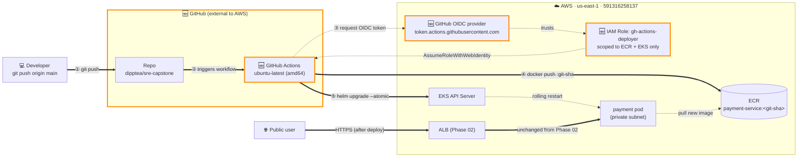

# Phase 03 — CI/CD pipeline (push to main → deployed)

## Goal

Push to `main` → GitHub Actions builds the payment-service container image, runs tests, pushes the image to ECR with an immutable git-SHA tag, and deploys it to EKS via Helm — replacing manual `helm upgrade` with a hands-off automated path that's safe to run multiple times a day.

> **Scope note:** ROADMAP's original Phase 02 included a second downstream service for cross-service tracing. That piece — already deferred from Phase 02 — is being carved out to **Phase 03b** rather than bundled here. Phase 03 stays narrowly focused on CI/CD mechanics. Phase 03b will add the second service and use the pipeline this phase delivers to ship it. ROADMAP will be updated at phase close to slot Phase 03b in.

## Non-goals

If we find ourselves reaching for any of these in Phase 03, stop — it's drift.

- **Second service / cross-service tracing** → deferred to **Phase 03b**.
- **CI tools other than GitHub Actions** → out of scope.
- **Advanced deployment strategies** (blue/green, canary, traffic shifting) → **Phase 08**.
- **Autoscaling (HPA), PDBs, and probe tuning** → **Phase 04**.
- **Failure-injection scenarios against the pipeline** → **Phase 05+**.
- **Multi-environment promotion** (dev/staging/prod) → out of scope.
- **Image signing, SBOM, and supply-chain security** → **Phase 07**.
- **Database migrations** → out of scope.
- **Pipeline observability** (metrics/logs to Datadog) → **Phase 07** (optional).
- **Secret rotation** (AWS Secrets Manager rotation policies) → out of scope.
- **Multi-region or multi-account deployment** → out of scope.
- **Manual deployments via `kubectl` or Helm CLI** → no longer the supported path after Phase 03; all deploys go through CI/CD (discipline, not RBAC enforcement).

**Rollback scope:**
- *In scope:* Helm `--atomic` automatic rollback on failed upgrade.
- *Out of scope:* advanced rollout strategies (canary, blue/green) → Phase 08.

## Background

**What changed since Phase 02:** In Phase 02, the app became public. But deploying changes is still manual. Right now every deploy needs to:

1. Build Docker image
2. Tag image
3. Push image to ECR
4. Run Helm upgrade
5. Pass correct values
6. Verify pods
7. Verify ALB / app

As the project grows — more deploys, more services, more image versions — more chances for mistakes.

**What Phase 03 adds:** You push code to GitHub → pipeline does everything automatically.

```
git push
  → GitHub Actions starts
  → builds Docker image
  → pushes to ECR
  → deploys to EKS using Helm
  → verifies deployment
```

| Phase | Deploy mechanism |
|---|---|
| Phase 02 | Manual |
| Phase 03 | Automatic |

**What Phase 03 depends on:** EKS cluster, ECR repo, Helm chart, GitHub repo — all already built in earlier phases. The pipeline just uses them.

**What comes after:** Later phases become easier because deploying new versions becomes fast and repeatable. Phase 03 automates the manual deployment steps from Phase 02 using GitHub Actions CI/CD.

## Design

### Decisions & rationale

**1. AWS authentication: OIDC, not static keys.** GitHub Actions assumes an AWS IAM Role via the GitHub OIDC provider — same security model as IRSA from Phase 02 (short-lived tokens, no static credentials in repo secrets). Trust policy locks the role to `repo:dipptea/sre-capstone:ref:refs/heads/main` so a PR from a fork can't assume it.

**2. Image build: native amd64 on GitHub-hosted runner.** `ubuntu-latest` runners are amd64; EKS nodes are amd64 — match. No `docker buildx --platform` complication. *(Phase 01 hit the exact arm64-vs-amd64 footgun when building on Mac — captured in [lessons.md](../lessons.md).)*

**3. Image tag: git SHA only, short form (7 chars).** Immutable, traceable to the exact commit, no overwrite risk. Skip semver until we have multiple consumers requiring versioned APIs (Phase 07+ if at all). **No `:latest` ever** — that's the production footgun ROADMAP's Phase 03 comprehension checkpoints flag.

**4. CI test scope (minimum viable):**
- `pytest` against the FastAPI app's tests/ directory (whatever Phase 01 left there).
- `docker build` validates the Dockerfile is buildable.
- Skip linting (`ruff`, `mypy`) — not load-bearing for pipeline mechanics; revisit Phase 07 if useful.

**5. Deploy: `helm upgrade --install --atomic --timeout 5m`.**
- `--install` makes the same command work for first-time install AND upgrade (idempotent).
- `--atomic` auto-rolls back to previous release if any pod fails to come ready within timeout.
- `5m` is generous for our single-replica service; tighten if it becomes the limiting factor.

**6. IAM Role permissions: minimum scope.**
- **ECR** (one repo only): `GetAuthorizationToken`, `BatchCheckLayerAvailability`, `PutImage`, `InitiateLayerUpload`, `UploadLayerPart`, `CompleteLayerUpload`.
- **EKS** (one cluster only): `DescribeCluster`, `GetToken` (for kubectl/helm auth).
- Nothing else. No S3, no Secrets Manager, no general read.

**7. Pipeline triggers:**
- `push: branches: [main]` → full pipeline (build + test + push + deploy).
- `pull_request:` → tests + build validation only (no ECR push, no deploy) — gives PR reviewers a signal without shipping anything.
- `workflow_dispatch:` → manual emergency trigger.

### Architecture (delta this phase)

Phase 03 adds the deploy pipeline — everything from Phase 02 stays unchanged. **Components introduced this phase have thick orange borders.**



**Reading the diagram (numbered deploy path ① → ⑤):**

1. Developer pushes a commit to `main` on GitHub.
2. GitHub triggers the Actions workflow on a GitHub-hosted `ubuntu-latest` runner.
3. The runner requests a short-lived OIDC token from GitHub's OIDC provider, presents it to AWS STS via `AssumeRoleWithWebIdentity`. The IAM Role's trust policy verifies the token's `sub` claim matches `repo:dipptea/sre-capstone:ref:refs/heads/main`, then grants temp credentials.
4. Runner uses temp creds to `docker push payment-service:<short-sha>` to ECR (immutable tag).
5. Runner runs `helm upgrade --install payment ./helm/payment --set image.tag=<short-sha> --atomic --timeout 5m` against the EKS API. EKS triggers a rolling restart; new pod pulls the new image from ECR. If health checks fail within 5 min, Helm auto-rolls back.

**What's NOT new** (intentionally unchanged):
- The user request path (laptop → Route 53 → ALB → pod) is identical to Phase 02.
- The Datadog telemetry path is identical.
- The IRSA setup for the AWS Load Balancer Controller is identical (separate IAM Role, separate OIDC provider — see Decisions #1).

**Two distinct OIDC providers** in your AWS account after this phase:
- `oidc.eks.us-east-1.amazonaws.com/id/<cluster-id>` — Phase 01, used by IRSA for LBC pod
- `token.actions.githubusercontent.com` — Phase 03, used by GitHub Actions runner

### Request flow

The representative "request" this phase is a **deploy** (not a user request — that's unchanged from Phase 02). Flow traces from `git push` to a new pod serving traffic, with the auto-rollback path in red at the bottom.

```mermaid
sequenceDiagram
    autonumber
    participant Dev as 💻 Developer
    participant GH as GitHub<br/>(repo + Actions runner)
    participant STS as AWS STS<br/>(via GitHub OIDC)
    participant ECR as ECR
    participant EKS as EKS API
    participant Pod as payment-service pod

    Note over Dev,GH: ① Push triggers workflow
    Dev->>GH: git push origin main
    GH->>GH: workflow starts on ubuntu-latest

    Note over GH,STS: ② Auth via OIDC (no static keys)
    GH->>STS: AssumeRoleWithWebIdentity(OIDC token)
    STS->>STS: verify sub == repo:dipptea/sre-capstone:ref:refs/heads/main
    STS-->>GH: temp credentials (~15 min TTL)

    Note over GH,ECR: ③ Build + test + push
    GH->>GH: docker build → payment-service:&lt;git-sha&gt;
    GH->>GH: pytest (workflow fails fast if any test fails)
    GH->>ECR: docker push payment-service:&lt;git-sha&gt;

    Note over GH,Pod: ④ Deploy via Helm
    GH->>EKS: helm upgrade --install --atomic --timeout 5m<br/>--set image.tag=&lt;git-sha&gt;
    EKS->>Pod: rolling restart (terminate old, schedule new)
    Pod->>ECR: pull payment-service:&lt;git-sha&gt;
    Pod->>Pod: container starts, /health passes
    EKS-->>GH: rollout complete

    Note over GH,Dev: ⑤ Success
    GH->>Dev: ✅ commit status: green

    Note over GH,Pod: Failure mode — auto-rollback
    rect rgb(255, 230, 230)
    Note over EKS,Pod: If pod fails health check within 5 min
    EKS->>Pod: terminate new (failed) pod
    EKS->>Pod: restore previous release version
    GH->>Dev: ❌ commit status: red (Helm --atomic rolled back)
    end
```

**Key beats worth naming:**

- **Step 2 — OIDC sub claim verification.** This is the security boundary. If the trust policy's `sub` condition doesn't match exactly, STS returns `AccessDenied`. Common mistake: forgetting that `ref:refs/heads/main` means *only the main branch* — pushes to feature branches won't pass STS.
- **Step 3 — fail fast.** `pytest` runs *before* `docker push`, so a test failure means no broken image lands in ECR.
- **Step 4 — `--atomic` is the safety net.** Without it, a deploy with a broken image leaves the cluster in a half-upgraded state (old pods terminated, new pods crashloopping). With it, Helm waits for the new pods to pass health checks within `--timeout`, and if they don't, it `helm rollback`s automatically.
- **Step 5 — green check on the commit.** Future-you (or a teammate) can see at a glance which commits made it to production by looking at the commit list in GitHub.

### Implementation outline

7 milestones in build order. Each ends with a verification step the **user** runs (per the Hands rule). Milestone-level only — specific commands belong in chat during execution.

1. **GitHub OIDC provider in AWS (Terraform).** Add `aws_iam_openid_connect_provider` for `token.actions.githubusercontent.com`. One-time setup that sits alongside the existing EKS OIDC provider. *Done when:* `aws iam list-open-id-connect-providers --profile capstone-admin` returns 2 entries (EKS + GitHub).

2. **IAM Role for GitHub Actions (Terraform).** Create role `gh-actions-deployer` with trust policy locked to `repo:dipptea/sre-capstone:ref:refs/heads/main`, attach an inline policy with the minimum-scope ECR + EKS permissions from Decision #6. *Done when:* `aws iam get-role --role-name gh-actions-deployer` shows the role; the trust policy's Federated principal is the GitHub OIDC provider ARN.

3. **EKS access entry for the GH Actions role (Terraform).** AWS-side IAM permissions aren't enough — the role also needs Kubernetes RBAC inside the cluster (so `helm upgrade` can call the K8s API). Add `aws_eks_access_entry` + `aws_eks_access_policy_association` for `gh-actions-deployer` with the `AmazonEKSClusterAdminPolicy` (or scoped tighter — TBD per Open question). *Done when:* `aws eks list-access-entries --cluster-name capstone-sre-cluster` includes the role's ARN.

4. **GitHub Actions workflow file (`.github/workflows/deploy.yml`).** Write the workflow per Decision #7 triggers and the Request flow steps. Three jobs:
   - `test` — runs on every PR and push: checkout → docker build (validates Dockerfile) → pytest.
   - `build-and-push` — runs on push to main: assume IAM Role via OIDC → docker push to ECR with `<git-sha>` tag.
   - `deploy` — runs on push to main after `build-and-push`: assume role → `aws eks update-kubeconfig` → `helm upgrade --install --atomic --timeout 5m`.
   *Done when:* GitHub Actions tab shows the workflow listed; YAML is committed to `main`.

5. **First test-only run via PR (validates auth + tests, no deploy).** Open a no-op PR (e.g., a comment change in README). Watch the `test` job run successfully — validates OIDC trust policy + Dockerfile + pytest, *without* shipping anything to ECR or the cluster. *Done when:* PR check shows green; Actions log shows `Successfully assumed role` and pytest passes.

6. **First deploy via merge to main (the happy path — actual deliverable).** Merge the PR (or push a small app change directly). Full pipeline runs end-to-end. *Done when:* (a) `aws ecr describe-images --repository-name payment-service` shows a new image with the commit's short SHA as the tag; (b) `helm history payment -n payment` shows a new DEPLOYED revision; (c) `kubectl get pods -n payment` shows the new pod with the new image SHA in `kubectl describe pod`; (d) `curl https://payment.payservice.click/pay` returns 200 served by the new version.

7. **Negative test — broken commit triggers `--atomic` rollback (validates the safety net).** Push a deliberately broken change (e.g., a typo that breaks app startup, or a bad image tag), watch `helm upgrade --atomic` fail health checks within 5 min and auto-rollback to the previous release. *Done when:* (a) `helm history payment -n payment` shows the failed revision marked `FAILED` and the prior revision restored as `DEPLOYED`; (b) `curl https://payment.payservice.click/pay` continues returning 200 throughout (old version kept serving); (c) Actions workflow shows red status; (d) you fix the broken commit, push again, recovery via the same pipeline.

### Failure-mode notes

For each *new* component this phase, the first observable symptom / blast radius / where to look first. Tight version; deeper failure-analysis comes via Phase 5–6 drills.

- **GitHub OIDC provider in AWS IAM.** *Symptom* = all GitHub Actions deploys fail with `AccessDenied: Not authorized to perform sts:AssumeRoleWithWebIdentity` in the AssumeRole step. *Blast radius* = **all CI/CD broken; cluster unaffected** (existing pods keep running, manual `helm upgrade` from laptop still works as emergency fallback). *Mitigation* = `aws iam list-open-id-connect-providers --profile capstone-admin` should return 2 entries (EKS + GitHub). If missing, recreate via Terraform. **Subtle gotcha:** GitHub occasionally rotates its OIDC certificate thumbprint; newer `terraform-aws-provider` versions auto-handle this, older versions need a manual `terraform apply` after the rotation.

- **IAM Role for GitHub Actions (`gh-actions-deployer`).** Two distinct failure modes. *Symptom A (trust policy wrong)* = `AssumeRoleWithWebIdentity → AccessDenied` even though the OIDC provider exists. *Symptom B (permissions too narrow)* = AssumeRole succeeds, but a downstream call (ECR push, EKS describe-cluster) fails with `AccessDenied`. *Blast radius* = same as OIDC provider — CI/CD broken, cluster unaffected. *Mitigation* = for A, check CloudTrail's `sts:AssumeRoleWithWebIdentity` event — it logs the actual `sub` claim received vs what the trust policy expects. Common: pushed from a feature branch but trust policy says `ref:refs/heads/main` only. For B, the workflow log names the specific failing API call — add it to the inline policy.

- **EKS access entry for the GH Actions role.** *Symptom* = AssumeRole works, ECR push works, but `helm upgrade` fails with `error: You must be logged in to the server (Unauthorized)` or `Kubernetes cluster unreachable`. *Blast radius* = **partial CI failure** — image gets pushed to ECR (so a record exists of "what was supposed to deploy") but pod is never updated. Old version keeps serving. *Mitigation* = `aws eks list-access-entries --cluster-name capstone-sre-cluster --profile capstone-admin` must include the role's ARN. If missing, the IAM permissions are correct but the cluster's RBAC doesn't recognize the principal — add `aws_eks_access_entry` + `aws_eks_access_policy_association` via Terraform.

- **GitHub Actions workflow file (`.github/workflows/deploy.yml`).** *Symptom* = various: push to main but no workflow runs (trigger config wrong); workflow runs but skips a step (conditional bug); workflow runs but uses wrong region/cluster name (env var typo). *Blast radius* = bounded to what the workflow actually does. A bad workflow CAN'T break the running cluster as long as `helm --atomic` remains the deploy safety net (a broken deploy auto-rolls back; cluster keeps serving the old version). *Mitigation* = use GitHub Actions' workflow validation (built into the GitHub UI when you commit YAML). Always merge changes via PR so the `test` job runs first. **Pin action versions to specific commit SHAs**, not `@main` or `@latest` — that's the action-side equivalent of the `:latest` Docker-tag footgun.

- **Helm `--atomic` itself.** *Symptom* = `helm upgrade` hangs for the `--timeout` duration, then exits with `Error: UPGRADE FAILED: timed out waiting for the condition` and auto-runs `helm rollback`. *Blast radius* = **zero — that's literally the point.** Old version keeps serving traffic throughout the failed deploy attempt. *Mitigation* = `helm history payment -n payment` shows the failed revision. `kubectl describe pod` on the new (failed) pod reveals WHY health checks failed — image pull issue, config bug, port mismatch, app crashed at startup. Fix root cause in code, push again. If `--atomic` itself misbehaves (rare — e.g., rollback fails partway), `helm rollback payment <previous-revision> -n payment` is the manual recovery.

- **Bonus — `pytest` in CI gates everything.** *Symptom* = a flaky test starts failing on `main` for unrelated reasons; nobody can deploy until the test is fixed. *Blast radius* = **all deploys blocked by a non-product issue.** Could become a "I'll just push past the failed test" pressure during incidents, which is exactly when the test was supposed to protect you. *Mitigation* = treat test flake as a real bug; fix it or quarantine it (mark `@pytest.mark.flaky` and exclude from CI) — never just `--no-verify` past it. **The test gate's value is its credibility; one ignored failure costs all future failures.**

## Validation

Phase 03 is **done** when ALL of the following are true. Items are observable conditions, not gut checks. Milestones 6 + 7 verifications double as the headline tests.

### Infrastructure (AWS-side)

- [ ] `aws iam list-open-id-connect-providers --profile capstone-admin` returns **2 entries** (EKS + GitHub).
- [ ] `aws iam get-role --role-name gh-actions-deployer` shows the role; trust policy's `Federated` principal is the GitHub OIDC provider ARN; condition includes `sub:repo:dipptea/sre-capstone:ref:refs/heads/main`.
- [ ] `aws iam list-attached-role-policies --role-name gh-actions-deployer` shows the inline minimum-scope policy (ECR push verbs + EKS DescribeCluster + GetToken — no S3, no Secrets Manager).
- [ ] `aws eks list-access-entries --cluster-name capstone-sre-cluster --profile capstone-admin` includes the `gh-actions-deployer` ARN.

### GitHub side

- [ ] `.github/workflows/deploy.yml` exists on `main` and is visible in the GitHub Actions tab.
- [ ] At least one PR has run the `test` job to green (validates OIDC trust + tests, no deploy).
- [ ] At least one push to main has run the full pipeline (test → build → push → deploy) to green.

### End-to-end (the deliverable)

- [ ] A commit pushed to main has its short SHA as an immutable tag in ECR (`aws ecr describe-images --repository-name payment-service --query 'imageDetails[*].imageTags' --profile capstone-admin`).
- [ ] `helm history payment -n payment` shows that revision as `DEPLOYED`.
- [ ] `kubectl get pods -n payment -o jsonpath='{.items[*].spec.containers[*].image}'` returns the image with the matching SHA.
- [ ] `curl -i https://payment.payservice.click/pay` returns `200` served by the new version.
- [ ] `terraform plan` shows zero pending changes (no infrastructure drift).

### Negative test (`--atomic` safety net works)

- [ ] At least one deliberately broken commit has been pushed and **auto-rolled-back**.
- [ ] `helm history payment -n payment` shows the failed revision marked `FAILED` and the prior revision restored as `DEPLOYED`.
- [ ] During the broken deploy attempt, `curl https://payment.payservice.click/pay` continued returning 200 throughout (old version kept serving).

### Tracking & ops

- [ ] [INVENTORY.md](../INVENTORY.md) updated: new resources (OIDC provider, IAM Role, access entry — all $0/mo).
- [ ] [ARCHITECTURE.md](../ARCHITECTURE.md) updated to reflect Phase 03 cumulative state.
- [ ] [runbook.md](../runbook.md) has a Phase 03 section with deploy steps + "if pipeline fails" first-look diagnostics.
- [ ] [DECISIONS.md](../DECISIONS.md) captures the "GitHub Actions over Jenkins" choice (cross-phase decision per CLAUDE.md decision-log split).

## Rollback / undo

If Phase 03 needs to be reverted (CI tooling change, security incident with the IAM Role, decision reversal), tear down **top of stack first**:

```bash
# 1. Disable the workflow — stops new pipeline runs immediately
git rm .github/workflows/deploy.yml
git commit -m "Phase 03 rollback: disable CI/CD workflow"
git push

# 2. Destroy the EKS access entry (cluster RBAC for the role)
terraform destroy -target=aws_eks_access_policy_association.gh_actions
terraform destroy -target=aws_eks_access_entry.gh_actions

# 3. Destroy the IAM Role (and inline policy, attachment goes with it)
terraform destroy -target=aws_iam_role.gh_actions_deployer

# 4. Destroy the GitHub OIDC provider (only if no other roles trust it)
terraform destroy -target=aws_iam_openid_connect_provider.github

# 5. Manual deploys via `helm upgrade` from laptop are once again the deploy mechanism.
#    Update runbook.md to note CI/CD is removed.
```

After running: `aws iam list-open-id-connect-providers` should be back to 1 entry (EKS only). The cluster, the payment-service, the ALB, and Datadog all keep running — Phase 03 rollback only removes the *deploy mechanism*, not the deployed thing.

## Comprehension checkpoints

By end of Phase 03, you should be able to explain — out loud, without notes, in 60s or less per item:

- [ ] Why we need a separate OIDC provider for GitHub (vs reusing the EKS one) — and what's in the IAM trust policy that links a specific repo + branch to a specific role
- [ ] What `AssumeRoleWithWebIdentity` does — request, response, TTL, what happens after expiry
- [ ] Why image tags use git SHA, not `:latest` (and what specifically goes wrong with `:latest` in production)
- [ ] What `helm upgrade --atomic` does on failure (timing, what gets rolled back, what doesn't)
- [ ] Where the deploy boundary lives — what the pipeline does vs what Helm/Kubernetes does after it hands off
- [ ] First two things to check if a deploy fails: how to tell if it's "auth failed", "image broken", or "app crashed at startup"
- [ ] Why we kept manual `kubectl`/`helm` working as an emergency fallback rather than blocking it at the cluster level

## Open questions

All resolved before approval.

- [x] **EKS access entry policy scope** — Resolved 2026-05-05: use `AmazonEKSClusterAdminPolicy` (broad, same scope as the `CapstoneAdmin` SSO role) for Phase 03. Phase 03 is about pipeline mechanics; tighter RBAC scoping deferred to Phase 07 (security hardening).
- [x] **Image tag format** — Resolved 2026-05-05: short SHA, 7 chars (e.g., `f6df6dd`). Matches Phase 01's existing tag format and is readable in `helm history` output.
- [x] **`pytest` test scope** — Resolved 2026-05-05: add a minimal placeholder test if no real tests exist in `payment-service` (e.g., `def test_health_endpoint_returns_200(): ...`). A "runs pytest but has no tests" gate is a no-op. Real test coverage is a separate, ongoing effort beyond Phase 03.
- [x] **PR-to-main workflow** — Resolved 2026-05-05: require human review (manual merge after green CI). Solo capstone, but the discipline is the point — also gives the `test` job time to surface issues before they hit main.
- [x] **Hotfix path when pipeline is broken** — Resolved 2026-05-05: document break-glass procedure in `runbook.md` — manual `helm upgrade` from laptop with `CapstoneAdmin` SSO role, used only when CI is itself broken. Default path is "fix CI first" for non-emergencies.

## Decision log

_(append entries during execution when something deviates or a choice gets made)_
