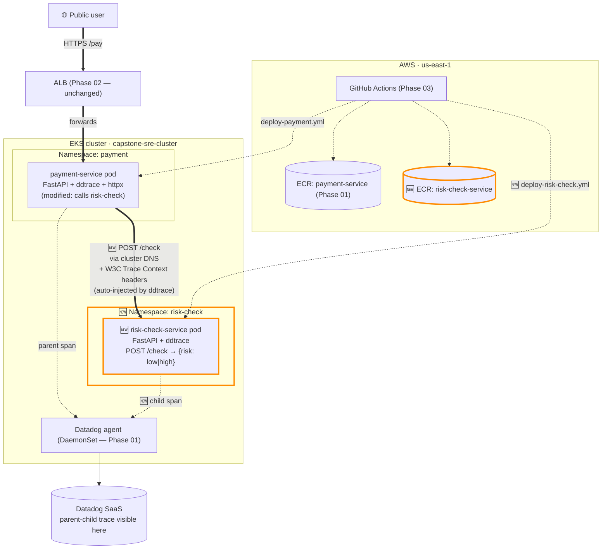
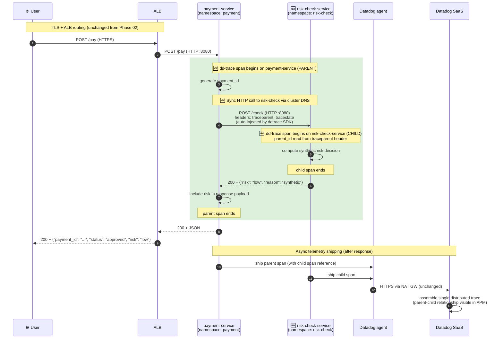

# Phase 03b — Second downstream service + cross-service tracing

## Goal

Add a second internal service `risk-check-service` that `payment-service` calls synchronously during `/pay`. Demonstrate Datadog APM showing a single distributed trace spanning both services with a parent-child span relationship, establishing the foundation for Phase 06 downstream-service latency and failure drills.

## Non-goals

If we're reaching for any of these in Phase 03b, stop — it's drift.

- **Public ingress for `risk-check-service`** — out of scope; it's internal-only. Only `payment-service` calls it via cluster DNS.
- **Authentication between services** (mTLS, JWT, API keys) — out of scope. Single trust boundary within the cluster. Service mesh / mTLS is Phase 07+ if at all.
- **Service mesh / Istio / Linkerd / sidecar proxies** — out of capstone scope.
- **HPA / autoscaling on either service** → **Phase 04**.
- **Failure injection on risk-check** (slow responses, timeouts, errors, dependency loss) → **Phase 06** (this phase makes those drills possible by adding the service).
- **Async messaging** (SQS, Kafka, EventBridge) — out of scope. Synchronous HTTP only.
- **Caching layer** (Redis, Memcached) — out of scope. Straight HTTP call to risk-check on every `/pay`.
- **No database persistence on either service** (no RDS, DynamoDB, file storage, in-memory state across requests). Both services compute synthetic decisions and return — no risk history, no transaction log. State management + a real DB lands in **Phase 06+** where the "slow DB" failure drill needs one.
- **Multiple replicas on risk-check** — 1 replica, like payment-service. HA comes **Phase 04**.
- **Different language for risk-check** — Python FastAPI to match payment-service (polyglot is out of capstone scope).
- **Rate limiting / circuit breakers / retry-with-backoff** → **Phase 06+** if useful.
- **Real risk model logic** — synthetic decision (e.g., random low/high or always-low). The trace is the deliverable, not the risk math.
- **Multi-region or multi-account deployment** — out of scope.

## Background

**What changed since Phase 03:** Deployment was automated instead of being done manually, but the system still has only one service.

**What Phase 03b adds:** In this phase, we are adding a second microservice for cross-checks.

**Depends on:** VPC, EKS, ECR, Datadog trace and log correlation, payment-service ingress, ALB, and the CI/CD deployment automation through GitHub Actions.

**What comes after:**
- **Phase 05** — Failure injection: Infrastructure failure drills
- **Phase 06** — Failure injection: Dependency/service failure drills using `risk-check-service` latency, timeouts, and failures.

## Design

### Decisions & rationale

**1. Service-to-service call: synchronous HTTP via cluster DNS.** `payment-service` calls `risk-check-service` during `/pay` using a regular HTTP request to `risk-check-service.risk-check.svc.cluster.local:8080` — no service mesh, no ALB hop. Simplest pattern for the tracing demo and matches how most real microservices talk inside a cluster.

**2. HTTP client library: `httpx`.** Modern Python HTTP client; sync API works fine for our use case. dd-trace SDK auto-patches `httpx` for trace context propagation — no manual header injection needed.

**3. Trace propagation: dd-trace auto-instrumentation.** The `ddtrace-run` wrapper (already used by `payment-service`) automatically:
- adds W3C Trace Context headers (`traceparent`, `tracestate`) to outgoing httpx requests
- reads them on the receiving end (risk-check)
- builds a parent-child span relationship in Datadog APM

**Zero application code for tracing — pure config.** This is the load-bearing reason Phase 03b is short.

**4. Risk decision logic: synthetic stub.** `risk-check-service` returns `{"risk": "low"}` always (or random low/high if useful for variation). No real ML, no scoring logic. The trace is the deliverable, not the risk math.

**5. Endpoint shape: `POST /check` on `:8080`.** Mirrors `payment-service`'s pattern. Request body: `{"payment_id": "...", "amount": ...}`. Response: `{"risk": "low|high", "reason": "..."}`. Plus a `GET /health` for the readiness probe — same shape as payment.

**6. Helm chart: separate `helm/risk-check/`.** Modeled on `helm/payment/`. Avoids tight coupling — each service has its own release lifecycle. Umbrella charts (one chart deploys multiple services) are over-engineering at this scale.

**7. CI/CD strategy: separate workflow per service with path filters; shared structural pattern.**
- `.github/workflows/deploy-payment.yml` (renamed from `deploy.yml`) — triggers on `paths: services/payment/**`, `helm/payment/**`
- `.github/workflows/deploy-risk-check.yml` — triggers on `paths: services/risk-check/**`, `helm/risk-check/**`
- **Both pipelines follow the same Phase 03 CI/CD model** (test → build → push → deploy with `--atomic` rollback, OIDC auth via `gh-actions-deployer`). Only the service-specific paths/names differ.
- Result: deploys are independent (a payment-only change skips the risk-check pipeline and vice versa), but the engineering pattern stays consistent across both.

**8. ECR repo: separate `risk-check-service`.** Mirrors `payment-service` pattern. Each service has its own image lifecycle policy. New Terraform resource (`aws_ecr_repository.risk_check`).

**9. Kubernetes namespace: `risk-check`.** Mirrors payment's namespace isolation. Makes future RBAC scoping cleaner (when we tighten the EKS access entry to per-namespace scope in Phase 07).

**10. IAM permissions: extend existing `gh-actions-deployer` role, don't create a new one.** Add ECR push permissions for the `risk-check-service` repo to the existing inline policy on the same role. One CI role covers both services. (Per-service IAM roles is finer security but Phase 07 work; not load-bearing for Phase 03b.)

### Architecture (delta this phase)

Phase 03b adds: a second service in its own namespace, a cross-service call from payment → risk-check, and a separate CI/CD pipeline for the new service. **Components introduced this phase styled with thick orange borders.**



**Reading the diagram (key new flow in orange):**

1. User HTTPS hits ALB → forwarded to `payment-service` pod (unchanged from Phase 02).
2. **NEW:** `payment-service` synchronously calls `risk-check-service` via cluster DNS during `/pay` handling.
3. **NEW:** dd-trace auto-injects W3C Trace Context headers (`traceparent`, `tracestate`) into the outgoing httpx call.
4. **NEW:** `risk-check-service` reads those headers via dd-trace; its span becomes a child of payment-service's span in Datadog APM.
5. Both spans ship to the Datadog agent (DaemonSet, unchanged) → Datadog SaaS.
6. **Result in Datadog:** one trace, two service nodes, parent-child relationship visible in flame graph.

**What's NOT new** (intentionally unchanged):
- VPC, EKS cluster, ALB, Route 53, ACM cert — all carryover from Phase 01–02.
- Datadog agent DaemonSet — already collects logs + traces from any pod in any namespace.
- `gh-actions-deployer` IAM role — extended with ECR perms for risk-check (Decision #10), but the role itself is reused.
- User request path — still hits ALB → payment-service; risk-check is internal-only.

### Request flow

The representative request is a happy-path `POST /pay` showing parent-child trace propagation across the two services.



**Key beats worth naming:**

- **Steps 5–6 — automatic header injection.** dd-trace's auto-instrumentation patches `httpx`. When `payment-service` calls `risk-check-service`, dd-trace adds `traceparent` and `tracestate` HTTP headers automatically. **Zero application code for trace propagation** — the `ddtrace-run` wrapper (already in the existing payment-service Dockerfile) does it all.
- **Step 7 — child span construction.** dd-trace on `risk-check-service` reads the inbound `traceparent` header and creates a span whose `parent_id` matches the parent's `span_id`. Datadog SaaS uses these IDs to assemble the parent-child relationship.
- **Steps 11–12 — async telemetry.** Spans ship AFTER the user response. If the Datadog agent or NAT GW dies during this window, the user gets their 200 OK but the trace never reaches Datadog — partial-observability scenario from Phase 01's lessons.
- **Failure-mode preview for Phase 06:** If `risk-check-service` is slow (artificially delayed in Phase 06), step 7 takes longer, and the parent span on `payment-service` stretches to match. The flame graph shows a long child span — that's the diagnostic visualization Phase 06's drill exercises.

### Implementation outline

7 milestones in build order. Each ends with a verification step the **user** runs (per the Hands rule). Milestone-level only — specific commands belong in chat during execution.

1. **Scaffold `risk-check-service` application code.** Create `services/risk-check/` with: `app/main.py` (FastAPI: `POST /check`, `GET /health`), `Dockerfile`, `requirements.txt` (fastapi, uvicorn, ddtrace, python-json-logger, wrapt — match payment), `conftest.py` + `tests/test_smoke.py` (placeholder import test). *Done when:* `pytest` passes locally; `docker build` succeeds.

2. **New ECR repo + extend gh-actions-deployer IAM policy (Terraform).** Add `aws_ecr_repository.risk_check` + `aws_ecr_lifecycle_policy.risk_check` (mirror payment). Add ECR push permissions for the new repo to the existing `gh-actions-deployer` inline policy (extend the existing ECR statement's resources OR add a parallel statement). *Done when:* `terraform apply` succeeds; `aws ecr describe-repositories --profile capstone-admin --region us-east-1` shows 2 repos (`payment-service` + `risk-check-service`); `aws iam get-role-policy --role-name gh-actions-deployer --policy-name gh-actions-deployer-permissions` shows the new repo's ARN in the ECR statement's resources.

3. **New Helm chart for risk-check.** Create `helm/risk-check/` (Chart.yaml, values.yaml, templates/_helpers.tpl, deployment.yaml, service.yaml, serviceaccount.yaml, configmap.yaml — mirror `helm/payment/` but **NO** ingress.yaml). Service uses `ClusterIP` type, port 80 → 8080. Datadog env vars: `DD_SERVICE=risk-check-service`, `DD_ENV=capstone`, `DD_VERSION=0.1.0`. *Done when:* `helm lint helm/risk-check` passes; `helm template helm/risk-check` renders without errors.

4. **Modify `payment-service` to call risk-check.** Add `httpx` to requirements.txt. In `app/main.py` `/pay` handler: synchronous `httpx.post(url, timeout=2.0)` to `http://risk-check-service.risk-check.svc.cluster.local/check` with the payment payload; include the returned risk decision in the response JSON. **The `timeout=2.0` is non-negotiable** — without it, payment-service hangs forever if risk-check is unreachable (turning a partial outage into a full one). Real-world analogy: phone call without timeout = wait forever; phone call with timeout = hang up after 2 seconds and surface an error. Retries/circuit-breakers are deferred to Phase 06; the timeout is the minimum defensive measure. *Done when:* payment-service imports cleanly + `docker build` succeeds locally.

5. **Rename + add CI/CD workflows.** Rename `.github/workflows/deploy.yml` → `deploy-payment.yml`. Add path filters: `services/payment/**`, `helm/payment/**`, `.github/workflows/deploy-payment.yml`. New file: `.github/workflows/deploy-risk-check.yml` (clone of deploy-payment.yml; swap service paths, helm chart name, ECR repo name, namespace). *Done when:* both workflows show up in GitHub Actions tab; YAML lints clean.

6. **First deploy of risk-check via CI/CD pipeline.** **Sequencing matters here** — think of it as a warehouse delivery:
   - The **warehouse must exist** (ECR repo created in M2's terraform apply) BEFORE the delivery truck (GitHub Actions workflow) tries to drop off a package.
   - The **delivery person's access card** (gh-actions-deployer's IAM permission for the new ECR repo, extended in M2) must be active BEFORE the truck arrives.

   So: M2's `terraform apply` must already be complete before this push (otherwise the workflow's `docker push` fails — ECR repo doesn't exist — or `PutImage` fails — IAM permission not extended yet). With M2's infra in place, push all M3/M4/M5 changes (Helm chart, payment-service code mod, workflows) to main. Watch the `deploy-risk-check` workflow run end-to-end (and a parallel `deploy-payment` run, since payment code changed too).

   *Done when:* (a) ECR has `risk-check-service:<git-sha>`; (b) `helm history risk-check -n risk-check` shows revision 1 `deployed`; (c) `kubectl get pods -n risk-check` shows risk-check-service pod `Running 1/1`; (d) `kubectl logs deployment/risk-check-service -n risk-check` shows clean startup; (e) payment-service redeployed with the cross-service-call code change (matching short SHA tag).

7. **End-to-end cross-service trace verification (the actual deliverable).** From your laptop: `curl -X POST https://payment.payservice.click/pay`. Observe the response includes a `"risk"` field (proves payment-service successfully called risk-check). In Datadog APM → Traces, find the recent `/pay` trace. *Done when:* (a) `curl` returns `200` + `{"payment_id": "...", "status": "approved", "risk": "..."}`; (b) Datadog APM shows **ONE trace with TWO service nodes** (`payment-service` parent → `risk-check-service` child); (c) the flame graph shows the parent-child timing relationship clearly; (d) clicking the risk-check span shows it has the correct `parent_id` linking it to the payment span. **This milestone is the Phase 03b deliverable.**

### Failure-mode notes

For each *new* component this phase, the first observable symptom / blast radius / where to look first. Tight version; deeper failure-analysis comes via Phase 06's drills (which this phase enables).

- **`risk-check-service` pod down.** *Symptom* = `payment-service` `/pay` returns 500 (httpx raises `TimeoutError` after 2s, since payment hasn't been coded for graceful degradation yet — that's Phase 06+ work); **Datadog shows that payment-service tried to call risk-check-service, but the downstream request failed or never completed properly.** *Blast radius* = **full `/pay` outage** — payment is now coupled to risk-check. This is the synchronous-microservices tax that Phase 06 will exercise systematically. *Mitigation* = `kubectl get pods -n risk-check`; if pod NotReady, `kubectl describe pod` for events; if pod Running but unreachable, check service+endpoints (`kubectl get svc,endpoints -n risk-check`). Helm `--atomic` rollback handles bad deploys automatically.

- **Cross-service HTTP call (payment → risk-check).** *Symptom* = `/pay` slow (~2s) and returns 500; Datadog shows the parent payment span without a child risk-check span (or with an errored downstream call); the next request either succeeds (transient blip) or keeps failing (sustained outage). *Blast radius* = matches risk-check pod failure — no isolation between the two without circuit-breaker logic. The 2s timeout (Decision #4 in Implementation outline) prevents indefinite hangs but doesn't fix the underlying outage. *Mitigation* = check risk-check first (above); if risk-check is healthy, suspect cluster DNS (CoreDNS pod issues) — `kubectl exec` into a payment pod and try `nslookup risk-check-service.risk-check.svc.cluster.local`. Phase 06 will explore retries + circuit-breakers; for now, fast-fail is the design.

- **New ECR repo missing or IAM permission gap.** *Symptom* = `deploy-risk-check` workflow fails on the `docker push` step with `"repository does not exist"` (M2 not applied) or `AccessDenied` (M2 applied but the inline policy's ECR resources list doesn't include the new repo ARN). *Blast radius* = **deploys only**; any running risk-check pod (from a prior deploy) keeps serving traffic. *Mitigation* = `aws ecr describe-repositories --profile capstone-admin` to verify both repos exist; `aws iam get-role-policy --role-name gh-actions-deployer --policy-name gh-actions-deployer-permissions` to verify the inline policy's ECR statement lists both repos. Fix: `cd infra && terraform apply`.

- **`deploy-risk-check.yml` workflow misconfigured.** *Symptom* = pushing changes to `services/risk-check/` doesn't trigger any workflow run (path filter wrong); OR the workflow runs but deploys to the wrong namespace; OR it fails on `aws eks update-kubeconfig` with cluster-not-found. *Blast radius* = bounded to deploys — Helm `--atomic` remains the cluster safety net even if a half-baked deploy lands. *Mitigation* = compare with `deploy-payment.yml` line-by-line — the structural skeleton must match exactly; only service-specific paths/names should differ.

- **Trace propagation broken (parent-child link not visible in Datadog).** *Symptom* = `/pay` creates a trace with a `payment-service` span, but the `risk-check-service` span shows up as a SEPARATE trace instead of a child of payment's. *Blast radius* = **observability degradation only** — payment functionality still works, but Phase 06's failure drills will be much harder to diagnose. *Mitigation* = verify both pods use `ddtrace-run` as the entrypoint (`kubectl describe pod` and check the command); verify httpx is being patched (look for `ddtrace.contrib.httpx` in startup logs); confirm `DD_TRACE_ENABLED=true` on both services' ConfigMaps. **Common cause:** forgot `ddtrace-run` wrapper in the new risk-check Dockerfile `CMD` (it's not auto-applied; it's an explicit invocation, just like in payment-service's Dockerfile).

- **Bonus — synchronous coupling itself is the failure mode.** Even when both services are healthy, the design coupling means risk-check's latency directly inflates payment's latency. P99 of `/pay` = P99 of payment + P99 of risk-check + network overhead. **This is the design constraint Phase 06's drills will exercise** — slow risk-check, watch payment's P99 explode, decide whether to add timeout/retry/circuit-breaker logic. Phase 03b ships the pattern; Phase 06 stress-tests it.

## Validation

Phase 03b is **done** when ALL of the following are true. Items are observable conditions, not gut checks. Milestone 7 verification doubles as the headline test.

### Application + container

- [ ] `pytest` passes locally for `services/risk-check/` (smoke test imports the FastAPI app cleanly).
- [ ] `docker build` succeeds for `services/risk-check/` (Dockerfile is valid).
- [ ] `payment-service` Dockerfile still builds after the httpx + cross-service-call modification.

### Infrastructure (AWS-side)

- [ ] `aws ecr describe-repositories --profile capstone-admin --region us-east-1` returns 2 repos: `payment-service` AND `risk-check-service`.
- [ ] `aws iam get-role-policy --role-name gh-actions-deployer --policy-name gh-actions-deployer-permissions` shows BOTH ECR repo ARNs in the resources list of the ECR push statement.

### Kubernetes / Helm

- [ ] `helm lint helm/risk-check` passes; `helm template` renders without errors.
- [ ] `kubectl get pods -n risk-check` shows `risk-check-service` pod `Running 1/1`.
- [ ] `kubectl get svc -n risk-check` shows `risk-check-service` ClusterIP service on port 80 → 8080.
- [ ] `kubectl describe pod -n risk-check` shows `ddtrace-run` in the container command (trace propagation prerequisite).

### CI/CD

- [ ] Both workflow files (`deploy-payment.yml` + `deploy-risk-check.yml`) visible in GitHub Actions tab.
- [ ] A change to `services/risk-check/` ONLY triggers `deploy-risk-check.yml` (path filter works); `deploy-payment.yml` does not run.
- [ ] A change to `services/payment/` ONLY triggers `deploy-payment.yml`; `deploy-risk-check.yml` does not run.
- [ ] Both pipelines have run end-to-end at least once with green status.

### End-to-end (the deliverable)

- [ ] `curl -i -X POST https://payment.payservice.click/pay` returns `200` + JSON including `"payment_id"` AND `"risk"` fields.
- [ ] In Datadog APM → Traces, the recent `/pay` call shows up as **one trace with two service nodes** (`payment-service` parent + `risk-check-service` child).
- [ ] Clicking into the trace's flame graph shows `risk-check-service`'s span nested inside `payment-service`'s span (parent-child relationship intact).
- [ ] `terraform plan` from `infra/` shows zero pending changes.

### Tracking & ops

- [ ] [INVENTORY.md](../INVENTORY.md) updated with the new ECR repo + risk-check Helm release + namespace ($0/mo additions).
- [ ] [ARCHITECTURE.md](../ARCHITECTURE.md) updated to reflect Phase 03b cumulative state (new namespace, new service, cross-service call).
- [ ] [runbook.md](../runbook.md) has a Phase 03b section: how to deploy each service independently, what to check first if cross-service tracing breaks.
- [ ] [DECISIONS.md](../DECISIONS.md) — no new cross-phase entries needed (all Phase 03b decisions are phase-local; logged in this spec's Decision log only).

## Rollback / undo

If Phase 03b needs to be reverted (scope change, payment dependency on risk-check causing problems mid-implementation), tear down **top of stack first**:

```bash
# 1. Disable risk-check CI/CD — stop new pipeline runs
git rm .github/workflows/deploy-risk-check.yml
git commit -m "Phase 03b rollback: disable risk-check CI/CD"
git push

# 2. Revert payment-service code change (so it stops calling risk-check)
#    Either: git revert <commit-that-added-httpx-call>
#    Or:    edit app/main.py to remove the httpx.post(), commit, push
#    The deploy-payment workflow will redeploy payment-service WITHOUT the cross-service call.
git push origin main

# 3. Wait for deploy-payment workflow to land. Verify with:
kubectl get pods -n payment   # should be the new pod with revert commit's SHA
curl https://payment.payservice.click/pay  # should still return 200 (no risk field)

# 4. Uninstall risk-check Helm release
helm uninstall risk-check -n risk-check
kubectl delete namespace risk-check

# 5. Destroy risk-check ECR repo + revert IAM policy extension (Terraform)
#    Edit infra/github_actions.tf: remove risk-check-service ARN from gh-actions-deployer's inline policy
#    Edit infra/ecr.tf: remove aws_ecr_repository.risk_check + aws_ecr_lifecycle_policy.risk_check
terraform apply

# 6. (Optional) Delete the deploy-risk-check.yml from git history if you want a clean record
#    Otherwise just keep the disabled file as historical context
```

After rollback: ECR shows only `payment-service`; `kubectl get ns` no longer shows `risk-check`; the public `curl /pay` still works (just without the risk field). System is back to Phase 03 end-state.

## Comprehension checkpoints

By end of Phase 03b, you should be able to explain — out loud, without notes, in 60s or less per item:

- [ ] How dd-trace propagates trace context across an HTTP boundary (which headers? what does the receiving service do with them?).
- [ ] Why a 2-second timeout on the cross-service `httpx.post()` is non-negotiable, even though retries/circuit-breakers are out of scope.
- [ ] The cluster DNS naming convention for cross-namespace service calls (`<service>.<namespace>.svc.cluster.local`) and what would break if you used the ALB instead.
- [ ] Why we use a separate workflow file per service (with path filters) vs one big workflow that deploys both.
- [ ] The "warehouse + access card" sequencing rule: why Terraform changes (M2) must be applied **before** the first code push that triggers the new workflow.
- [ ] What a parent-child span relationship looks like in Datadog APM, and how Datadog assembles it from the `traceparent` header on the wire.
- [ ] How synchronous coupling makes `payment-service`'s P99 latency dependent on `risk-check-service`'s P99 — and why this is the design constraint Phase 06 will stress-test.

## Open questions

All resolved before approval.

- [x] **Risk decision logic** — Resolved 2026-05-07: `risk-check-service` returns `{"risk": "low"}` always. Simplest, deterministic, easy to test. Random low/high can come back later if Phase 06 drills need variation.
- [x] **payment-service behavior on risk-check failure** — Resolved 2026-05-07: hard-fail with HTTP 500 if the 2s timeout fires. Graceful degradation (`"risk": "unknown"` with 200 OK) is exactly the kind of design choice Phase 06 will exercise — building it now would pre-empt that learning.
- [x] **risk-check `/health` shape** — Resolved 2026-05-07: trivial 200 (matches payment-service's pattern). Real health checks that exercise dependencies are a Phase 04 concept.
- [x] **Service-to-service authentication** — Resolved 2026-05-07: none. Cluster network is the trust boundary at this scale. Phase 07's WAF + future security work owns service-to-service auth; pre-emptive auth is over-engineering for Phase 03b.
- [x] **`/check` payload schema** — Resolved 2026-05-07: minimal `{"payment_id": "..."}`. Keeps the spec tight; richer payloads come naturally with future phases if needed.

## Decision log

_(append entries during execution when something deviates or a choice gets made)_
