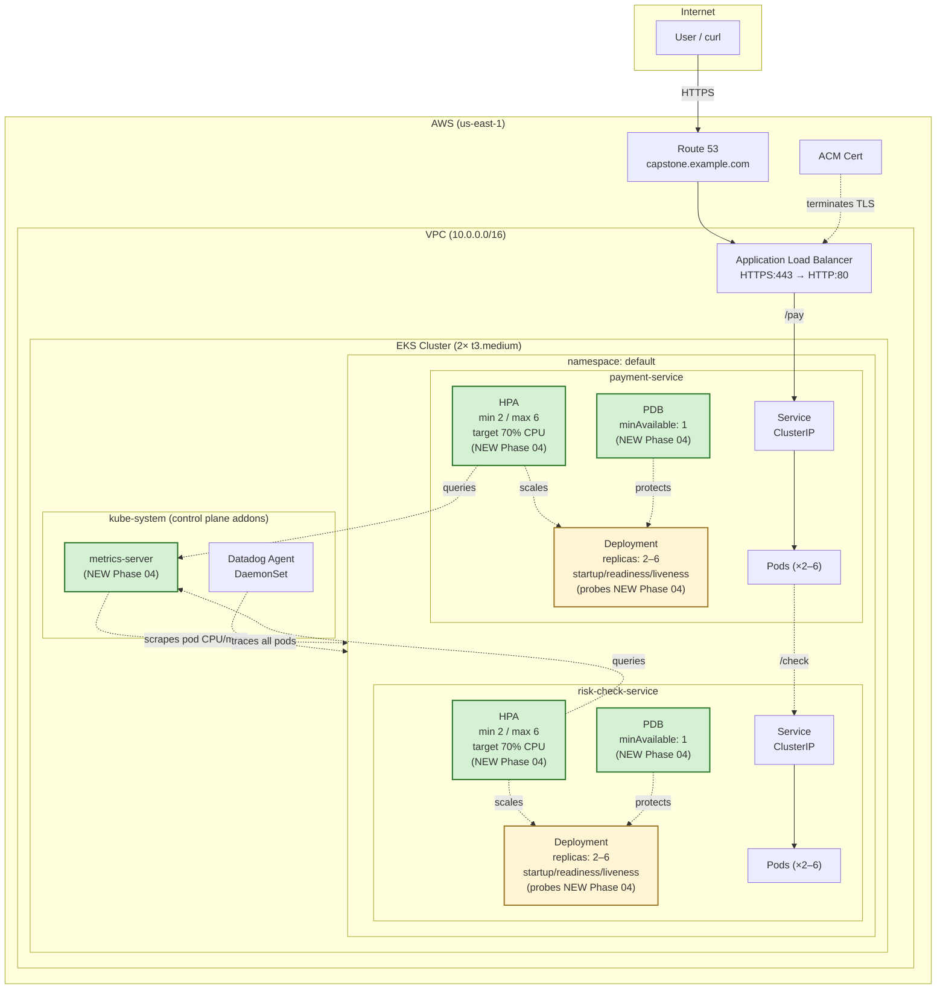
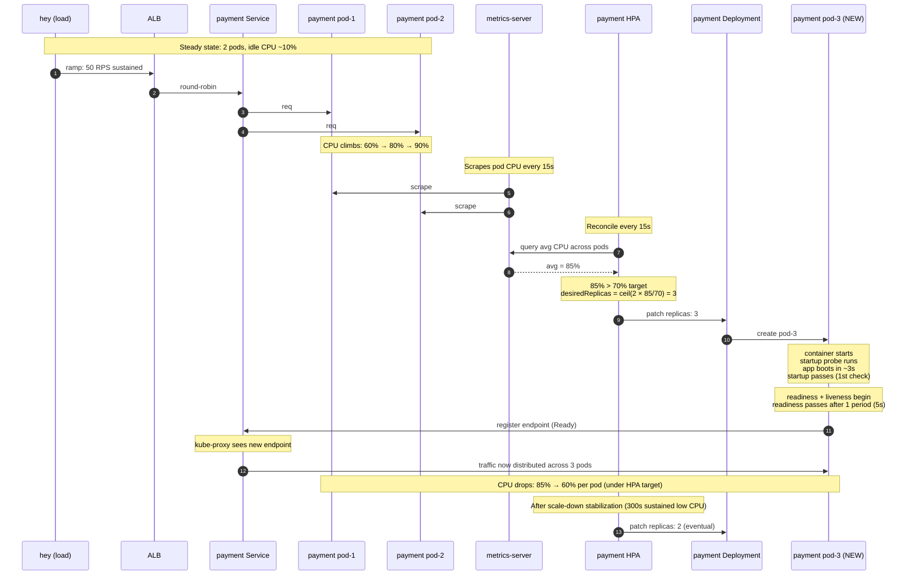
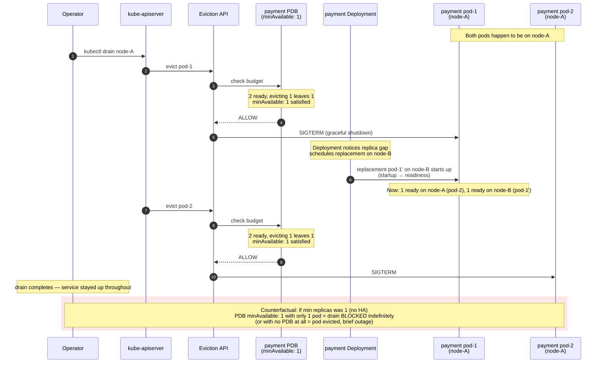

# Phase 04 — HA and scaling

## Goal

Add Horizontal Pod Autoscaler (HPA on CPU), PodDisruptionBudget, and tuned probes (readiness + liveness + startup) to **both** `payment-service` and `risk-check-service`. Verify under realistic load that HPA scales pods up/down within ~1 minute, PDB prevents node-drain outages, and probes correctly detect unhealthy pods — the prerequisite for Phase 05's failure-injection drills (which require HA to be meaningful).

> **Why both services, not just payment:** if only `payment-service` scales but `risk-check-service` stays single-pod, risk-check becomes the bottleneck. Payment scales to 10 pods, but **all 10 payment pods still send traffic to the SAME single risk-check pod** — the synchronous /pay → /check call gets queued at risk-check, latency spikes, the 2s timeout starts firing. Capacity ceiling moves; it doesn't lift. Both services must scale together.

## Non-goals

If we reach for any of these in Phase 04, stop — it's drift.

- **Vertical Pod Autoscaler (VPA)** — different concept (resize one pod's CPU/RAM vs add more pods). Out of scope; HPA is the one we want.
- **Cluster Autoscaler** (scales nodes, not pods) — out of scope; node count stays at 2× t3.medium. If HPA scales pods past what 2 nodes can fit, we'll see Pending pods (a learning moment, not a blocker). Deferred to a later phase.
- **Custom metrics for HPA** (RPS, latency-based, queue-length, etc.) — out of scope; CPU is the simplest starting point. RPS-based HPA is Phase 07+ if useful.
- **Service mesh / advanced traffic shaping** (Istio, Linkerd, weighted routing) — out of capstone scope.
- **Network policies** (pod-to-pod ACLs) — out of scope; Phase 07 security work.
- **Database / persistent storage** — still no DB; Phase 06+ when "slow DB" failure drill needs one.
- **Failure injection** (deliberately killing pods, draining nodes, slow risk-check) → **Phase 05/06**. Phase 04 builds the HA primitives that Phase 05/06 will exercise.
- **Resource request/limit tuning** beyond reasonable defaults (existing ~100m CPU / 128Mi memory are fine for Phase 04). Caveat: HPA-on-CPU is measured *against the request*, so if the load test fails to trigger scaling — or scales too eagerly — request values become the first thing to revisit. If that happens, log it in the spec's decision log and tune; don't silently change them.
- **Pod priority classes / preemption** — out of scope; single-tenant cluster.
- **Multi-region or cross-cluster scaling** — out of capstone.
- **Pre-emptive load shedding / circuit breakers in app code** — Phase 06 (failure-injection drills will reveal where these are needed).
- **Sophisticated load-testing scenarios** (sustained traffic, soak tests, spike-and-recover patterns over hours) — Phase 04's load tests are short bursts (~5-10 min) just to verify HPA fires correctly; sustained soak testing is Phase 07+ if useful.

## Background

**Where the system stands at the start of Phase 04 (post-03b):**

Both `payment-service` and `risk-check-service` run as **single-replica Deployments** in EKS. They sit behind ClusterIP Services, fronted by an ALB (Phase 02) terminating TLS at a Route 53 hostname. CI/CD (Phase 03) deploys via `helm upgrade --atomic` on push to main. Distributed tracing (Phase 03b) connects payment → risk-check spans in Datadog.

What's *missing* and why this phase fixes it:

- **No replica safety.** A single pod means: any restart (OOM, image pull, crash loop, node drain) drops the service to zero healthy endpoints — ALB returns 503 until the new pod becomes Ready. Even a normal Helm rolling deploy briefly hits zero on the old pod's termination because there's no second pod to absorb traffic.
- **No autoscaling.** Static `replicas: 1` is fine for a hello-world but can't survive realistic traffic. Setting `replicas: 3` would help availability but waste CPU at idle and still cap throughput at peak. HPA on CPU is the standard first answer.
- **Probes are minimal.** Whatever the Helm chart ships by default — likely a basic readiness check, no liveness, no startup probe. Under real conditions (slow JVM-style cold start, deadlocked process, dependency timeout) these need to be deliberate.
- **No PodDisruptionBudget.** When a node is drained (cluster upgrade, spot reclaim, manual cordon), Kubernetes will evict pods one by one. Without a PDB saying "keep at least N up," it can take both pods of a service down simultaneously if they're co-located.

**Why Phase 04 is a prerequisite for Phase 05 (failure injection):**

Phase 05 will deliberately kill pods, drain nodes, and inject latency to verify the system survives. None of that is meaningful against single-pod services — killing the only pod is just an outage, not a drill. Phase 04 builds the redundancy and self-healing primitives that Phase 05 will exercise. Concretely: ≥2 replicas + PDB ≥1 means we can lose a pod and stay up; HPA means we can absorb the resulting traffic shift; tuned probes mean Kubernetes notices an unhealthy pod fast enough to remove it from the load balancer.

**Why CPU-based HPA is the right starting point (not RPS / custom metrics):**

CPU is the only metric available out of the box from `metrics-server` (which we'll install this phase). Custom metrics (RPS, p99 latency, queue length) require Prometheus Adapter or a Datadog cluster agent integration — meaningful additional surface area for limited learning gain at this stage. CPU-based HPA also reveals the most common HPA footgun (request-vs-actual mismatch), which is itself a valuable failure-mode lesson. Custom-metric HPA is parked for Phase 07+.

**Load-test rig:**

Short bursts of HTTP load against the ALB endpoint using `hey` (single static binary, no setup). 5–10 minutes is enough to drive CPU above the HPA threshold and observe one full scale-up → steady-state → scale-down cycle. Sustained soak testing is out of scope (see Non-goals).

## Design

### Decisions & rationale

**1. HPA metric: CPU utilization.**
Already locked (see Background). `metrics-server` provides it out of the box. Custom metrics (RPS, latency) deferred to Phase 07+.

**2. HPA target: 70% CPU.**
50% scales up too eagerly (paying for idle headroom). 80%+ is risky because HPA isn't instant — metrics-server scrape (15s) + HPA reconcile + new pod becoming Ready totals 30–90s; if you're already at 80% when load arrives, you saturate before the new pod is up. 70% gives ~30% headroom per pod, the industry-common middle. Same value on both services keeps the mental model simple — divergence becomes a decision, not an accident.

**3. min/max replicas: 2 / 6, identical for both services.**
- `min: 2` (not 1): the whole point of Phase 04 is "lose a pod, stay up." `min: 1` at idle = single pod = no HA. Floor must be ≥ 2.
- `min: 3` would imply quorum reasoning, which doesn't apply to stateless HTTP. 2 is enough.
- `max: 6`: with 2× t3.medium (~2 vCPU each, ~4 vCPU cluster minus ~30% system overhead), 6 pods × 100m request × 2 services = 1.2 vCPU committed for app pods — comfortably fits. `max: 10+` would push past node capacity into Pending pods. Pending is educational (Phase 05 territory) but not the default outcome we want from a normal HPA scale-up. Cluster autoscaler is the right answer for "more capacity" and is deferred.
- Symmetric on both services because of the lockstep-scaling argument from Goal: payment can't usefully outscale risk-check without saturating the bottleneck.

**4. PodDisruptionBudget: `minAvailable: 1`, integer, both services.**
- `minAvailable: 1`: keep at least 1 pod up during voluntary disruption. Simple, works at any replica count.
- `maxUnavailable: 1`: equivalent at 2 replicas but diverges as we scale — at 6 pods it only allows 1 evicted at a time, making node drains glacially slow.
- `minAvailable: 50%`: scales with replica count, but at min replicas=2 it rounds to 1 anyway. Integer is clearer.
- `minAvailable: 2` is too strict — would block ALL voluntary disruption when at min replicas; we'd need 3+ pods running before any drain could start. Wrong for a 2-node cluster.
- PDB only governs **voluntary** disruption (drain, eviction, cluster upgrade). Involuntary disruption (node hardware failure, kernel panic) ignores PDB by design — that's the lesson, not a bug.

**5. Probes: startup + readiness + liveness, all on `/health`.**

Three probes, three different jobs. They are not sequential after startup — once startup succeeds, readiness and liveness run **concurrently** for the rest of the pod's life.

| Probe | Path | period | failureThreshold | timeout | Job |
|---|---|---|---|---|---|
| **startup** | `/health` | 5s | 6 | 1s | One-shot boot gate. Blocks readiness + liveness until app responds healthy. 30s total budget covers our Python boot (<5s) with comfortable margin and is the production-style pattern for future slower apps. |
| **readiness** | `/health` | 5s | 3 | 2s | "Can this pod take traffic?" Fast and aggressive: pod is removed from Service endpoints within ~15s of going unhealthy. |
| **liveness** | `/health` | 10s | 6 | 2s | "Is this process wedged?" Deliberately **looser** than readiness. Liveness restarting pods under load is a classic outage amplifier — if a downstream is slow, every pod fails liveness, every replacement also can't talk to the slow downstream, restart stampede. Liveness should fire only on genuine deadlock/death, not transient slowness. |

Note: with startup probe present, no `initialDelaySeconds` on liveness — startup is the right tool for "let me boot first," `initialDelaySeconds` is the legacy way.

**6. HPA stabilization windows: defaults.**
- Scale-up: 0s (default). Under load you want pods immediately.
- Scale-down: 300s (default). Wait 5 min of sustained low CPU before scaling down to avoid thrash on bursty traffic.

Naming the defaults explicitly so the reader knows we considered them. Not changing them.

**7. metrics-server: Helm chart from official repo, installed via Terraform `helm_release`.**
HPA on resource metrics literally cannot work without metrics-server (the API server has no CPU/memory data otherwise). Official chart is the standard path; installing it via Terraform keeps cluster-level addons declarative alongside everything else in IaC.

**8. Load-test tool: `hey`.**
Already locked (see Background). Single static binary, no setup; sufficient for short bursts to drive HPA.

### Architecture (delta this phase)

New in Phase 04: `metrics-server`, two HPAs, two PDBs, multi-replica Deployments with tuned probes. Everything else carries forward from Phase 03b.

**Reading the diagram:**
- Solid arrows = data path (request flow).
- Dotted arrows = control-plane / observability flow.
- Green-tinted boxes = new in Phase 04.
- Yellow-tinted boxes = existing in earlier phases but materially changed in Phase 04.

### Request flow

Two control loops are new in Phase 04: HPA scale-up under load, and PDB blocking a node drain. Both are dotted-line behaviors (control plane), not part of the user-facing data path — but they're the whole point of the phase, so we draw them.

#### Scale-up under load

#### PDB blocking a node drain

**What the diagrams together show:**
- **HPA loop** is a slow-feedback control system: 15s scrape + 15s reconcile + ~5–30s pod start = **30–90s** total before new capacity is online. This is why HPA target % matters (Decision 2) — you need headroom to survive the lag.
- **PDB** is a *gatekeeper*, not a signal: it returns ALLOW/DENY synchronously when something tries to evict. It does nothing on its own; it only matters when something else (drain, autoscaler, scheduler eviction) asks permission.
- **Together** they answer: "can this system absorb both a traffic spike *and* a node going away?" — yes, because HPA replaces capacity proactively and PDB ensures replacements come online before the old ones leave.

### Implementation outline

Build order — each milestone is independently verifiable. Pattern: install infrastructure (M1), build the full HA stack on `payment-service` (M2–M4b), mirror to `risk-check-service` (M5), then prove it works end-to-end with load tests (M6–M7). Each Phase 04 primitive (probes, HPA, PDB) is *triggered and observed*, not just deployed — verification, not adversarial chaos (chaos is Phase 05).

**M1 — Install `metrics-server` via Terraform Helm release.**
Add a `helm_release` to the EKS Terraform module pointing at the official metrics-server chart. Apply. Verify: `kubectl top nodes` and `kubectl top pods -A` both return CPU/memory data (they fail with `error: Metrics API not available` until metrics-server is up).
*Why first:* HPA reconcile queries metrics-server. Without it, every HPA we create will sit in `<unknown>/70%` state forever.

**M2 — Tune probes on `payment-service`.**
Update the payment Helm chart's `values.yaml` (or Deployment template) with explicit startup, readiness, and liveness probes per Decision 5. Deploy via the existing CI/CD pipeline (push to main). Verify: `kubectl describe pod` shows all three probe types listed; pod still becomes Ready after restart; `kubectl get events` shows no probe failures during steady state.
*Why second:* Probes are the foundation HPA stands on. Get them right before adding scaling — a misconfigured readiness probe will masquerade as an HPA bug.

**M3 — Add HPA for `payment-service`.**
Add a `HorizontalPodAutoscaler` manifest (in the chart or as a separate templated YAML): `scaleTargetRef` → payment Deployment, min 2 / max 6, target CPU 70%. Bump Deployment `replicas: 1 → 2` simultaneously so initial state matches HPA min. Deploy. Verify: `kubectl get hpa` shows `2/2` replicas with current CPU % (not `<unknown>`); `kubectl describe hpa` shows the target metric resolving cleanly.
*Why third:* HPA can be added once probes are good. The simultaneous bump to 2 replicas avoids HPA trying to scale down from 2 to 1 on first reconcile.

**M4 — Add PDB for `payment-service`.**
Add a `PodDisruptionBudget` manifest: selector matches payment Deployment labels, `minAvailable: 1`. Deploy. Verify: `kubectl get pdb` shows `MIN AVAILABLE: 1, ALLOWED DISRUPTIONS: 1` (because we have 2 pods, can lose 1).
*Why fourth:* PDB is independent of HPA but conceptually the second leg of "stay up under disruption." Easy add once HPA is stable.

**M4b — Verify PDB by draining a node.**
With both payment pods running (still pre-M5, so risk-check is single-pod and we ignore it for this test), `kubectl cordon <node>` then `kubectl drain <node> --ignore-daemonsets --delete-emptydir-data` on a node hosting at least one payment pod. Watch in another terminal: `kubectl get pods -w` and `kubectl get pdb`. Verify: pods evict one at a time, never both simultaneously; PDB's `ALLOWED DISRUPTIONS` drops to 0 between evictions and recovers as replacements come up; the service stays reachable throughout (`while true; do curl -s https://<ALB>/pay; done` in a third terminal — no 5xx). Then `kubectl uncordon <node>`.
*Why here:* PDB without a drain test is a configured manifest, not a verified primitive. Drain is the documented control-plane operation PDB exists to govern — not chaos. Functional verification belongs in Phase 04; adversarial chaos belongs in Phase 05.

**M5 — Mirror M2/M3/M4 onto `risk-check-service`.**
Same three changes (probes, HPA, PDB) on the risk-check chart. Single PR / single CI run, since the pattern is now proven on payment. Verify: `kubectl get hpa,pdb -A` shows both services with HA primitives; `kubectl get deploy` shows both at 2 replicas. (Skip a separate drain test for risk-check — the pattern is identical to payment's; no new learning per dollar of cluster surgery.)
*Why fifth:* Pattern is validated; no reason to drag this out across multiple milestones for the second service.

**M6 — Load test `payment-service` in isolation, observe HPA scale-up.**
Install `hey` locally (`brew install hey`). Hit `https://<ALB-host>/pay` with sustained load (e.g. `hey -z 5m -c 50 -m POST -d '{...}' https://...`). Watch in two terminals: `kubectl get hpa -w` and `kubectl get pods -w`. Verify: payment HPA scales from 2 → 3+ within ~90s of CPU exceeding 70%; new pods reach Ready (startup → readiness) and join the Service; CPU per pod drops back below threshold; after load stops, scale-down begins after the 5-min stabilization window.
*Why sixth:* Single-service load is simpler and isolates HPA behavior to one service. Confirms the pattern works before adding cross-service complexity.

**M7 — Load test end-to-end, observe both HPAs scale together.**
Drive load against `/pay` such that it forces `/check` calls to risk-check. Both services should scale together (payment first, risk-check shortly after as its CPU climbs). Verify: both HPAs scale to ≥3 replicas; p99 latency for `/pay` stays under timeout (no 2s timeout firings on the synchronous /check call); Datadog shows traces flowing across the increased pod count.
*Why last:* Validates the Goal's lockstep-scaling argument with both services live. Closest thing Phase 04 has to an end-of-phase integration test.

### Failure-mode notes

Per new component: what breaks, what it takes down with it, how we mitigate.

**`metrics-server` is down or unhealthy.**
- *Symptom:* `kubectl top` returns "Metrics API not available." `kubectl get hpa` shows `<unknown>/70%` for both HPAs. Datadog Kubernetes integration may also lose CPU/memory metrics depending on collection path.
- *Blast radius:* HPA can't make scaling decisions. Replica count freezes at whatever it was; under load, no scale-up. PDB still works (independent of metrics). Probes still work (independent of metrics).
- *Mitigation:* metrics-server is a stateless Deployment in `kube-system` — `kubectl rollout restart` typically clears it. If the chart values are wrong (TLS / hostname resolution issues are the common cause), fix in Terraform and re-apply. Datadog dashboards and pod CPU graphs are independent and remain available for diagnosis.

**HPA misconfigured: target too low (e.g. 30%) or metric noisy.**
- *Symptom:* HPA scales up rapidly to `max` and stays there; CPU per pod drops well below target but HPA doesn't scale down (because traffic load still varies). High pod count, low utilization, looks expensive.
- *Blast radius:* Wasted cluster capacity, potential Pending pods if `max` is high enough to exhaust nodes. No outage.
- *Mitigation:* Edit HPA target back to 70%. If metric is noisy (e.g. workload has CPU spikes that aren't representative), increase HPA scale-up stabilization window from 0s to 60–120s.

**HPA hits `max` under sustained load.**
- *Symptom:* `kubectl get hpa` shows `6/6` replicas at 100% CPU but no further scaling. Per-pod CPU stays high; latency degrades; eventually requests start timing out.
- *Blast radius:* Service can't absorb additional load. User-visible: latency creep, then 5xx as request queues fill.
- *Mitigation:* Short term — raise `max` (requires Helm upgrade). Long term — add more nodes (cluster autoscaler) or scale per-pod CPU request up + machine size up. The error here points at *capacity planning*, not HPA itself.

**PDB too strict (e.g. `minAvailable` equal to replica count).**
- *Symptom:* `kubectl drain` hangs forever with `error when evicting pod: Cannot evict pod as it would violate the pod's disruption budget`. Cluster upgrades, node maintenance all blocked.
- *Blast radius:* Cluster operations halt. No service impact (the pods stay up — that's PDB's job) but you can't do node maintenance.
- *Mitigation:* Edit PDB to `minAvailable: 1` (or scale Deployment up so PDB has slack). PDB only affects voluntary disruption; involuntary disruption (node hardware failure) ignores it.

**PDB too loose / missing.**
- *Symptom:* During node drain, all replicas evicted simultaneously. Brief outage during drain (until replacements come up on other nodes). `kubectl get endpoints` shows zero healthy backends mid-drain.
- *Blast radius:* User-visible 5xx during the eviction window. Window length depends on pod startup time (~5–30s).
- *Mitigation:* Add or fix PDB. This is exactly the failure mode Phase 04 closes; if you see it post-Phase-04, the PDB manifest didn't actually deploy or its label selector doesn't match the Deployment.

**Startup probe too short (failureThreshold × periodSeconds < actual boot time).**
- *Symptom:* CrashLoopBackOff. `kubectl describe pod` shows "Startup probe failed" repeatedly. Pod never reaches Ready.
- *Blast radius:* New pods can't replace old pods. During a rolling deploy, old pods terminate but new pods never come up → eventual outage. HPA keeps trying to add pods that never become Ready → pod count balloons in Pending/CrashLoopBackOff state.
- *Mitigation:* Increase `failureThreshold` or `periodSeconds`. Our budget is 30s (6 × 5s); if Python boot is consistently exceeding that, find out why before raising the budget — could be DNS, dependency timeout, image pull from a slow registry.

**Readiness probe too aggressive (timeout too short, threshold too low).**
- *Symptom:* Pods flap in and out of Service endpoints (`kubectl get endpoints` keeps changing). Intermittent 503s from ALB. `kubectl get events` shows "Readiness probe failed" sporadically.
- *Blast radius:* User-facing intermittent errors. Looks like an upstream/dependency problem at first glance. HPA may also misbehave because metrics-server only counts Ready pods toward HPA's "current replicas" calculation.
- *Mitigation:* Increase `timeoutSeconds` (2s → 5s) or `failureThreshold` (3 → 5). Confirm `/health` endpoint isn't itself making expensive downstream calls.

**Liveness probe too aggressive — restart stampede under partial dependency outage.**
- *Symptom:* When a downstream (e.g. risk-check) becomes slow, payment's `/health` starts timing out → liveness fails → kubelet restarts payment pods → replacement pods *also* time out on the same slow downstream → restart loop across the entire Deployment. `kubectl get pods` shows climbing restart counts; service availability collapses.
- *Blast radius:* **Whole-service outage**, even though the underlying problem is downstream slowness, not pod death. The cure (restart) makes the disease worse — replacements can't talk to the slow downstream either, and burn capacity rebooting.
- *Mitigation:* This is why liveness is configured *looser* than readiness in Decision 5 (period 10s, failureThreshold 6 = 60s before kill, vs readiness 5s × 3 = 15s before removed from endpoints). The fix is design, not runtime: liveness probes should test the *process*, not the *dependencies*. If `/health` calls downstream, change it to a pure liveness check (in-process only). Readiness can still test downstream — that's the right separation.

**Pending pods (HPA wants to scale past cluster capacity).**
- *Symptom:* `kubectl get pods` shows pods stuck `Pending`. `kubectl describe pod` shows "0/2 nodes available: insufficient cpu" or similar.
- *Blast radius:* HPA can't deliver the capacity it wants. Existing pods are still serving but at higher CPU than HPA targets. Eventual: latency creep on the loaded service.
- *Mitigation:* In Phase 04 with `max: 6` and our request sizing, this shouldn't happen on the happy path. If it does, it means CPU requests are too high, or system pods are eating more than expected — investigate `kubectl describe node` for capacity. Permanent fix is cluster autoscaler (deferred). Manual fix: lower `max` or add a node by editing the EKS node group.

## Validation

Every box should be ticked only if the listed command produces the listed evidence. Pasted output is the proof.

**metrics-server is healthy and feeding HPA**
- [ ] `kubectl top nodes` returns CPU and memory for both nodes (no "Metrics API not available")
- [ ] `kubectl top pods -A` returns CPU and memory for app pods
- [ ] `kubectl get deploy -n kube-system metrics-server` shows `READY 1/1`

**Probes deployed correctly on both services**
- [ ] `kubectl describe pod -l app=payment-service` shows all three probe types (Startup, Liveness, Readiness) with the parameters from Decision 5
- [ ] Same check for `risk-check-service`
- [ ] `kubectl get events --sort-by=.lastTimestamp | grep -i probe` shows no probe failures during steady state (post-startup)

**HPA deployed and active on both services**
- [ ] `kubectl get hpa` shows entries for both services with `TARGETS: <X>%/70%` (X being a real number, not `<unknown>`)
- [ ] `kubectl get hpa <name> -o jsonpath='{.spec.minReplicas}/{.spec.maxReplicas}'` returns `2/6` for both
- [ ] `kubectl describe hpa <name>` "Conditions" section shows `AbleToScale: True`, `ScalingActive: True`, `ScalingLimited: False` at idle

**PDB deployed and observable for both services**
- [ ] `kubectl get pdb` shows entries for both services with `MIN AVAILABLE: 1` and `ALLOWED DISRUPTIONS: 1` (when at min replicas)
- [ ] `kubectl get pdb <name> -o yaml` confirms the selector matches the Deployment's pod labels (no typo silently making it select zero pods)

**PDB functionally verified via drain (M4b)**
- [ ] During `kubectl drain` of a node with payment pods, `kubectl get endpoints payment-service` never shows zero ready endpoints
- [ ] During the same drain, a tight curl loop against the ALB returns no 5xx responses
- [ ] `kubectl get pdb` during drain shows `ALLOWED DISRUPTIONS: 0` while an eviction is in flight, recovering to `1` once the replacement pod is Ready

**HPA functionally verified via load (M6 — payment alone)**
- [ ] During load test, `kubectl get hpa -w` shows `payment-service` `TARGETS` exceed 70% then `REPLICAS` increase from 2 → 3+ within ~90 seconds
- [ ] `kubectl get pods` confirms new pods reach Running and Ready (Conditions: ContainersReady=True, Ready=True)
- [ ] After load stops, after the 5-minute scale-down stabilization window, replicas return to 2
- [ ] No 5xx in the load tester's output during the steady-state portion (excludes the scale-up window itself if first requests time out — note in lessons if observed)

**End-to-end HA validated (M7 — both services under load)**
- [ ] During cross-service load (drives both `/pay` and downstream `/check`), both HPAs scale to ≥ 3 replicas
- [ ] p99 latency of `/pay` (Datadog) stays under the 2s timeout — no timeout firings on the synchronous /check call
- [ ] Datadog APM trace flame graph shows traces flowing across the increased pod count for both services (i.e., trace IDs distributed across multiple pod instances on both ends)

**Architecture and docs caught up**
- [ ] `ARCHITECTURE.md` updated with the Phase 04 cumulative diagram (matches the spec's Architecture section)
- [ ] `runbook.md` has operate-steps for: install metrics-server, change HPA targets, change PDB, drain a node safely, run the load test
- [ ] `lessons.md` has at least one Phase 04 entry written by user (not Claude)
- [ ] Verbal recall: user can explain the phase aloud in 60 seconds without notes (verified at `/phase-close`)
- [ ] Visual recall: user can redraw the Phase 04 architecture diagram from memory (verified at `/phase-close`)

## Rollback / undo

Phase 04 is mostly additive — most undo is "delete the new resource." Two categories are in-place edits and need a real revert.

**Full Phase 04 rollback (worst case — entire phase backs out):**

1. Revert the commits that added probes to the Helm charts and bumped `replicas` from 1 → 2. Push to main; CI/CD redeploys the prior chart values.
2. `kubectl delete hpa payment-service-hpa risk-check-service-hpa` (or `helm uninstall` the per-service HPA chart, depending on packaging).
3. `kubectl delete pdb payment-service-pdb risk-check-service-pdb`.
4. `terraform destroy -target=helm_release.metrics_server` (or revert the `helm_release` block and `terraform apply`).
5. Verify: `kubectl get hpa,pdb -A` returns empty; `kubectl top nodes` returns "Metrics API not available"; both Deployments at `replicas: 1` with default probes.

State after: identical to end of Phase 03b. ~5 minutes wall time.

**Per-component undo (more common — selective rollback):**

| Change | Undo command | Effect | State after |
|---|---|---|---|
| `metrics-server` install | `terraform destroy -target=helm_release.metrics_server` | HPAs go to `<unknown>/70%` and stop scaling | Phase 03b state for metrics |
| HPA on a service | `kubectl delete hpa <name>` | Replica count freezes at whatever it currently is | Replicas need manual `kubectl scale` if you want to return to base |
| PDB on a service | `kubectl delete pdb <name>` | Voluntary disruption (drain) no longer protected | Pre-PDB Phase 03b state |
| Probe changes | Revert chart `values.yaml`, push to main | Default chart probes (likely just basic readiness) | Phase 03b state for probes |
| Replica bump (1 → 2) | Revert chart `values.yaml`, push to main | Service goes back to single-pod, no HA | Phase 03b state |

**Operational undo (mid-milestone recovery):**

| Situation | Recovery |
|---|---|
| `kubectl drain` (M4b) hung — pod stuck Terminating | `kubectl delete pod <name> --grace-period=0 --force` only as last resort. First, check `kubectl describe pod` for the actual block (commonly: PDB satisfied but `terminationGracePeriodSeconds` not yet elapsed — wait it out). |
| Drained node not coming back | `kubectl uncordon <node>` to mark it schedulable again. Existing Deployments will rebalance gradually as new pods are created. |
| Load test (M6/M7) accidentally drove HPA to `max` and won't scale down | Stop the load tester. Wait the 5-minute scale-down stabilization window. If still stuck, check `kubectl describe hpa` for the active condition — `ScalingLimited: True` means it hit max; current load is still keeping CPU above target. |
| Load test left orphaned high replica count after the user gave up waiting | `kubectl scale deploy/<name> --replicas=2` manually overrides; HPA will reconcile from there on next loop. |

**What rollback does NOT undo:**

- Probe-tuning *insights* you've gained from M2's deployment. Those go into `lessons.md` regardless of whether you keep the probes.
- Cluster state changes from M4b's drain: any pods that got rescheduled to a different node stay where they are after `uncordon`. This is not a problem — pods are stateless — just noting it's not a perfect "back to where I started" undo.
- Costs already incurred during the phase (compute, ALB, ELB IPs). One-time charges, not state.

## Comprehension checkpoints

Six checkpoints to clear before `/phase-close`. Each tests a concept that, if not internalized, means Phase 04 was mechanical not learned.

**Predict** — Before running M6's load test, predict: from the moment payment-service pods cross 70% CPU, how long until a third pod is Ready and serving traffic? Walk through every component that contributes to that delay (metrics-server scrape interval, HPA reconcile interval, scheduler, image pull / cached, container start, startup probe, readiness probe). Why does this total matter for choosing the HPA target %?

**Failure-mode** — Liveness probe currently hits `/health`. Suppose someone changes `/health` so it internally calls risk-check (a "deeper health check" that "validates downstreams"). Risk-check then becomes slow under partial outage. Walk through the cascade end-to-end: which probe fires first, what kubelet does, what the replacement pods experience, what the user sees. Where does the cascade stop, and what's the *design fix* (not a runtime knob)?

**Explain-back** — In your own words: why must `min replicas` be ≥ 2 even though HPA can add a pod under load? Why isn't "HPA scales from 1 → 2 when needed" sufficient HA? Be precise about *when* each of these mechanisms reacts.

**Counterfactual** — If we set HPA target CPU to 50% instead of 70%, name three concrete differences in observed behavior — at idle, during a moderate load ramp, and at sustained peak. Which of those three is the practical reason 70% is the more common default?

**Connection** — PDB `minAvailable: 1` and ALB's healthy-target requirement (Phase 02) both encode the same underlying idea. What is that idea? Where do they differ in the *kind* of disruption each protects against, and why do you need both?

**Real-world** — In past production work, where have you seen a slow or failing downstream cause a restart loop or cascading availability problem? What was the actual fix that stopped it (not the workaround that masked it)?

## Open questions

- [ ] **Which Helm chart packaging for HPA + PDB?** Add as templated YAML inside the existing `payment-service` / `risk-check-service` charts, or as a separate `ha-primitives` chart that targets multiple Deployments? Defer until M3 — likely answer is "in the existing per-service chart" but worth re-validating once we see the templating pattern.
- [x] ~~**Will `metrics-server` need `--kubelet-insecure-tls`?**~~ **Resolved 2026-05-08 (M1):** No. `kubectl top nodes` returned data on the first try with the default chart on this EKS cluster. The commented-out workaround in [infra/metrics-server.tf](../infra/metrics-server.tf) can stay as documentation but is unused.
- [x] ~~**What's the actual idle CPU usage of each service?**~~ **Resolved 2026-05-08 (M1):** Actual idle is **4m for payment, 3m for risk-check** — far lower than the 100m CPU request. ~25× ratio. See Decision log entry below for implications on M6 load testing and possible request retuning.
- [ ] **How aggressive should `hey` ramp be in M6/M7?** Need enough to drive CPU above 70% target across 2 pods, but not so much that requests start failing before HPA can react (the scale-up window itself). Will tune empirically — start at `-c 50 -z 5m` and adjust.

## Decision log

**2026-05-08 — M1 introduces `helm_release` as the preferred Helm-install pattern.**
Existing addons (`infra/datadog.tf`, `infra/lbc.tf`) use `null_resource` + `local-exec` calling `helm` directly. That pattern was a Phase 01/02 expedient; it has real downsides — Terraform can't detect drift in chart values, version changes don't propagate without manual `terraform taint` (the existing files have no `triggers` block), and destroy-time errors are silently swallowed. Phase 04 M1 adopts `helm_release` for `metrics-server`. Datadog and LBC remain on the old pattern; migration is tracked as a future cleanup, not Phase 04 scope. The `helm` provider config already exists in [infra/provider.tf](../infra/provider.tf#L51-L55) but had not been exercised — first use is in this milestone.

**2026-05-08 — Idle CPU observation (M1 verification): real-vs-request ratio is ~25×.**
After M1, `kubectl top pods -A` shows payment-service at **4m** CPU and risk-check-service at **3m** CPU at idle. The chart's `resources.requests.cpu` is **100m** per Decision 5. That means HPA's 70% target = 70m per pod, and the gap from idle (4m) to scale-up trigger (70m) is ~17×. Implications:
- **M6 load test:** `hey` ramp must drive each pod's CPU climb by an order of magnitude to trigger scaling. Starting at `-c 50 -z 5m` (per Open question 4) may be insufficient — be ready to crank concurrency higher.
- **Request retuning may be needed:** if M6 shows HPA unable to fire under realistic load, the cleanest fix is dropping `resources.requests.cpu` from 100m → 25m or so. That tightens the actual-vs-request gap and makes 70% target a meaningful threshold. This is the "first thing to revisit" caveat from Non-goals — not Phase 04 scope unless M6 reveals it's needed.
- **No action this milestone.** Logged so the M6 baseline is informed.
