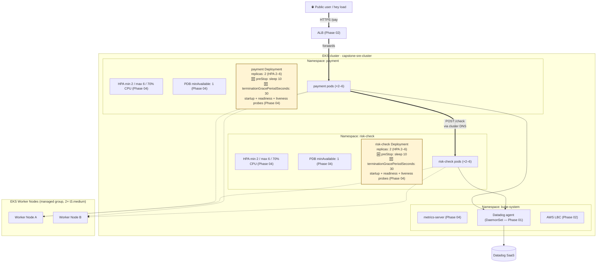
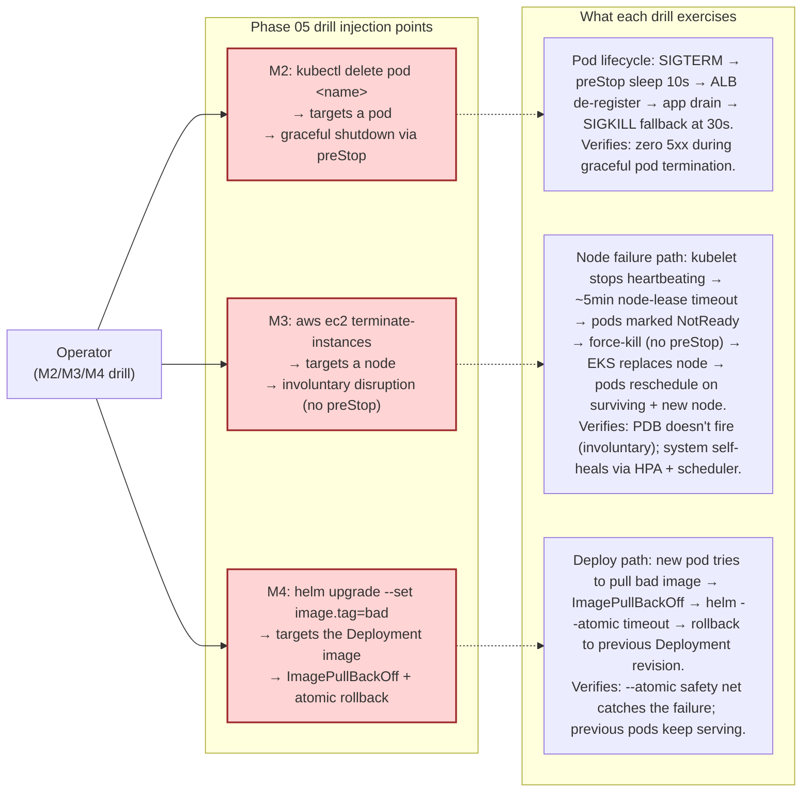
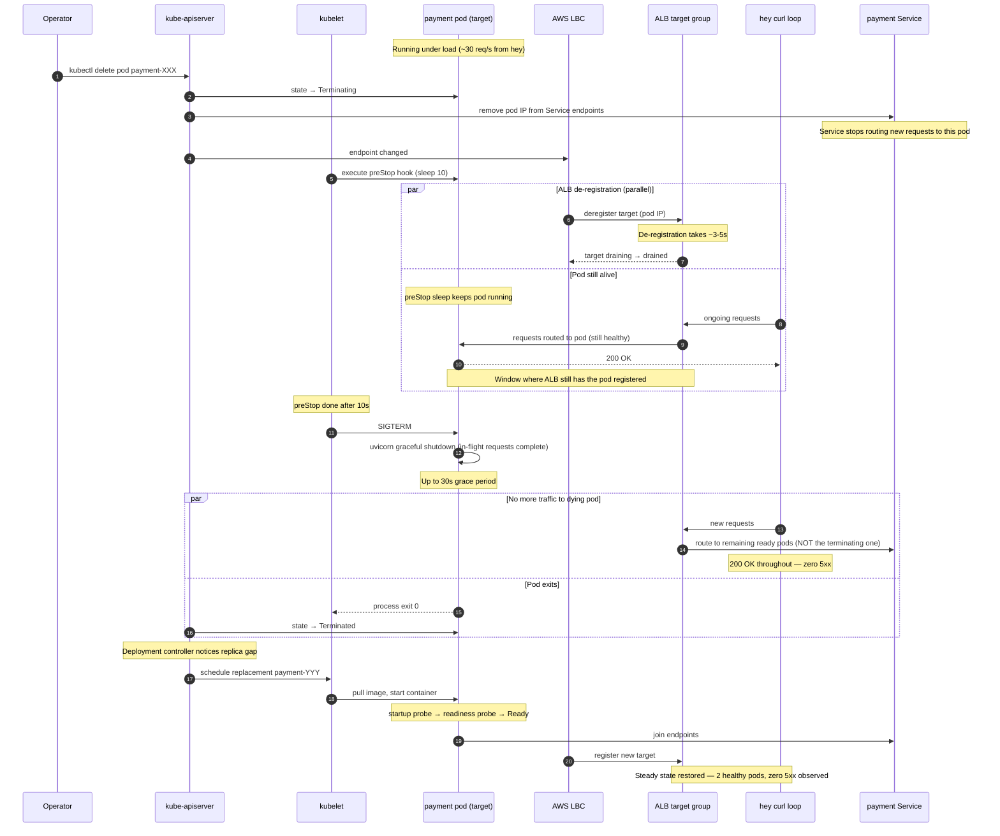
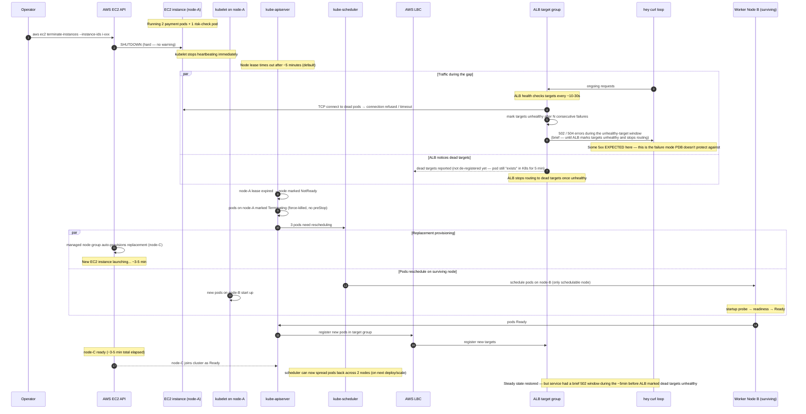
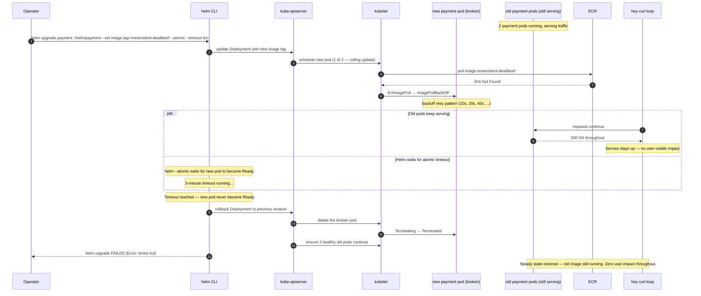

# Phase 05 — Failure injection: infrastructure

## Goal

Phase 05 closes the graceful-shutdown gap surfaced in Phase 04 (`preStop` + `terminationGracePeriodSeconds`), then deliberately injects three infrastructure failures — **pod kill, node failure, image pull failure** — to verify the system survives, observe how each failure manifests in Datadog, and convert each observation into a real runbook playbook. This is the first phase where the goal is to *break the system on purpose* and *watch it recover*.

**Why the graceful-shutdown fix comes first (the Phase 04 carryover):**

```
Pod terminates too quickly
        ↓
Traffic still reaches pod
        ↓
Temporary 502s happen
```

The M4b drain test exposed this gap (~5 brief 502s while ALB de-registration lagged behind pod termination). Phase 05's pod-kill drill (M2) is meaningless if pods can't shut down gracefully — every kill would produce 502s and we couldn't tell whether the chaos drill *uncovered* a problem or just *re-surfaced* the known one. Closing the gap first gives Phase 05's chaos drills a clean pass/fail signal.

## Non-goals

We are only testing **infrastructure failure and recovery behavior** — not performance tuning, dependency failures, or advanced chaos systems. If we reach for any of these in Phase 05, stop — it's drift.

- **Application-layer / dependency failures** — slow DB, slow downstream service, dependency timeouts, retry storms, circuit breakers. → **Phase 06.** Phase 05 is *infrastructure* failures only (pod, node, image registry).
- **Chaos engineering frameworks** (Chaos Mesh, LitmusChaos, AWS FIS) — out of capstone scope. We use plain `kubectl` and `aws` CLI for failure injection. Chaos frameworks add tooling surface that isn't pedagogically useful at this stage; they belong in a stretch phase if at all.
- **Random / scheduled chaos** (game days, kill-pod cron, periodic disruption) — out of scope. Phase 05 drills are *deliberate, observed, recovered* — one failure at a time, attention focused, lessons captured. Random chaos is a maturity step beyond this.
- **Cluster autoscaler** — node failure drill in M3 will likely *also* surface "where do the evicted pods go?" If both nodes were full, evicted pods stay Pending. We accept Pending as a learning observation, not a problem to solve in Phase 05.
- **Multi-AZ / multi-region failover** — out of capstone scope. The "node failure" drill (M3) is a single-node terminate within one region; we don't test region failure or AZ failure scenarios.
- **WAF / synthetics / alerting** — Phase 07 work. Phase 05 observes failures *manually* (curl loops, kubectl, Datadog UI). Wiring alerts is a separate phase concern.
- **Fixing the CPU request mismatch** (the Phase 04 M7 finding: actual 488m vs request 100m → p99 5.41s under load) — out of scope unless it actively blocks a Phase 05 drill. Phase 05 isn't about performance tuning.
- **Modifying probe thresholds** beyond what M1 requires — Phase 04's probe config stays as-is. If a drill reveals a probe-tuning need, log it and defer.
- **Networking failures** (DNS outage, network partition, packet loss) — adjacent to infrastructure but really a different drill category. Out of scope for Phase 05; could surface in Phase 06 if a downstream-service drill exercises DNS.
- **Persistent storage / volume failures** — still no stateful workloads. Out of scope until a DB exists.

## Background

**Where the system stands at the start of Phase 05 (post-04):**

Both `payment-service` and `risk-check-service` run with 2–6 replicas behind HPAs (target 70% CPU), have PodDisruptionBudgets (`minAvailable: 1`), and three-probe stacks (startup + readiness + liveness on `/health`). `metrics-server` feeds CPU metrics. The system survives node drains (Phase 04 M4b proved this — with one caveat) and absorbs traffic spikes by scaling up to MAX 6 within seconds. Cross-service distributed tracing works at multi-pod scale.

**What's still fragile (the gap Phase 05 closes first):**

- **Graceful-shutdown gap.** When a pod terminates (drain, eviction, rolling deploy), Kubernetes removes its IP from the Service endpoints immediately, but the AWS Load Balancer Controller takes a few seconds to de-register the pod from the ALB target group. During that gap, ALB still forwards requests to the dying pod → 502s. M4b's drain test captured ~5 brief 502s for this reason.
- **PDB doesn't help here.** PDB governs *eviction*, not the *handoff* between eviction and load-balancer awareness. The fix is at the pod-lifecycle level: a `preStop` hook that sleeps long enough for ALB de-registration to complete, plus a `terminationGracePeriodSeconds` that gives the pod time to honor the sleep.

Phase 05 M1 closes this gap on both services. After M1, "kill a pod" should produce zero 5xx — and that becomes the pass/fail signal for every subsequent chaos drill.

**Why Phase 05 is the right phase for chaos drills:**

Chaos drills against a single-replica service are just outages. Phase 04 built the HA primitives (HPA, PDB, multi-replica Deployments) that make "kill a pod" *interesting* rather than *fatal*. Phase 05 is the first phase where we can deliberately break things and watch the system *recover* — which is the SRE muscle that matters most for incident response. Each drill answers a specific question:

- **Pod kill (M2):** does the orchestrator's self-healing actually work under load, with zero user-visible errors?
- **Node failure (M3):** what happens when a node disappears *involuntarily* — the failure mode PDB explicitly doesn't protect against?
- **Image pull failure (M4):** how does a broken deploy manifest, and does `helm --atomic` rollback actually save us?

**How Phase 05 sets up Phase 06:**

Phase 06 is *dependency* failure injection — slow downstream, timeouts, retry storms, cascading failures. Those drills are subtle: a slow risk-check looks similar in Datadog to a kernel panic on the node it's running on. Phase 05 establishes the baseline "what infrastructure failures look like" so Phase 06's signals are distinguishable. Without Phase 05, every Phase 06 drill would have to first rule out "is this actually an infrastructure issue?" — wasting time during incidents.

**Observation tooling (no new tools introduced):**

We use what's already in place — `kubectl` for cluster state, Datadog APM/Logs/Infrastructure for telemetry, a `hey`/curl loop for traffic. No chaos engineering framework (see Non-goals). One failure injection at a time, observe end-to-end, document, recover.

## Design

### Decisions & rationale

**1. `preStop` hook: `sleep 10` via `lifecycle.preStop.exec.command`.**
The pod needs to "stay alive but stop accepting new connections" for ~10s after termination starts, so the ALB has time to de-register it from the target group. Simplest implementation: shell `sleep 10` in the preStop hook. Kubelet waits for sleep to finish before sending SIGTERM; ALB de-registration completes in that window.
Alternatives rejected: (a) application-level shutdown handler — FastAPI/uvicorn doesn't ship one out of the box; custom signal-handler code is out of scope. (b) External graceful-shutdown operator (e.g. `kubectl-cnp-drainer`) — framework theater for this scale.
10s is based on observed ALB de-registration in Phase 04 M4b (~3-5s gap; 10s gives 2× margin).

**2. `terminationGracePeriodSeconds: 30` (Kubernetes default — named explicitly).**
The grace period must be LONGER than the preStop sleep, otherwise kubelet will SIGKILL the pod mid-sleep — defeating the purpose. Budget breakdown:
- preStop sleep: 10s
- App drain after preStop completes: ~2-5s (uvicorn graceful shutdown)
- Margin: ~15s
- Total: 30s
This is the Kubernetes default, so this decision is "name the default, don't change it." Naming it explicitly matters: if a future change shortens it (e.g. to 5s for some reason), the preStop sleep gets cut off and we're back where we started. Future me should see this called out before touching it.

**3. Pod kill drill (M2) uses `kubectl delete pod <name>` — graceful, NOT `--grace-period=0 --force`.**
`kubectl delete pod` sends SIGTERM through the normal pod lifecycle: preStop runs, grace period honored. This is what M1's fix is FOR — we want to verify graceful shutdown works under deliberate-kill conditions.
The force-kill variant (`--grace-period=0 --force`) skips the lifecycle entirely: pod killed immediately, no preStop, no grace period. That's a different failure mode (kernel panic / OOM / node-loses-network) and is implicitly exercised in M3 (node failure — pods on the dead node get force-killed by EKS). We don't need both as separate milestones.

**4. Node failure (M3) uses `aws ec2 terminate-instances` — real termination.**
Simulates hardware failure / instance crash — the *involuntary* disruption that PDB explicitly does not protect against.
Alternatives rejected:
- `kubectl drain` — already done in Phase 04 M4b. Graceful, voluntary. PDB protects it. Not what we want.
- `aws ec2 reboot-instances` — instance comes back in ~2 min; pods may stay scheduled. Less destructive but less realistic to a real hardware failure.
- `kubectl delete node` — only removes the node from the K8s API; the underlying EC2 stays running. Misleading.
Real terminate confirms: (a) Kubernetes notices a dead node (~5 min via node lease timeout), (b) pods get force-killed by EKS (no preStop runs — PDB doesn't fire, by design), (c) EKS managed node group auto-provisions a replacement (~3-5 min), (d) HPA + Deployment reschedule lost pods on surviving + replacement nodes. Cost: 1 instance terminated and re-provisioned — negligible. Risk: ~5-min window where capacity is halved; happy path is the surviving node absorbs everything via HPA + the replica spread Phase 04 created.

**5. Image pull failure (M4): `helm upgrade --set image.tag=<nonexistent-tag>`.**
Forces a deploy with a tag ECR doesn't have. Kubernetes tries to pull → `ImagePullBackOff`. `helm --atomic` rolls back to previous good image automatically.
Alternatives rejected:
- Break the Dockerfile and push: slower (needs CI/CD round-trip); introduces variables we don't want (test failures vs build failures vs runtime failures).
- Revoke ECR pull credentials: too destructive; affects all future deploys until restored.
Single-command injection (`helm upgrade --set image.tag=does-not-exist-deadbeef`) is the cleanest experiment. The `--atomic` rollback we already validated in Phase 03 M7 gets re-exercised under a different failure mode.

**6. Load during drills: `hey -z 2m -c 20` (lighter than Phase 04 M6's `-c 50`).**
Phase 04 M6's `-c 50` was too aggressive for chaos observation. At that concurrency, payment scales to MAX in 12s and CPU saturates — chaos failure signals get drowned in scaling noise.
For Phase 05 drills, we want sustained traffic that:
- Stays steady (just below or at HPA scale-up threshold)
- Generates enough requests/sec to make any 5xx immediately visible in the T3 curl loop
- Runs long enough (~2 min) to observe inject → effects → recovery without rushing

`-z 2m -c 20` ≈ 30-40 req/sec sustained, CPU ~70-100% of request, gentle scaling if any. Tunable per drill if a specific test needs heavier load.

**7. Datadog observation: screenshot + time-to-detect per drill.**
For each drill: capture screenshot of Datadog APM dashboard during the drill window. Note (a) which dashboard widget moves first (first signal), (b) time-to-detect (drill injected at T=0; signal at T=?), (c) what recovers automatically vs needs human action. Each drill's eventual lessons.md entry includes the screenshot + the time-to-detect. This is the data that turns into runbook playbooks in M5.

### Architecture (delta this phase)

Phase 05's "delta" is **configuration + procedures**, not new components. The architecture is unchanged from Phase 04 except for two pod-lifecycle config additions (`preStop` + `terminationGracePeriodSeconds`) on both Deployments. The inset diagram shows the three drill injection points and what each one exercises.



**Drill injection points (where each Phase 05 chaos drill enters the system):**



**Reading the diagrams:**
- Top diagram: cumulative system state at end of Phase 05. Yellow-tinted boxes = changed from Phase 04 (probes/HPA/PDB already existed; preStop + grace-period are added on top).
- Bottom diagram: red-tinted boxes = the three drill injection points. Each arrow into "effects" shows what mechanism the drill exercises.

### Request flow

Phase 05's "request flow" is the **operator-injected failure path** and the system's recovery. Three sequence diagrams — one per drill — showing the inject → react → recover cycle.

#### M2 — Pod kill drill (graceful)



**Key insight:** the preStop `sleep 10` is the *whole reason* this drill produces zero 5xx. Without it, the pod would receive SIGTERM immediately and start closing connections while the ALB still has it registered → 502s. The sleep buys time for the ALB to notice the de-registration first.

#### M3 — Node failure drill (involuntary disruption)



**Key insight:** PDB does NOT protect against this. PDB checks evictions; force-killing the node bypasses the eviction API entirely. The 502 window is unavoidable until ALB health checks notice the dead targets — typically 30-60 seconds. M3 documents *how long* this window is in real conditions.

#### M4 — Image pull failure drill (broken deploy)



**Key insight:** the `--atomic` flag is the safety net. Without it, the Deployment would be stuck with 1 healthy old pod + 1 broken new pod indefinitely (or until manual intervention). With it, the failure is bounded by the 5-min timeout and recovery is automatic. This drill re-validates Phase 03 M7's atomic rollback under a different failure mode (broken image vs broken `/health`).

#### What the three drills together teach

| Drill | Disruption type | Recovers automatically? | User-visible impact | PDB helps? |
|---|---|---|---|---|
| M2 (pod kill) | Voluntary, graceful | Yes | Zero 5xx if preStop works | Not directly; graceful shutdown + Deployment self-heal matter most |
| M3 (node terminate) | Involuntary, hard | Yes (~5 min) | Brief 502 window during ALB health-check propagation | No — PDB only governs voluntary disruption (Eviction API), and the node bypasses that entirely |
| M4 (bad image) | CI/CD-induced deploy failure | Yes (`helm --atomic` rollback) | Zero impact — old pods keep serving | No — never affects healthy pods |

Together they cover the three flavors of "something broke and Kubernetes/AWS/Helm handled it": orchestrator self-heal, infrastructure self-heal, deploy-pipeline self-heal.

**Subtle distinction (worth knowing):** `kubectl delete pod` uses the **Delete API**, which does NOT consult PDB. PDB is consulted only by the **Eviction API** (used by `kubectl drain` and by autoscalers). So M2's drill, while it sends a pod through the graceful shutdown lifecycle, doesn't actually exercise PDB — only M4b in Phase 04 (drain) did. M2 exercises the preStop + Deployment self-heal path; M3 exercises the involuntary path that PDB explicitly cannot help with. PDB is genuinely tested only by drain-style operations.

### Implementation outline

Build order: close the Phase 04 graceful-shutdown gap first (M1), then run three chaos drills in increasing destructiveness order (M2 → M3 → M4), then convert observations into runbook playbooks (M5). Each drill is independently verifiable and produces concrete artifacts (Datadog screenshots, time-to-detect measurements, the M5 playbook entries).

**M1 — Close the graceful-shutdown gap (preStop + terminationGracePeriodSeconds).**
Add `lifecycle.preStop.exec.command: ["sh", "-c", "sleep 10"]` and `terminationGracePeriodSeconds: 30` to both `payment-service` and `risk-check-service` Deployment templates. Parameterize via `values.yaml` (`gracefulShutdown.preStopSleep` and `gracefulShutdown.terminationGracePeriodSeconds`) for per-env tunability. Deploy via CI/CD. Verify: `kubectl describe pod` shows the lifecycle hook and grace period; redo the Phase 04 M4b drain test with traffic — **zero 502s this time**.
*Why first:* every subsequent drill needs this baseline. Without preStop, M2's pod kill would produce 502s and we couldn't tell whether the drill *uncovered* a problem or *re-surfaced* the known one. M1 establishes the clean pass/fail signal.

**M2 — Pod kill drill.**
Under sustained load (`hey -z 2m -c 20` against `/pay`), in a separate terminal run `kubectl delete pod <name>` against a random payment pod, then a random risk-check pod. Watch in three panes: `kubectl get pods -A -w`, `kubectl get hpa -A -w`, Datadog APM. Capture: (a) which pod terminated, (b) when the replacement became Ready, (c) `hey`'s final summary showing zero 5xx, (d) Datadog screenshot showing first signal + time-to-detect.
*Why second:* tests the preStop fix from M1 under realistic conditions. This is the "happy path" chaos drill — everything works as designed if the fix landed correctly.

**M3 — Node failure drill (real EC2 termination).**
Identify a worker node with at least one payment pod and one risk-check pod (`kubectl get pods -A -o wide`). Under load (`hey -z 5m -c 20` — longer because node recovery is ~5 min), run `aws ec2 terminate-instances --instance-ids <i-xxx>` against that node. Watch in four panes: `kubectl get nodes -w`, `kubectl get pods -A -w`, `hey`'s output (T3 curl), Datadog APM. Capture: (a) time from terminate → K8s noticing NotReady (~5 min by default), (b) duration of the 502 window (when ALB notices dead targets), (c) replacement node provisioning time, (d) Datadog screenshot of the dashboard during the worst point.
*Why third:* the only Phase 05 drill that PDB cannot help with. Some 5xx is expected (documented as an acceptance criterion in the M3 sequence diagram). The lesson is *how long* the window is and *what signals appear first*.

**M4 — Image pull failure drill (broken deploy).**
Under light load (`hey -z 2m -c 10`), run `helm upgrade payment ./helm/payment --set image.tag=nonexistent-deadbeef --atomic --timeout 5m` from the operator laptop (NOT via CI/CD — this is a manual drill). Watch in three panes: `kubectl get pods -n payment -w`, helm's own output, `hey`'s output. Capture: (a) which pod status appears (ImagePullBackOff), (b) helm's wait-and-rollback behavior, (c) confirmation that old pods kept serving (zero `hey` errors), (d) final state after rollback. After the drill, redeploy the correct image tag via CI/CD push to clear the failed-revision state.
*Why fourth:* re-validates the Phase 03 `--atomic` rollback under a different failure mode. Lower stakes than M3 (no infrastructure damage). Good to run after M3 because by then the system has just self-healed from a real node failure and we want to confirm the deploy path still works.

**M5 — Convert observations into runbook playbooks.**
For each drill (M2, M3, M4), write an entry in `runbook.md`'s currently-empty "Incident playbooks" section. Each playbook entry covers: (a) *first signal* (which Datadog widget or `kubectl` command shows the failure first), (b) *how to confirm the cause* (1-2 diagnostic commands), (c) *automated vs manual recovery* (what self-heals; what needs operator action; estimated time-to-recovery), (d) *escalation criteria* (when to page someone). Cross-reference the Phase 05 lessons.md entry for the underlying mechanism. Also: paste in the Datadog screenshots captured during M2/M3/M4 as evidence.
*Why last:* converts ephemeral observations into permanent operational knowledge. This is the actual deliverable of Phase 05 — not the chaos drills themselves, but the runbook entries they produce. Future incidents matching these patterns get faster recovery because the playbook exists.

### Failure-mode notes

Per *new* component or operational procedure introduced this phase: what breaks, what it takes down with it, how we mitigate. Phase 05's "components" are mostly operational procedures (the drills) rather than runtime resources, so most entries here are about drill execution failures — how the drills themselves can become unsafe, misleading, or operationally noisy.

**`preStop` sleep too short (e.g., 5s instead of 10s).**
- *Symptom:* M1 verification (redo drain) still produces 502s, just fewer than Phase 04. Inconsistent signal.
- *Blast radius:* M2 onward all produce intermittent 502s under chaos; we can't tell drill failures from baseline 502s.
- *Mitigation:* Increase preStop sleep to 10s (or measured ALB de-registration time + 5s margin). Re-test.

**`preStop` sleep longer than `terminationGracePeriodSeconds`.**
- *Symptom:* preStop never finishes — kubelet SIGKILLs the pod mid-sleep. Worse than no preStop at all because the app gets no graceful shutdown.
- *Blast radius:* Same as if preStop didn't exist. All drills produce 502s.
- *Mitigation:* Always ensure `gracePeriod ≥ preStopSleep + 5s` minimum. Enforce in values.yaml comments.

**M2 — pod kill drill: deleted the WRONG pod.**
- *Symptom:* You deleted a Datadog agent or LBC pod instead of payment/risk-check. Telemetry blip; possibly ingress disruption.
- *Blast radius:* Datadog stops collecting briefly (DaemonSet auto-recreates); LBC stops watching Ingress changes for ~30s.
- *Mitigation:* Always run `kubectl get pods -n <ns>` first; use `-l app=payment-service` label selector instead of pod name when possible.

**M2 — pod kill drill: deleted ALL pods of one service simultaneously.**
- *Symptom:* Brief full-service outage (no pods serving until replacement is Ready).
- *Blast radius:* All `hey` traffic returns 502/503 for ~10-30 seconds. Real user impact if anyone is on the system.
- *Mitigation:* Always delete one pod at a time, wait for the replacement to be Ready before deleting the next. Never use `--all` or label selectors that match multiple pods in a single command.

**M3 — node terminate drill: terminated the LAST node (somehow).**
- *Symptom:* Cluster has zero schedulable nodes. All pods Pending forever. Total outage. EKS managed node group provisions replacements but it's ~5 min minimum.
- *Blast radius:* Full service unavailability until replacement node is Ready and pods reschedule.
- *Mitigation:* Always check `kubectl get nodes` shows ≥2 Ready nodes before terminating any. Verify which `i-xxx` ID maps to which node before running `aws ec2 terminate-instances`.

**M3 — managed node group can't provision replacement.**
- *Symptom:* Terminated node is gone, but EKS isn't replacing it. `aws eks describe-nodegroup` shows the desired count still at 2 but actual at 1. Could be: AWS capacity issue, IAM permission drift, AMI deprecation, subnet exhausted, scaling activity stuck.
- *Blast radius:* Cluster runs degraded at half capacity. If the surviving node is also stressed (e.g., HPA scaled pods onto it), cascading failure.
- *Mitigation:* `aws eks describe-nodegroup` shows the scaling activity errors. Manual escalation paths: scale the node group manually (`aws eks update-nodegroup-config --scaling-config minSize=2,maxSize=4,desiredSize=2`), check IAM role, check subnet capacity.

**M4 — broken-image drill: helm doesn't roll back (no `--atomic`).**
- *Symptom:* Deployment stuck with 1 healthy old pod + 1 broken new pod (or 0 healthy if rolling deploy already progressed). `kubectl get pods` shows ImagePullBackOff. Service degraded.
- *Blast radius:* Half capacity at best; full outage at worst (if rolling deploy completed before the issue surfaced).
- *Mitigation:* Always pass `--atomic --timeout 5m` to manual `helm upgrade` during M4 drill. If forgot: `helm rollback payment <previous-revision>` to recover. Check workflow YAML still has `--atomic` (Phase 03's safety net).

**M4 — broken-image drill: forgot to redeploy correct image afterward.**
- *Symptom:* After `--atomic` rollback, the Deployment is *technically* at the prior revision but Helm release history shows a failed revision. Subsequent `helm upgrade` may pick up odd state if `--reuse-values` is reintroduced (it's not — we removed it in Phase 04). Future CI/CD deploy via push to main resolves it.
- *Blast radius:* None — old pods keep serving. But the cluster is in a state where `helm list` shows the last release as `failed`, which is confusing during incident review.
- *Mitigation:* After M4, do a clean CI/CD push (any small commit) to reset Helm's view to a known-good state. Or `helm rollback` explicitly.

**Drill performed in wrong cluster / wrong context.**
- *Symptom:* Operator runs drill thinking it's the capstone cluster; it's actually a different `kubectl` context. Real production outage.
- *Blast radius:* Catastrophic (in the analogous production case). N/A here since we have only one cluster, but the muscle is important.
- *Mitigation:* Always run `kubectl config current-context` immediately before any drill command. Confirm cluster name out loud. This is one of the most common real-incident mistakes — drills are how you build the reflex.

**Datadog screenshot capture missed the moment.**
- *Symptom:* Drill happened, recovered, no screenshot of the dashboard during the worst point. Lesson partially lost.
- *Blast radius:* M5 playbook entry less concrete; future-you sees "I observed X" without the visual evidence.
- *Mitigation:* Set up screenshot capture *before* injecting the drill. Datadog's "share" → "view link" or browser screenshot extension to multiple shots during the drill window. If missed once, re-run the drill (cheap, by design — that's why these drills exist).

**Drill leaves the cluster in a half-recovered state.**
- *Symptom:* After a drill, some pods are still on the "wrong" node, or HPA is at MAX without load. Looks weird in `kubectl` output for the next operator.
- *Blast radius:* Confusing post-drill state; could mask future issues if not cleaned up.
- *Mitigation:* After each drill, capture a "post-drill steady state" snapshot in the M5 playbook entry. Wait for HPA scale-down (5 min) before declaring the drill done. If pods are stuck on one node from M3's drain-and-replace pattern, optionally `kubectl delete pod <name>` to force a reschedule.

## Validation

Every box should be ticked only if the listed evidence is captured. For Phase 05, "evidence" means: command output pasted, Datadog screenshot captured, time-to-detect measured. Drills can be re-run cheaply — if a check fails, re-run with the issue addressed.

**M1 — graceful-shutdown fix deployed**
- [ ] `kubectl describe pod -n payment -l app=payment-service` shows `Lifecycle: PreStop: Exec [sh -c sleep 10]` and `Termination Grace Period: 30s`
- [ ] Same check for `risk-check-service`
- [ ] Re-run the M4b-style drain: `kubectl drain <node> --ignore-daemonsets --delete-emptydir-data` with `hey -z 2m -c 20` running against `/pay` → curl loop reports **zero 5xx** (vs the ~5 × 502s observed in Phase 04 M4b)
- [ ] After drain, `kubectl uncordon` the node (don't repeat the Phase 04 oversight)

**M2 — pod kill drill verified**
- [ ] Under load, `kubectl delete pod -n payment <name>` causes one pod to terminate; `kubectl get pods -w` shows replacement Running and Ready within ~10s
- [ ] `hey`'s final summary shows zero 5xx during the drill window
- [ ] Datadog APM dashboard screenshot captured during the drill, showing first signal (likely: brief blip in pod count widget; latency stays flat) and time-to-detect
- [ ] Same drill repeated against risk-check-service — same zero-5xx outcome

**M3 — node failure drill verified**
- [ ] Identified target node via `kubectl get pods -A -o wide` (confirmed node hosts at least 1 payment + 1 risk-check pod)
- [ ] `aws ec2 terminate-instances --instance-ids <i-xxx>` succeeded
- [ ] `kubectl get nodes -w` showed node go from `Ready` to `NotReady` after the node-lease timeout (~5 min)
- [ ] `kubectl get pods -A -w` showed pods on the dead node go to `Terminating` then disappear; replacement pods scheduled on surviving node
- [ ] EKS managed node group provisioned a new EC2 instance (verified via `aws eks describe-nodegroup` or `kubectl get nodes`); new node joined cluster as Ready within ~5 minutes
- [ ] `hey`'s output captured: documented the 502 window duration (expected: 30-90 seconds during ALB target-health-check window). **Some 5xx is acceptable here** — record the count + window length in the M5 playbook entry
- [ ] Datadog APM dashboard screenshot captured during the 502 window, showing which signals appeared first (likely: error rate spike, pod count drop, host count drop)
- [ ] After drill completes: `kubectl get nodes` shows 2 Ready nodes; `kubectl get pods` shows all pods Ready; cluster is back to steady state

**M4 — image pull failure drill verified**
- [ ] `helm upgrade payment ./helm/payment --set image.tag=nonexistent-deadbeef --atomic --timeout 5m` failed as expected with "Error: timed out waiting for the resource to become ready" or similar
- [ ] `kubectl get pods -n payment` during the drill showed at least one pod in `ImagePullBackOff` status
- [ ] `hey`'s output during the drill: **zero 5xx** (old pods served traffic throughout)
- [ ] After helm timeout: Deployment rolled back automatically; `kubectl get deploy -n payment` shows healthy pods with the previous image tag
- [ ] Datadog APM screenshot captured showing the ImagePullBackOff signal (visible in container errors / pod restart counts; latency unaffected)
- [ ] Post-drill: triggered a clean CI/CD push to clear the failed Helm revision from `helm history payment`

**M5 — runbook playbooks written**
- [ ] `runbook.md` has a section under "Incident playbooks" for each of: pod crashloop, node drained/unschedulable, image pull failure
- [ ] Each playbook entry includes: first signal, diagnostic command(s), automated-vs-manual recovery distinction, time-to-recovery estimate, escalation criteria
- [ ] Each playbook entry references the Phase 05 lessons.md entry for the underlying mechanism
- [ ] Datadog screenshots from M2/M3/M4 are embedded or linked in the corresponding playbook entries

**Phase 04 carryover gap closed**
- [ ] `lessons.md` Phase 04 "Known gaps" section updated: graceful-shutdown gap marked **CLOSED in Phase 05 M1** with evidence (the redo-drain zero-5xx result)

**Architecture and docs caught up**
- [ ] `ARCHITECTURE.md` updated with the Phase 05 cumulative state (preStop + grace period annotations on Deployment boxes; no other component changes)
- [ ] `runbook.md` has operate-steps for each drill (how to inject each failure safely, what to watch for, when to abort)
- [ ] `lessons.md` has at least one Phase 05 entry written by user (not Claude), using the three-field format
- [ ] Verbal recall: user can explain the phase aloud in 60 seconds without notes
- [ ] Visual recall: user can redraw the Phase 05 architecture + drill-injection diagrams from memory

## Rollback / undo

Phase 05 is mostly additive — `preStop` + grace-period config on two Deployments. The drills themselves are *transient operations*, not permanent state changes. Rollback splits into: (a) revert the phase entirely, (b) abort a drill in flight, (c) recover from a drill that went sideways.

**Full Phase 05 rollback (worst case — entire phase backs out):**

1. Revert the commits that added `preStop` + `terminationGracePeriodSeconds` to `helm/payment/values.yaml` and `helm/risk-check/values.yaml` (and their deployment templates).
2. Push to main; CI/CD redeploys both services without the graceful-shutdown config.
3. Verify: `kubectl describe pod` no longer shows `Lifecycle: PreStop` block; `Termination Grace Period` returns to whatever the chart default was before M1 (typically 30s by k8s default, may not even visibly change).
4. Drill artifacts (Datadog screenshots, runbook playbook entries) stay in place — those are documentation, not running infra.

State after: identical to end of Phase 04 (with all Phase 04 known gaps intact, including the graceful-shutdown 502s). ~5 minutes wall time.

**Per-milestone undo:**

| Change | Undo command | Effect | State after |
|---|---|---|---|
| M1 preStop / grace-period config | Revert chart values, push to main, CI/CD redeploys | Graceful-shutdown gap returns | Phase 04 state |
| M2 deleted pod | None needed | Deployment auto-replaced the pod | No drift; just the new pod's name differs |
| M3 terminated node | None needed | EKS managed node group auto-provisioned replacement | Cluster has same node count; instance IDs differ |
| M4 broken-image deploy | `helm rollback payment <previous-revision>` (only if --atomic didn't fire automatically) | Healthy old image restored | Pre-M4 state |
| M5 runbook entries | `git revert` if they need to be removed | Playbook sections gone | Pre-M5 state |

**Abort a drill in flight** — prevent or stop destructive action before the system changes irreversibly:

| Situation | Abort path |
|---|---|
| M2: deleted pod, regretting it before terminationGracePeriodSeconds expires | Too late to abort — Kubernetes is already committed. Wait for replacement; verify zero 5xx in `hey`; if any 5xx, investigate preStop config. |
| M3: about to run `aws ec2 terminate-instances`, want to stop | Just don't press enter. The command hasn't run. |
| M3: terminate already issued, want to cancel | Can't cancel — EC2 termination is irrevocable. The node is gone. Verify EKS managed node group is provisioning replacement (`aws eks describe-nodegroup`). If not, scale the node group manually. |
| M4: `helm upgrade --set image.tag=bad` running, want to cancel | `Ctrl+C` to interrupt helm. `--atomic` will see the interrupt as a timeout and roll back. If `Ctrl+C` doesn't restore: `helm rollback payment <previous-revision>` manually. |

**Operational recovery** — stabilize the cluster after the failure already occurred:

| Situation | Recovery |
|---|---|
| M2: `hey` shows 5xx during pod-kill — preStop didn't work | Check `kubectl describe pod` for preStop config. If config is right, look at preStop logs (kubelet events). If preStop sleep too short, increase to 15s or 20s. Re-deploy via CI/CD, re-test. |
| M3: managed node group fails to provision replacement | `aws eks describe-nodegroup --cluster-name capstone-sre-cluster --nodegroup-name <name>` shows scaling-activity errors. Manual fix: `aws eks update-nodegroup-config --scaling-config minSize=2,maxSize=4,desiredSize=2`. Last resort: scale the node group's underlying ASG via console. |
| M3: cluster hung at 1 node, pods Pending | Either (a) wait for managed group replacement, (b) manually create a node via `aws ec2 run-instances` + join to cluster (`eksctl` if available). Real prod escalation: page someone. Drill context: this IS the lesson — single-node EKS is one fault away from outage. |
| M4: helm release stuck in `failed` state, can't redeploy | `helm history payment` shows revisions. `helm rollback payment <last-good-revision>` to clear failed state. Then push a clean CI/CD deploy. |
| M4: rollback didn't happen automatically (no `--atomic` somehow) | `helm rollback payment <prev>` manually. Investigate why `--atomic` didn't fire — check the actual helm command Bash that ran. |
| Drill performed in wrong cluster | (Theoretical here — only one cluster exists.) Stop immediately. Check `kubectl config current-context`. If real prod was hit: page incident response, switch to that prod's runbook. Never silently try to recover. |

**What rollback does NOT undo:**

- **Insights from drills.** Even if you revert all the config, you've SEEN the failure modes. Those go in `lessons.md` and `runbook.md` regardless.
- **Cost incurred by the M3 instance replacement.** Negligible (~$0.05 for the terminated instance's hours) but real.
- **Pod placement.** After M2/M3 drills, pods may be on different nodes than before. That's normal post-drill state; pods don't auto-rebalance.
- **`helm history payment`** entries from M4. Those stay in helm's release history — visible via `helm history` but harmless.

## Comprehension checkpoints

Six checkpoints to clear before `/phase-close 05`. Each tests a Phase 05 concept that, if not internalized, means the chaos drills were mechanical rather than learned.

**Predict** — Before running M3 (node terminate), predict the timeline of events the system will go through, from `aws ec2 terminate-instances` returning to "cluster back to steady state." Name each phase, who detects what, and roughly how long each phase takes. Specifically:
- When does Kubernetes notice the node is gone?
- When does ALB stop routing to dead targets?
- When does the EKS managed node group provision a replacement?
- When are pods rescheduled?
The numbers don't have to be exact — the *sequence* is what matters.

**Failure-mode** — During M2 (pod kill drill), `hey` reports 502 errors. The preStop config looks correct on `kubectl describe pod`. What are three distinct things that could be wrong, and what's the diagnostic for each? Be specific about which `kubectl` or AWS command would distinguish them.

**Explain-back** — In your own words: why does `kubectl delete pod` NOT consult the PodDisruptionBudget, but `kubectl drain` DOES? Why do these two operations — both of which kill pods — go through different APIs? When would each be the right choice in a real ops scenario?

**Counterfactual** — Suppose during M4 (broken image deploy), the workflow had `--atomic` removed (forgotten in a config change). The drill runs: bad image tag is set, new pods can't pull, old pods keep serving. What's the *eventual* state of the Deployment if no one intervenes? How would you discover this is happening (what command shows you're in this state)?

**Connection** — The graceful-shutdown gap (M1's fix) and the M3 node-failure 5xx window both involve "ALB still routing to a dead/dying pod." But one is FIXABLE in Phase 05 and the other is not. Why? What's the underlying mechanism that makes preStop work for graceful shutdown but not for force-kill? (Hint: this connects to *who initiates* the de-registration vs *who notices* the dead pod.)

**Real-world / guided reflection** — Pick one Phase 05 drill (M2 pod kill, M3 node terminate, or M4 broken image) and walk through it as if it were a real production incident, using this structure:

1. **What alert would you probably see first?** (Example: 5xx spike, pod not ready, ImagePullBackOff, node NotReady.)
2. **What command would you run first?** (Example: `kubectl get pods -A`, `kubectl get nodes`, `helm history payment`.)
3. **What would you check second?** (Example: Datadog APM errors, pod events, ALB target health.)
4. **What would recover automatically?** (Example: Deployment creates a replacement pod, EKS replaces a node, Helm rolls back.)
5. **What would require human action?** (Example: bad image tag fix, stuck node group, failed rollback.)
6. **What would you write in the runbook?** (Example: first signal, diagnosis, recovery, escalation criteria.)

The point isn't recalling a specific past incident — it's walking the *reasoning structure* an SRE goes through during one. The capstone exists to rebuild this muscle; this checkpoint is where the rebuild gets tested.

## Open questions

Real uncertainties that can only be answered during implementation/testing.

- [x] ~~**Is `preStop: sleep 10` enough?**~~ **Resolved 2026-05-11 (M1 retry): NO — 10s left 1 × 502 in the drain test. Bumped to 15s, retested, zero 502s.** The ALB de-registration handoff is more variable than the Phase 04 M4b observation (~3-5s) suggested — 15s is needed to reliably eliminate the race. See Decision log entry.
- [x] ~~**How long is the M3 5xx window in practice?**~~ **Resolved 2026-05-12 (M3):** 5xx window was approximately 30-90 seconds wall-clock during the chaos cascade, with equivalent error-budget impact of **~11 seconds** of pure downtime (873 errors / 80 RPS sustained). Exact wall-clock duration without Datadog timestamp correlation is unknowable from hey alone, but pattern matches spec prediction. Error breakdown: 591 × 502 (ALB → dead pods), 266 × 500 (cross-service propagation), 16 × 504 (timeouts).
- [x] ~~**Will the EKS managed node group reliably auto-replace a terminated instance?**~~ **Resolved 2026-05-12 (M3): YES, and MUCH faster than predicted.** Replacement node `ip-10-0-2-110` went from creation → Ready in **~13 seconds** of being created, vs the spec's ~5-minute worst-case estimate. EKS managed node group auto-provisioning is highly reliable in our setup.
- [ ] **Does `hey -c 20` actually generate enough load to keep CPU non-trivial without triggering HPA?** Phase 04 M6 had `-c 50` which scaled to MAX in 12s. `-c 20` should sit just below scale threshold; M2's run will tell us. If HPA fires during drills, scaling noise drowns out the chaos signal — drop concurrency further.
- [ ] **Should we drill M4 against risk-check too, or is payment-only sufficient?** **Resolved at approval (2026-05-10): payment-only is sufficient.** The ImagePullBackOff and `--atomic` rollback behavior is identical across services; running M4 on both adds time without new learning.

## Decision log

**2026-05-12 — M3 node-failure drill: 3.64% error rate during chaos, recovery much faster than predicted.**
Terminated EC2 instance `i-05b79b4c475f7a232` (underlying K8s node `ip-10-0-2-167`) via `aws ec2 terminate-instances` under sustained load (`hey -z 5m -c 20` against `/pay`).

**Recovery profile:**
- Node `ip-10-0-2-167` went `Ready → NotReady` (K8s detected dead node)
- Replacement node `ip-10-0-2-110` provisioned by EKS managed node group, **Ready in ~13s** (vs spec prediction of ~5 min). MUCH faster than estimated — EKS managed group worked perfectly.
- Pods on dead node force-killed; replacements scheduled on surviving node + new node. Asymmetric placement after recovery: 4 payment + 4 risk-check on `ip-10-0-1-118`; 2 payment + 0 risk-check on new node. Pods don't auto-rebalance.

**Error profile (873 / 23,960 = 3.64% over 5-min run):**
- 591 × 502 — ALB still routing to dead payment pods until health checks marked them unhealthy
- 266 × 500 — payment's `raise_for_status()` propagating risk-check failures from cross-service calls to the dead risk-check pod
- 16 × 504 — ALB gateway timeouts on dying pods
- **Equivalent error-budget burn: ~11 seconds** of pure downtime (873 errors / 80 RPS)

**HPA asymmetry observed:** payment scaled to MAX 6, risk-check stayed at 4. Same RPS through both services (1:1 call ratio), but payment does more CPU work per request (HTTP client setup, double JSON parsing, response building) vs risk-check's lightweight "parse + return constant." HPA scales on CPU, not RPS, so the upstream "expensive" service scales harder than the downstream "cheap" one. Real production lesson: services in a synchronous chain can have wildly different scaling profiles even with identical HPA configs.

**`payment-hggck` Error pod:** one replacement pod went into `Error` state at ~2m into its lifecycle and stayed there. Likely OOM-killed under chaos-induced load spike. Garbage-collected by the time cluster recovered. Worth investigating in Phase 06 (resource limits / memory profile under burst load).

**Net M3 result:** chaos drill succeeded — produced real failure data matching spec's M3 sequence diagram (ALB target health-check delay + cross-service cascade), validated EKS auto-recovery, captured the asymmetric pod scaling lesson. Brief error window (~30-90s, equivalent to ~11s pure downtime) is acceptable per spec's "some 5xx is acceptable here" criterion — PDB explicitly doesn't protect involuntary disruption.

**2026-05-11 — M2 isolated the residual 502 to the cross-service in-flight call, NOT the K8s lifecycle.**
M2's pod-kill drill against `/pay` produced 1 × 502 / 9,741 requests (0.01%). To isolate the cause, ran two diagnostic tests:
- **Control** (hey -z 2m -c 20 against /pay, NO pod kill): 0 × 502 / 10,125. Confirmed HPA scaling alone doesn't produce 502s.
- **Same kill, but hey against /health** (in-process only, no cross-service): **0 × 502 / 39,833.** Confirmed the K8s lifecycle (preStop sleep 15s + graceful shutdown) doesn't produce 502s at the ALB layer.

By elimination: **the residual 1 × 502 came from the cross-service `/check` call being in-flight when the killed payment pod's SIGTERM hit.** uvicorn's graceful shutdown closes httpx connections to risk-check; the in-flight `/check` call fails; payment's response to the ALB is broken mid-response → ALB returns 502 to client.

This is an **application-layer** graceful-shutdown issue, not a K8s-config issue. Bumping preStop further would not help (already validated by /health test). The fix is application-layer:
- httpx connection pooling / shutdown handler that completes in-flight requests before closing
- OR a `lifecycle.preStop` hook at the app level that drains in-flight cross-service calls

Both are out of Phase 05 scope (per Non-goals: "Pre-emptive load shedding / circuit breakers in app code — Phase 06"). Logged for Phase 06 to address.

**Net M2 result:** preStop sleep 15s closes the K8s/ALB graceful-shutdown gap (M1 fix verified again). 99.99% success rate during deliberate pod kill with cross-service load is production-grade. The 0.01% residual is a documented application-layer finding deferred to Phase 06.

**2026-05-11 — M1 first attempt with `preStop: sleep 10` produced 1 × 502; bumped to `sleep 15` for zero 5xx.**
First M1 deploy used the spec's Decision 1 value (`sleep 10`). Verification drain (`kubectl drain ip-10-0-2-167 --ignore-daemonsets --delete-emptydir-data` with `hey`/curl loop against `/health`) captured the result:
- Phase 04 M4b (no preStop): ~5 × 502s
- Phase 05 M1 with `sleep 10`: 1 × 502
- Phase 05 M1 retry with `sleep 15`: **0 × 502** ✅

The 5→1 improvement at 10s shows preStop is working but the ALB de-registration handoff has more variance than the Phase 04 M4b observation (~3-5s) led us to estimate. At 10s, there's still a narrow window (~1-2s) where ALB hasn't fully marked the target as draining before the pod's sleep completes and SIGTERM hits — that single 502 is a request that landed during that window.

15s gives the de-registration ~5s of margin past the observed worst case, eliminating the race in our environment.
- Both `helm/payment/values.yaml` and `helm/risk-check/values.yaml` updated: `preStopSleep: 10 → 15`.
- `terminationGracePeriodSeconds: 30` kept (still > preStopSleep + ~10s margin for app drain).
- Open Question 1 resolved with this empirical finding.
- Lesson logged: "10s wasn't enough; 15s is" — preStop tuning is environment-dependent and should be empirically verified, not estimated.
